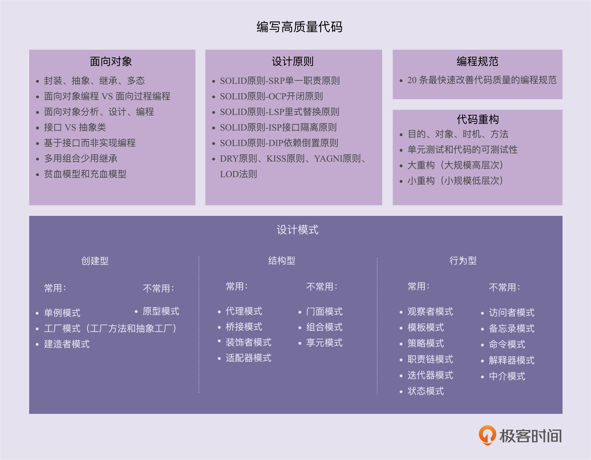

- [设计模式](#设计模式)
    - [面向对象、设计原则、设计模式、编程规范、重构](#面向对象设计原则设计模式编程规范重构)
- [面向对象](#面向对象)
    - [初探](#初探)
    - [封装、抽象、继承、多态分别可以解决哪些编程问题？](#封装抽象继承多态分别可以解决哪些编程问题)
    - [对比面向过程](#对比面向过程)
    - [接口vs抽象类的区别](#接口vs抽象类的区别)
    - [为何说要多用组合少用继承](#为何说要多用组合少用继承)
    - [MVC or DDD](#mvc-or-ddd)
- [设计原则](#设计原则)
    - [SOLID](#solid)
        - [单一职责原则](#单一职责原则)
        - [开闭原则](#开闭原则)
        - [里式替换原则](#里式替换原则)
        - [接口隔离原则](#接口隔离原则)
        - [依赖反转原则](#依赖反转原则)
    - [KISS](#kiss)
    - [DRY](#dry)
    - [迪米特法则](#迪米特法则)
- [规范与重构](#规范与重构)
    - [通过测试提高重构](#通过测试提高重构)
    - [可测试性的代码](#可测试性的代码)
    - [解耦](#解耦)
    - [20条建议](#20条建议)
- [未完](#未完)

# 设计模式

## 面向对象、设计原则、设计模式、编程规范、重构

* 面向对象编程因为其具有丰富的特性（封装、抽象、继承、多态），可以实现很多复杂的设计思路，是很多设计原则、设计模式等编码实现的基础。
* 设计原则是指导代码设计的一些经验总结，对于某些场景下，是否应该应用某种设计模式，具有指导意义。比如，“开闭原则”是很多设计模式（策略、模板等）的指导原则。
* 设计模式是针对软件开发中经常遇到的一些设计问题，总结出来的一套解决方案或者设计思路。应用设计模式的主要目的是提高代码的可扩展性。从抽象程度上来讲，设计原则比设计模式更抽象。设计模式更加具体、更加可执行。
* 编程规范主要解决的是代码的可读性问题。编码规范相对于设计原则、设计模式，更加具体、更加偏重代码细节、更加能落地。持续的小重构依赖的理论基础主要就是编程规范。
* 重构作为保持代码质量不下降的有效手段，利用的就是面向对象、设计原则、设计模式、编码规范这些理论。

# 面向对象

## 初探

现在，主流的编程范式或者是编程风格有三种，它们分别是面向过程、面向对象和函数式编程

**1. 什么是面向对象编程？**
 

面向对象编程是一种编程范式或编程风格。它以类或对象作为组织代码的基本单元，并将封装、抽象、继承、多态四个特性，作为代码设计和实现的基石 。

 

**2. 什么是面向对象编程语言？**

 

面向对象编程语言是支持类或对象的语法机制，并有现成的语法机制，能方便地实现面向对象编程四大特性（封装、抽象、继承、多态）的编程语言。

 

**3. 如何判定一个编程语言是否是面向对象编程语言？**

 

如果按照严格的的定义，需要有现成的语法支持类、对象、四大特性才能叫作面向对象编程语言。如果放宽要求的话，只要某种编程语言支持类、对象语法机制，那基本上就可以说这种编程语言是面向对象编程语言了，不一定非得要求具有所有的四大特性。

 

**4. 面向对象编程和面向对象编程语言之间有何关系？**

 

面向对象编程一般使用面向对象编程语言来进行，但是，不用面向对象编程语言，照样可以进行面向对象编程。反过来讲，即便使用面向对象编程语言，写出来的代码也不一定是面向对象编程风格的，也有可能是面向过程编程风格的。

 

**5. 什么是面向对象分析和面向对象设计？**

 

简单点讲，面向对象分析就是要搞清楚做什么，面向对象设计就是要搞清楚怎么做。两个阶段最终的产出是类的设计，包括程序被拆解为哪些类，每个类有哪些属性方法、类与类之间如何交互等等。

## 封装、抽象、继承、多态分别可以解决哪些编程问题？
**1. 关于封装特性**
 

What：隐藏信息，保护数据访问。 
How：暴露有限接口和属性，需要编程语言提供访问控制的语法。 
Why：提高代码可维护性；降低接口复杂度，提高类的易用性。 

封装也叫作信息隐藏或者数据访问保护。类通过暴露有限的访问接口，授权外部仅能通过类提供的方式来访问内部信息或者数据。它需要编程语言提供权限访问控制语法来支持，例如 Java 中的 private、protected、public 关键字。封装特性存在的意义，一方面是保护数据不被随意修改，提高代码的可维护性；另一方面是仅暴露有限的必要接口，提高类的易用性。

 

**2. 关于抽象特性**

What: 隐藏具体实现，使用者只需关心功能，无需关心实现。 
How: 通过接口类或者抽象类实现，特殊语法机制非必须。 
Why: 提高代码的扩展性、维护性；降低复杂度，减少细节负担。 

 

抽象就是讲如何隐藏方法的具体实现，让使用者只需要关心方法提供了哪些功能，不需要知道这些功能是如何实现的。抽象可以通过接口类或者抽象类来实现，但也并不需要特殊的语法机制来支持。抽象存在的意义，一方面是提高代码的可扩展性、维护性，修改实现不需要改变定义，减少代码的改动范围；另一方面，它也是处理复杂系统的有效手段，能有效地过滤掉不必要关注的信息。

 

**3. 关于继承特性**

What: 表示 is-a 关系，分为单继承和多继承。 
How: 需要编程语言提供特殊语法机制。例如 Java 的 “extends”，C++ 的 “:” 。 
Why: 解决代码复用问题。 

 

继承是用来表示类之间的 is-a 关系，分为两种模式：单继承和多继承。单继承表示一个子类只继承一个父类，多继承表示一个子类可以继承多个父类。为了实现继承这个特性，编程语言需要提供特殊的语法机制来支持。继承主要是用来解决代码复用的问题。

 

**4. 关于多态特性**

What: 子类替换父类，在运行时调用子类的实现。 
How: 需要编程语言提供特殊的语法机制。比如继承、接口类、duck-typing。 
Why: 提高代码扩展性和复用性。 

 

多态是指子类可以替换父类，在实际的代码运行过程中，调用子类的方法实现。多态这种特性也需要编程语言提供特殊的语法机制来实现，比如继承、接口类、duck-typing。多态可以提高代码的扩展性和复用性，是很多设计模式、设计原则、编程技巧的代码实现基础。

 

**3W 模型的关键在于 Why，没有 Why，其它两个就没有存在的意义。从四大特性可以看出，面向对象的终极目的只有一个：可维护性。易扩展、易复用，降低复杂度等等都属于可维护性的实现方式。**

## 对比面向过程
面向对象这种现在非常流行的编程范式，或者说编程风格。实际上，除了面向对象之外，被大家熟知的编程范式还有另外两种，面向过程编程和函数式编程

**1. 什么是面向过程编程？**

什么是面向过程编程语言？实际上，面向过程编程和面向过程编程语言并没有严格的官方定义。理解这两个概念最好的方式是跟面向对象编程和面向对象编程语言进行对比。相较于面向对象编程以类为组织代码的基本单元，面向过程编程则是以过程（或方法）作为组织代码的基本单元。它最主要的特点就是数据和方法相分离。相较于面向对象编程语言，面向过程编程语言最大的特点就是不支持丰富的面向对象编程特性，比如继承、多态、封装。

**2. 面向对象编程相比面向过程编程有哪些优势？**

面向对象编程相比起面向过程编程的优势主要有三个。

* 对于大规模复杂程序的开发，程序的处理流程并非单一的一条主线，而是错综复杂的网状结构。
* 面向对象编程比起面向过程编程，更能应对这种复杂类型的程序开发。面向对象编程相比面向过程编程，具有更加丰富的特性（封装、抽象、继承、多态）。利用这些特性编写出来的代码，更加易扩展、易复用、易维护。
* 从编程语言跟机器打交道的方式的演进规律中，可以总结出：面向对象编程语言比起面向过程编程语言，更加人性化、更加高级、更加智能

## 接口vs抽象类的区别

**1. 抽象类和接口的语法特性**
 
抽象类不允许被实例化，只能被继承。它可以包含属性和方法。方法既可以包含代码实现，也可以不包含代码实现。不包含代码实现的方法叫作抽象方法。子类继承抽象类，必须实现抽象类中的所有抽象方法。接口不能包含属性，只能声明方法，方法不能包含代码实现。类实现接口的时候，必须实现接口中声明的所有方法。
 

**2. 抽象类和接口存在的意义**
 

抽象类是对成员变量和方法的抽象，是一种 is-a 关系，是为了解决代码复用问题。接口仅仅是对方法的抽象，是一种 has-a 关系，表示具有某一组行为特性，是为了解决解耦问题，隔离接口和具体的实现，提高代码的扩展性。
 

**3. 抽象类和接口的应用场景区别**
 

什么时候该用抽象类？什么时候该用接口？实际上，判断的标准很简单。如果要表示一种 is-a 的关系，并且是为了解决代码复用问题，就用抽象类；如果要表示一种 has-a 关系，并且是为了解决抽象而非代码复用问题，那就用接口。
 

## 为何说要多用组合少用继承

**1 为什么不推荐使用继承？**

 

继承是面向对象的四大特性之一，用来表示类之间的 is-a 关系，可以解决代码复用的问题。虽然继承有诸多作用，但继承层次过深、过复杂，也会影响到代码的可维护性

**2 组合相比继承有哪些优势？**

 

继承主要有三个作用：表示 is-a 关系，支持多态特性，代码复用。而这三个作用都可以通过组合、接口、委托三个技术手段来达成。除此之外，利用组合还能解决层次过深、过复杂的继承关系影响代码可维护性的问题

**3 如何判断该用组合还是继承？**
 

尽管鼓励多用组合少用继承，但组合也并不是完美的，继承也并非一无是处。 继承改写成组合意味着要做更细粒度的类的拆分。这也就意味着，要定义更多的类和接口。类和接口的增多也就或多或少地增加代码的复杂程度和维护成本。所以，在实际的项目开发中，还是要根据具体的情况，来具体选择该用继承还是组合。如果类之间的继承结构稳定（不会轻易改变），继承层次比较浅（比如，最多有两层继承关系），继承关系不复杂，就可以大胆地使用继承。反之，系统越不稳定，继承层次很深，继承关系复杂，就尽量使用组合来替代继承。除此之外，还有一些设计模式会固定使用继承或者组合。比如，装饰者模式（decorator pattern）、策略模式（strategy pattern）、组合模式（composite pattern）等都使用了组合关系，而模板模式（template pattern）使用了继承关系。

## MVC or DDD
领域驱动设计（Domain Driven Design), 简称 DDD

MVC 三层架构中的 M 表示 Model，V 表示 View，C 表示 Controller

平时做 Web 项目的业务开发，大部分都是基于贫血模型的 MVC 三层架构，在专栏中我把它称为传统的开发模式。之所以称之为“传统”，是相对于新兴的基于充血模型的 DDD 开发模式来说的。基于贫血模型的传统开发模式，是典型的面向过程的编程风格。相反，基于充血模型的 DDD 开发模式，是典型的面向对象的编程风格。

不过，DDD 也并非银弹。对于业务不复杂的系统开发来说，基于贫血模型的传统开发模式简单够用，基于充血模型的 DDD 开发模式有点大材小用，无法发挥作用。相反，对于业务复杂的系统开发来说，基于充血模型的 DDD 开发模式，因为前期需要在设计上投入更多时间和精力，来提高代码的复用性和可维护性，所以相比基于贫血模型的开发模式，更加有优势。

# 设计原则

## SOLID

### 单一职责原则
Single Responsibility Principle, SRP

**1. 如何理解单一职责原则（SRP）？**

一个类只负责完成一个职责或者功能。不要设计大而全的类，要设计粒度小、功能单一的类。单一职责原则是为了实现代码高内聚、低耦合，提高代码的复用性、可读性、可维护性。

**2. 如何判断类的职责是否足够单一？**

不同的应用场景、不同阶段的需求背景、不同的业务层面，对同一个类的职责是否单一，可能会有不同的判定结果。实际上，一些侧面的判断指标更具有指导意义和可执行性，比如，出现下面这些情况就有可能说明这类的设计不满足单一职责原则：类中的代码行数、函数或者属性过多；类依赖的其他类过多，或者依赖类的其他类过多；私有方法过多；比较难给类起一个合适的名字；类中大量的方法都是集中操作类中的某几个属性。

**3. 类的职责是否设计得越单一越好？**

单一职责原则通过避免设计大而全的类，避免将不相关的功能耦合在一起，来提高类的内聚性。同时，类职责单一，类依赖的和被依赖的其他类也会变少，减少了代码的耦合性，以此来实现代码的高内聚、低耦合。但是，如果拆分得过细，实际上会适得其反，反倒会降低内聚性，也会影响代码的可维护性

### 开闭原则
Open Closed Principle，简写为 OCP

**1. 如何理解“对扩展开放、对修改关闭”？**

添加一个新的功能，应该是通过在已有代码基础上扩展代码（新增模块、类、方法、属性等），而非修改已有代码（修改模块、类、方法、属性等）的方式来完成。关于定义，有两点要注意。第一点是，开闭原则并不是说完全杜绝修改，而是以最小的修改代码的代价来完成新功能的开发。第二点是，同样的代码改动，在粗代码粒度下，可能被认定为“修改”；在细代码粒度下，可能又被认定为“扩展”。

**2. 如何做到“对扩展开放、修改关闭”？**

要时刻具备扩展意识、抽象意识、封装意识。在写代码的时候，要多花点时间思考一下，这段代码未来可能有哪些需求变更，如何设计代码结构，事先留好扩展点，以便在未来需求变更的时候，在不改动代码整体结构、做到最小代码改动的情况下，将新的代码灵活地插入到扩展点上。很多设计原则、设计思想、设计模式，都是以提高代码的扩展性为最终目的的。特别是 23 种经典设计模式，大部分都是为了解决代码的扩展性问题而总结出来的，都是以开闭原则为指导原则的。最常用来提高代码扩展性的方法有：多态、依赖注入、基于接口而非实现编程，以及大部分的设计模式（比如，装饰、策略、模板、职责链、状态）。

### 里式替换原则

Liskov Substitution Principle，缩写为 LSP

里式替换原则是用来指导，继承关系中子类该如何设计的一个原则。理解里式替换原则，最核心的就是理解“design by contract，按照协议来设计”这几个字。父类定义了函数的“约定”（或者叫协议），那子类可以改变函数的内部实现逻辑，但不能改变函数原有的“约定”。这里的约定包括：函数声明要实现的功能；对输入、输出、异常的约定；甚至包括注释中所罗列的任何特殊说明。理解这个原则，还要弄明白里式替换原则跟多态的区别。虽然从定义描述和代码实现上来看，多态和里式替换有点类似，但它们关注的角度是不一样的。多态是面向对象编程的一大特性，也是面向对象编程语言的一种语法。它是一种代码实现的思路。而里式替换是一种设计原则，用来指导继承关系中子类该如何设计，子类的设计要保证在替换父类的时候，不改变原有程序的逻辑及不破坏原有程序的正确性。

### 接口隔离原则
Interface Segregation Principle”，缩写为 ISP

**1. 如何理解“接口隔离原则”？**

理解“接口隔离原则”的重点是理解其中的“接口”二字。这里有三种不同的理解。

如果把“接口”理解为一组接口集合，可以是某个微服务的接口，也可以是某个类库的接口等。如果部分接口只被部分调用者使用，就需要将这部分接口隔离出来，单独给这部分调用者使用，而不强迫其他调用者也依赖这部分不会被用到的接口。

如果把“接口”理解为单个 API 接口或函数，部分调用者只需要函数中的部分功能，那就需要把函数拆分成粒度更细的多个函数，让调用者只依赖它需要的那个细粒度函数。

如果把“接口”理解为 OOP 中的接口，也可以理解为面向对象编程语言中的接口语法。那接口的设计要尽量单一，不要让接口的实现类和调用者，依赖不需要的接口函数。

**2. 接口隔离原则与单一职责原则的区别**

单一职责原则针对的是模块、类、接口的设计。接口隔离原则相对于单一职责原则，一方面更侧重于接口的设计，另一方面它的思考角度也是不同的。接口隔离原则提供了一种判断接口的职责是否单一的标准：通过调用者如何使用接口来间接地判定。如果调用者只使用部分接口或接口的部分功能，那接口的设计就不够职责单一。

### 依赖反转原则
Dependency Inversion Principle，缩写为 DIP

**1. 控制反转**

实际上，控制反转是一个比较笼统的设计思想，并不是一种具体的实现方法，一般用来指导框架层面的设计。这里所说的“控制”指的是对程序执行流程的控制，而“反转”指的是在没有使用框架之前，程序员自己控制整个程序的执行。在使用框架之后，整个程序的执行流程通过框架来控制。流程的控制权从程序员“反转”给了框架。

**2. 依赖注入**

依赖注入和控制反转恰恰相反，它是一种具体的编码技巧。不通过 new 的方式在类内部创建依赖类的对象，而是将依赖的类对象在外部创建好之后，通过构造函数、函数参数等方式传递（或注入）给类来使用。

**3. 依赖注入框架**

通过依赖注入框架提供的扩展点，简单配置一下所有需要的类及其类与类之间依赖关系，就可以实现由框架来自动创建对象、管理对象的生命周期、依赖注入等原本需要程序员来做的事情。

**4. 依赖反转原则**

依赖反转原则也叫作依赖倒置原则。这条原则跟控制反转有点类似，主要用来指导框架层面的设计。高层模块不依赖低层模块，它们共同依赖同一个抽象。抽象不要依赖具体实现细节，具体实现细节依赖抽象。

## KISS

Keep It Simple and Stupid.

Keep It Short and Simple.

Keep It Simple and Straightforward.

不要使用同事可能不懂的技术来实现代码；(就要用， 提升整个团队的技术素养)

不要重复造轮子，要善于使用已经有的工具类库；（就要造轮子， 才能更好理解技术， 如果轮子不好用， 就要写个新的更好的）

不要过度优化。（就要过度优化， 要不怎么提升性能）

这是个哲学问题， 有时候你就要反着来！！

## DRY

Don’t Repeat Yourself

**1.DRY 原则**

三种代码重复的情况：实现逻辑重复、功能语义重复、代码执行重复。实现逻辑重复，但功能语义不重复的代码，并不违反 DRY 原则。实现逻辑不重复，但功能语义重复的代码，也算是违反 DRY 原则。除此之外，代码执行重复也算是违反 DRY 原则。

**2. 代码复用性**

讲到提高代码可复用性的一些方法，有以下 7 点。

* 减少代码耦合

* 满足单一职责原则

* 模块化业务与非业务逻辑分离

* 通用代码下沉

* 继承、多态、抽象、封装

* 应用模板等设计模式

实际上，除了上面讲到的这些方法之外，复用意识也非常重要。在设计每个模块、类、函数的时候，要像设计一个外部 API 一样去思考它的复用性。在第一次写代码的时候，如果当下没有复用的需求，而未来的复用需求也不是特别明确，并且开发可复用代码的成本比较高，那就不需要考虑代码的复用性。在之后开发新的功能的时候，发现可以复用之前写的这段代码，那就重构这段代码，让其变得更加可复用。相比于代码的可复用性，DRY 原则适用性更强一些。可以不写可复用的代码，但一定不能写重复的代码。

## 迪米特法则

**1. 如何理解“高内聚、松耦合”？**

“高内聚、松耦合”是一个非常重要的设计思想，能够有效提高代码的可读性和可维护性，缩小功能改动导致的代码改动范围。“高内聚”用来指导类本身的设计，“松耦合”用来指导类与类之间依赖关系的设计。

所谓高内聚，就是指相近的功能应该放到同一个类中，不相近的功能不要放到同一类中。相近的功能往往会被同时修改，放到同一个类中，修改会比较集中。所谓松耦合指的是，在代码中，类与类之间的依赖关系简单清晰。即使两个类有依赖关系，一个类的代码改动也不会或者很少导致依赖类的代码改动。

**2. 如何理解“迪米特法则”？**

不该有直接依赖关系的类之间，不要有依赖；有依赖关系的类之间，尽量只依赖必要的接口。迪米特法则是希望减少类之间的耦合，让类越独立越好。每个类都应该少了解系统的其他部分。一旦发生变化，需要了解这一变化的类就会比较少

# 规范与重构

## 通过测试提高重构

**1. 什么是单元测试？**

单元测试是代码层面的测试，由研发自己来编写，用于测试“自己”编写的代码的逻辑的正确性。单元测试顾名思义是测试一个“单元”，有别于集成测试，这个“单元”一般是类或函数，而不是模块或者系统。

**2. 为什么要写单元测试？**

写单元测试的过程本身就是代码 Code Review 和重构的过程，能有效地发现代码中的 bug 和代码设计上的问题。除此之外，单元测试还是对集成测试的有力补充，还能帮助我们快速熟悉代码，是 TDD 可落地执行的改进方案。

**3. 如何编写单元测试？**

写单元测试就是针对代码设计各种测试用例，以覆盖各种输入、异常、边界情况，并将其翻译成代码。我们可以利用一些测试框架来简化单元测试的编写。除此之外，对于单元测试，我们需要建立以下正确的认知：

* 编写单元测试尽管繁琐，但并不是太耗时；

* 我们可以稍微放低对单元测试代码质量的要求；

* 覆盖率作为衡量单元测试质量的唯一标准是不合理的；

* 单元测试不要依赖被测代码的具体实现逻辑；

* 单元测试框架无法测试，多半是因为代码的可测试性不好。

**4. 单元测试为何难落地执行？**

一方面，写单元测试本身比较繁琐，技术挑战不大，很多程序员不愿意去写；另一方面，国内研发比较偏向“快、糙、猛”，容易因为开发进度紧，导致单元测试的执行虎头蛇尾。最后，关键问题还是团队没有建立对单元测试正确的认识，觉得可有可无，单靠督促很难执行得很好。课堂讨论

## 可测试性的代码

**1. 什么是代码的可测试性**

粗略地讲，所谓代码的可测试性，就是针对代码编写单元测试的难易程度。对于一段代码，如果很难为其编写单元测试，或者单元测试写起来很费劲，需要依靠单元测试框架中很高级的特性，那往往就意味着代码设计得不够合理，代码的可测试性不好。

**2. 编写可测试性代码的最有效手段**

依赖注入是编写可测试性代码的最有效手段。通过依赖注入，我们在编写单元测试的时候，可以通过 mock 的方法解依赖外部服务，这也是我们在编写单元测试的过程中最有技术挑战的地方。

**3. 常见的 Anti-Patterns**

常见的测试不友好的代码有下面这 5 种：

* 代码中包含未决行为

* 逻辑滥用可变

* 全局变量

* 滥用静态方法

* 使用复杂的继承关系

* 高度耦合的

## 解耦

**1.“解耦”为何如此重要？**

过于复杂的代码往往在可读性、可维护性上都不友好。解耦保证代码松耦合、高内聚，是控制代码复杂度的有效手段。代码高内聚、松耦合，也就是意味着，代码结构清晰、分层模块化合理、依赖关系简单、模块或类之间的耦合小，那代码整体的质量就不会差。

**2. 代码是否需要“解耦”？**

间接的衡量标准有很多，比如，看修改代码是否牵一发而动全身。直接的衡量标准是把模块与模块、类与类之间的依赖关系画出来，根据依赖关系图的复杂性来判断是否需要解耦重构。

**3. 如何给代码“解耦”？**

给代码解耦的方法有：封装与抽象、中间层、模块化，以及一些其他的设计思想与原则，比如：单一职责原则、基于接口而非实现编程、依赖注入、多用组合少用继承、迪米特法则等。当然，还有一些设计模式，比如观察者模式

## 20条建议

**1. 关于命名**

命名的关键是能准确达意。对于不同作用域的命名，我们可以适当地选择不同的长度。

我们可以借助类的信息来简化属性、函数的命名，利用函数的信息来简化函数参数的命名。

命名要可读、可搜索。不要使用生僻的、不好读的英文单词来命名。命名要符合项目的统一规范，也不要用些反直觉的命名。

接口有两种命名方式：一种是在接口中带前缀“I”；另一种是在接口的实现类中带后缀“Impl”。对于抽象类的命名，也有两种方式，一种是带上前缀“Abstract”，一种是不带前缀。这两种命名方式都可以，关键是要在项目中统一。

**2. 关于注释**

注释的内容主要包含这样三个方面：做什么、为什么、怎么做。对于一些复杂的类和接口，我们可能还需要写明“如何用”。

类和函数一定要写注释，而且要写得尽可能全面详细。函数内部的注释要相对少一些，一般都是靠好的命名、提炼函数、解释性变量、总结性注释来提高代码可读性。

**3. 关于代码风格**
 类中成员怎么排列？在 Google Java 编程规范中，依赖类按照字母序从小到大排列。类中先写成员变量后写函数。成员变量之间或函数之间，先写静态成员变量或函数，后写普通变量或函数，并且按照作用域大小依次排列。

* 函数、类多大才合适？

函数的代码行数不要超过一屏幕的大小，比如 50 行。类的大小限制比较难确定

* 一行代码多长最合适？

最好不要超过 IDE 显示的宽度。当然，限制也不能太小，太小会导致很多稍微长点的语句被折成两行，也会影响到代码的整洁，不利于阅读。

* 善用空行

分割单元块对于比较长的函数，为了让逻辑更加清晰，可以使用空行来分割各个代码块。在类内部，成员变量与函数之间、静态成员变量与普通成员变量之间、函数之间，甚至成员变量之间，都可以通过添加空行的方式，让不同模块的代码之间的界限更加明确。

*  四格缩进还是两格缩进？

我个人比较推荐使用两格缩进，这样可以节省空间，特别是在代码嵌套层次比较深的情况下。除此之外，值得强调的是，不管是用两格缩进还是四格缩进，一定不要用 tab 键缩进。

* 大括号是否要另起一行？

我个人还是比较推荐将大括号放到跟上一条语句同一行的风格，这样可以节省代码行数。但是，将大括号另起一行，也有它的优势，那就是，左右括号可以垂直对齐，哪些代码属于哪一个代码块，更加一目了然。

* 类中成员的排列顺序

在 Google Java 编程规范中，依赖类按照字母序从小到大排列。类中先写成员变量后写函数。成员变量之间或函数之间，先写静态成员变量或函数，后写普通变量或函数，并且按照作用域大小依次排列。今天讲到所有的代码风格都没有对错和优劣之分，只要能在团队、项目中统一即可，不过，最好能跟业内推荐的风格、开源项目的代码风格相一致。

**4. 关于编码技巧**

* 将复杂的逻辑提炼拆分成函数和类。

* 通过拆分成多个函数或将参数封装为对象的方式，来处理参数过多的情况。

* 函数中不要使用参数来做代码执行逻辑的控制。

* 函数设计要职责单一。

* 移除过深的嵌套层次，方法包括：去掉多余的 if 或 else 语句，使用 continue、break、return 关键字提前退出嵌套，调整执行顺序来减少嵌套，将部嵌套逻辑抽象成函数。

* 用字面常量取代魔法数。

* 用解释性变量来解释复杂表达式，以此提高代码可读性。

**5. 统一编码规范**

除了这三节讲到的比较细节的知识点之外，最后，还有一条非常重要的，那就是，项目、团队，甚至公司，一定要制定统一的编码规范，并且通过 Code Review 督促执行，这对提高代码质量有立竿见影的效果。

# 未完
