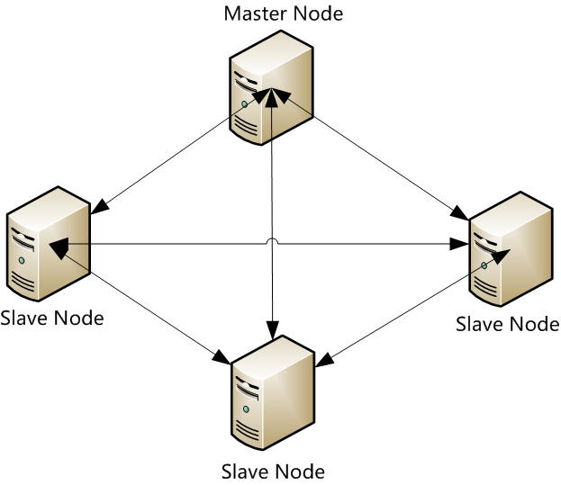
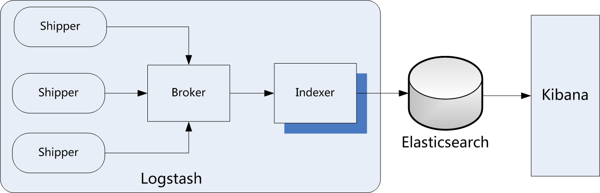
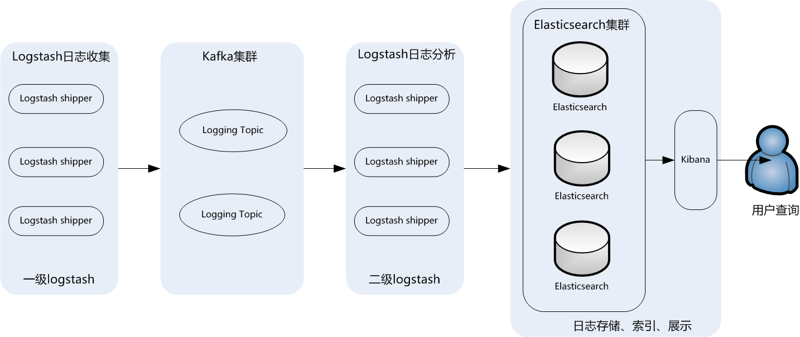

- [ELK](#elk)
    - [ELK架构介绍](#elk架构介绍)
        - [1 核心组成](#1-核心组成)
        - [2 Elasticsearch介绍](#2-elasticsearch介绍)
        - [3 Logstash介绍](#3-logstash介绍)
        - [4 kibana介绍](#4-kibana介绍)
        - [5 ELK工作流程](#5-elk工作流程)
    - [ELK常见应用架构](#elk常见应用架构)
        - [1 最简单的ELK架构](#1-最简单的elk架构)
        - [2 典型ELK架构](#2-典型elk架构)
        - [3 ELK集群架构](#3-elk集群架构)
    - [Mac 使用](#mac-使用)
        - [1 ElasticSearch install on mac](#1-elasticsearch-install-on-mac)
        - [2 Logstash install on mac](#2-logstash-install-on-mac)
        - [3 Kiban install on mac](#3-kiban-install-on-mac)
# ELK
## ELK架构介绍
### 1 核心组成
ELK是一个应用套件，由Elasticsearch、Logstash和Kibana三部分组件组成，简称ELK；它是一套开源免费、功能强大的日志分析管理系统。ELK可以将我们的系统日志、网站日志、应用系统日志等各种日志进行收集、过滤、清洗，然后进行集中存放并可用于实时检索、分析。
这三款软件都是开源软件，通常是配合使用，而且又先后归于Elastic.co公司名下，故又被简称为ELK Stack。
下图是ELK Stack的基础组成。


### 2 Elasticsearch介绍
Elasticsearch是一个实时的分布式搜索和分析引擎，它可以用于全文搜索，结构化搜索以及分析，采用Java语言编写。目前，最新的版本是Elasticsearch7.6.1，它的主要特点如下：

实时搜索，实时分析分布式架构、实时文件存储，并将每一个字段都编入索引文档导向，所有的对象全部是文档高可用性，易扩展，支持集群（Cluster）、分片和复制（Shards和Replicas）接口友好，支持JSON

Elasticsearch支持集群架构，典型的集群架构如下图所示：


从图中可以看出，Elasticsearch集群中有Master Node和SlaveNode两种角色，其实还有一种角色Client Node，这在后面会做深入介绍。

### 3 Logstash介绍
Logstash是一款轻量级的、开源的日志收集处理框架，它可以方便的把分散的、多样化的日志搜集起来，并进行自定义过滤分析处理，然后传输到指定的位置，比如某个服务器或者文件。Logstash采用JRuby语言编写，目前最新的版本是Logstash7.6.1，它的主要特点如下：

几乎可以访问任何数据可以和多种外部应用整合支持动态、弹性扩展

Logstash的理念很简单，从功能上来讲，它只做三件事情：

input：数据收集filter：数据加工，如过滤，改写等output：数据输出

别看它只做三件事，但通过组合输入和输出，可以变幻出多种架构实现多种需求。Logstash内部运行逻辑如下图所示：

其中，每个部分含义如下：

Shipper：主要用来收集日志数据，负责监控本地日志文件的变化，及时把日志文件的最新内容收集起来，然后经过加工、过滤，输出到Broker。
Broker：相当于日志Hub，用来连接多个Shipper和多个Indexer。
Indexer：从Broker读取文本，经过加工、过滤，输出到指定的介质（可以是文件、网络、elasticsearch等）中。

Redis服务器是logstash官方推荐的broker，这个broker起数据缓存的作用，通过这个缓存器可以提高Logstashshipper发送日志到Logstash indexer的速度，同时避免由于突然断电等导致的数据丢失。可以实现broker功能的还有很多软件，例如kafka等。
这里需要说明的是，在实际应用中，LogStash自身并没有什么角色，只是根据不同的功能、不同的配置给出不同的称呼而已，无论是Shipper还是Indexer，始终只做前面提到的三件事。
这里需要重点掌握的是logstash中Shipper和Indexer的作用，因为这两个部分是logstash功能的核心，在下面的介绍中，会陆续介绍到这两个部分实现的功能细节。

### 4 kibana介绍
Kibana是一个开源的数据分析可视化平台。使用Kibana可以为Logstash和ElasticSearch提供的日志数据进行高效的搜索、可视化汇总和多维度分析，还可以与Elasticsearch搜索引擎之中的数据进行交互。它基于浏览器的界面操作可以快速创建动态仪表板，实时监控ElasticSearch的数据状态与更改。

### 5 ELK工作流程
一般都是在需要收集日志的所有服务上部署logstash，作为logstash shipper用于监控并收集、过滤日志，接着，将过滤后的日志发送给Broker，然后，Logstash Indexer将存放在Broker中的数据再写入Elasticsearch，Elasticsearch对这些数据创建索引，最后由Kibana对其进行各种分析并以图表的形式展示。
ELK工作流程如下图所示：


有些时候，如果收集的日志量较大，为了保证日志收集的性能和数据的完整性，logstash shipper和logstash indexer之间的缓冲器（Broker）也经常采用kafka来实现。

在这个图中，要重点掌握的是ELK架构的数据流向，以及logstash、Elasticsearch和Kibana组合实现的功能细节。

## ELK常见应用架构
### 1 最简单的ELK架构
ELK套件在大数据运维应用中是一套必不可少的、方便的、易用的开源解决方案，它提供搜集、过滤、传输、储存等机制，对应用系统和海量日志进行集中管理和准实时搜索、分析，并通过搜索、监控、事件消息和报表等简单易用的功能，帮助运维人员进行线上业务系统的准实时监控、业务异常时及时定位原因、排除故障等，还可以跟踪分析程序Bug、分析业务趋势、安全与合规审计，深度挖掘日志的大数据应用价值。

下图是最简单的ELK应用架构：


此架构主要是将Logstash部署在各个节点上搜集相关日志、数据，并经过分析、过滤后发送给远端服务器上的Elasticsearch进行存储。Elasticsearch再将数据以分片的形式压缩存储，并提供多种API供用户查询、操作。用户可以通过Kibana Web直观的对日志进行查询，并根据需求生成数据报表。

此架构的优点是搭建简单，易于上手。缺点是Logstash消耗系统资源比较大，运行时占用CPU和内存资源较高。另外，由于没有消息队列缓存，可能存在数据丢失的风险。此架构建议供初学者或数据量小的环境使用。

### 2 典型ELK架构
为保证ELK收集日志数据的安全性和稳定性，此架构引入了消息队列机制，下图是典型的ELK应用架构：



此架构主要特点是引入了消息队列机制，位于各个节点上的Logstash Agent（一级Logstash，主要用来传输数据）先将数据传递给消息队列（常见的有Kafka、Redis等），接着，Logstash server（二级Logstash，主要用来拉取消息队列数据，过滤并分析数据）将格式化的数据传递给Elasticsearch进行存储。最后，由Kibana将日志和数据呈现给用户。由于引入了Kafka（或者Redis）缓存机制，即使远端Logstash server因故障停止运行，数据也不会丢失，因为数据已经被存储下来了。

这种架构适合于较大集群、数据量一般的应用环境，但由于二级Logstash要分析处理大量数据，同时Elasticsearch也要存储和索引大量数据，因此它们的负荷会比较重，解决的方法是将它们配置为集群模式，以分担负载。

此架构的优点在于引入了消息队列机制，均衡了网络传输，从而降低了网络闭塞尤其是丢失数据的可能性，但依然存在Logstash占用系统资源过多的问题，在海量数据应用场景下，可能会出现性能瓶颈。

### 3 ELK集群架构
这个架构是在上面第二个架构基础上改进而来的，主要是将前端收集数据的Logstash Agent换成了filebeat，消息队列使用了kafka集群，然后将Logstash和Elasticsearch都通过集群模式进行构建，完整架构如下图所示：


此架构适合大型集群、海量数据的业务场景，它通过将前端LogstashAgent替换成filebeat，有效降低了收集日志对业务系统资源的消耗。同时，消息队列使用kafka集群架构，有效保障了收集数据的安全性和稳定性，而后端Logstash和Elasticsearch均采用集群模式搭建，从整体上提高了ELK系统的高效性、扩展性和吞吐量。

## Mac 使用

### 1 ElasticSearch install on mac

[Package Doc](https://www.elastic.co/guide/en/elasticsearch/reference/current/targz.html)
```
    ./bin/elasticsearch

    ./bin/elasticsearch -d -p pid (daemon)

    http://localhost:9200/
```

Q1:

```
    future versions of Elasticsearch will require Java 11; your Java version from [/Library/Java/JavaVirtualMachines/jdk1.8.0_171.jdk/Contents/Home/jre] does not meet this requirement
```

A1:

[Jdk 13](https://docs.oracle.com/en/java/javase/11/migrate/index.html#JSMIG-GUID-C25E2B1D-6C24-4403-8540-CFEA875B994A)
```
    vim ~/.bash_profile

    export JAVA_HOME=/Library/Java/JavaVirtualMachines/jdk-13.0.2.jdk/Contents/Home

    source ~/.bash_profile
```

### 2 Logstash install on mac

```
    brew tap elastic/tap
    brew install elastic/tap/logstash-full
    logstash
```

### 3 Kiban install on mac

[Kiban](https://www.elastic.co/downloads/kibana)
```
    ./bin/kibana
```

Q1:

 Unable to revive connection: http://localhost:9200/

A1:
```
    vim config/kibana.yml

    server.host: "127.0.0.1"

```

