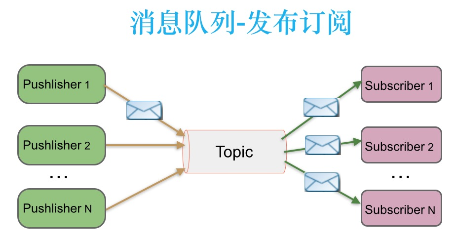
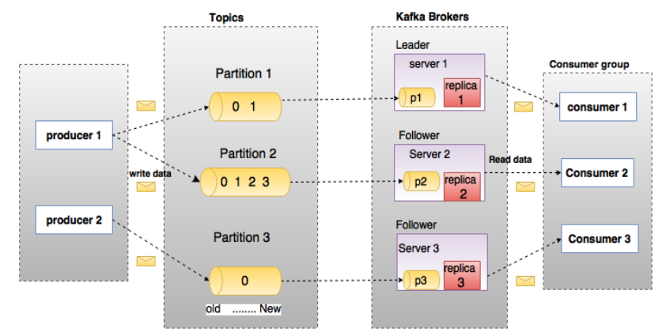
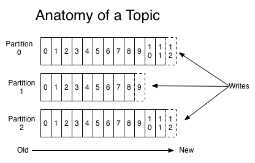

- [Kafka](#kafka)
    - [常见问题](#常见问题)
        - [为什么使用消息队列?消息队列的作用是什么?](#为什么使用消息队列消息队列的作用是什么)
        - [Kafka 是依靠什么机制保持高可靠，高可用](#kafka-是依靠什么机制保持高可靠高可用)
            - [多副本冗余的高可用机制](#多副本冗余的高可用机制)
            - [多个副本之间数据是如何同步的?](#多个副本之间数据是如何同步的)
    - [简介](#简介)
        - [概述](#概述)
        - [消息系统介绍](#消息系统介绍)
        - [点对点消息传递](#点对点消息传递)
        - [发布-订阅消息传递](#发布-订阅消息传递)
        - [Kafka的优点](#kafka的优点)
        - [Kafka中的术语解释](#kafka中的术语解释)
    - [架构](#架构)
        - [架构图](#架构图)
            - [分布式模型](#分布式模型)
    - [Topics和Partition](#topics和partition)
    - [Producer消息路由](#producer消息路由)
    - [Consumer Group](#consumer-group)
    - [Push vs. Pull](#push-vs-pull)
    - [Kafka delivery guarantee](#kafka-delivery-guarantee)
# Kafka
## 常见问题
### 为什么使用消息队列?消息队列的作用是什么?
解耦， 异步， 削峰

### Kafka 是依靠什么机制保持高可靠，高可用
#### 多副本冗余的高可用机制

在 Kafka 集群中，每个 Partition 都有多个副本，其中一个副本叫做 Leader，其他的副本叫做 Follower
多副本之间数据如何同步?

#### 多个副本之间数据是如何同步的?
其实任何一个 Partition，只有 Leader 是对外提供读写服务的。也就是说，如果有一个客户端往一个 Partition 写入数据，此时一般就是写入这个 Partition 的 Leader 副本。然后 Leader 副本接收到数据之后，Follower 副本会不停的给它发送请求尝试去拉取最新的数据，拉取到自己本地后，写入磁盘中。


## 简介
### 概述
Kafka是最初由Linkedin公司开发，是一个分布式、分区的、多副本的、多订阅者，基于zookeeper协调的分布式日志系统（也可以当做MQ系统），常见可以用于web/nginx日志、访问日志，消息服务等等，Linkedin于2010年贡献给了Apache基金会并成为顶级开源项目。

主要应用场景是：日志收集系统和消息系统。

Kafka主要设计目标如下：

* 以时间复杂度为O(1)的方式提供消息持久化能力，即使对TB级以上数据也能保证常数时间的访问性能。

* 高吞吐率。即使在非常廉价的商用机器上也能做到单机支持每秒100K条消息的传输。

* 支持Kafka Server间的消息分区，及分布式消费，同时保证每个partition内的消息顺序传输。

* 同时支持离线数据处理和实时数据处理。

* 支持在线水平扩展

### 消息系统介绍
一个消息系统负责将数据从一个应用传递到另外一个应用，应用只需关注于数据，无需关注数据在两个或多个应用间是如何传递的。分布式消息传递基于可靠的消息队列，在客户端应用和消息系统之间异步传递消息。有两种主要的消息传递模式：点对点传递模式、发布-订阅模式。大部分的消息系统选用发布-订阅模式。Kafka就是一种发布-订阅模式。

### 点对点消息传递
在点对点消息系统中，消息持久化到一个队列中。此时，将有一个或多个消费者消费队列中的数据。但是一条消息只能被消费一次。当一个消费者消费了队列中的某条数据之后，该条数据则从消息队列中删除。该模式即使有多个消费者同时消费数据，也能保证数据处理的顺序。这种架构描述示意图如下：


### 发布-订阅消息传递

在发布-订阅消息系统中，消息被持久化到一个topic中。与点对点消息系统不同的是，消费者可以订阅一个或多个topic，消费者可以消费该topic中所有的数据，同一条数据可以被多个消费者消费，数据被消费后不会立马删除。在发布-订阅消息系统中，消息的生产者称为发布者，消费者称为订阅者。该模式的示例图如下：



### Kafka的优点
1）解耦：

在项目启动之初来预测将来项目会碰到什么需求，是极其困难的。消息系统在处理过程中间插入了一个隐含的、基于数据的接口层，两边的处理过程都要实现这一接口。这允许你独立的扩展或修改两边的处理过程，只要确保它们遵守同样的接口约束。

2）冗余：（副本）

有些情况下，处理数据的过程会失败。除非数据被持久化，否则将造成丢失。消息队列把数据进行持久化直到它们已经被完全处理，通过这一方式规避了数据丢失风险。许多消息队列所采用的"插入-获取-删除"范式中，在把一个消息从队列中删除之前，需要你的处理系统明确的指出该消息已经被处理完毕，从而确保你的数据被安全的保存直到你使用完毕。

3）扩展性

因为消息队列解耦了你的处理过程，所以增大消息入队和处理的频率是很容易的，只要另外增加处理过程即可。不需要改变代码、不需要调节参数。扩展就像调大电力按钮一样简单。

4）灵活性&峰值处理能力

在访问量剧增的情况下，应用仍然需要继续发挥作用，但是这样的突发流量并不常见；如果为以能处理这类峰值访问为标准来投入资源随时待命无疑是巨大的浪费。使用消息队列能够使关键组件顶住突发的访问压力，而不会因为突发的超负荷的请求而完全崩溃。

5）可恢复性

系统的一部分组件失效时，不会影响到整个系统。消息队列降低了进程间的耦合度，所以即使一个处理消息的进程挂掉，加入队列中的消息仍然可以在系统恢复后被处理。

6）顺序保证

在大多使用场景下，数据处理的顺序都很重要。大部分消息队列本来就是排序的，并且能保证数据会按照特定的顺序来处理。Kafka保证一个Partition内的消息的有序性。

7）缓冲

在任何重要的系统中，都会有需要不同的处理时间的元素。例如，加载一张图片比应用过滤器花费更少的时间。消息队列通过一个缓冲层来帮助任务最高效率的执行———写入队列的处理会尽可能的快速。该缓冲有助于控制和优化数据流经过系统的速度。

8）异步通信

很多时候，用户不想也不需要立即处理消息。消息队列提供了异步处理机制，允许用户把一个消息放入队列，但并不立即处理它。想向队列中放入多少消息就放多少，然后在需要的时候再去处理它们。


### Kafka中的术语解释
概述
在深入理解Kafka之前，先介绍一下Kafka中的术语。下图展示了Kafka的相关术语以及之间的关系：


上图中一个topic配置了3个partition。Partition1有两个offset：0和1。Partition2有4个offset。Partition3有1个offset。副本的id和副本所在的机器的id恰好相同。

如果一个topic的副本数为3，那么Kafka将在集群中为每个partition创建3个相同的副本。集群中的每个broker存储一个或多个partition。多个producer和consumer可同时生产和消费数据。

1 broker
Kafka 集群包含一个或多个服务器，服务器节点称为broker。

broker存储topic的数据。如果某topic有N个partition，集群有N个broker，那么每个broker存储该topic的一个partition。

如果某topic有N个partition，集群有(N+M)个broker，那么其中有N个broker存储该topic的一个partition，剩下的M个broker不存储该topic的partition数据。

如果某topic有N个partition，集群中broker数目少于N个，那么一个broker存储该topic的一个或多个partition。在实际生产环境中，尽量避免这种情况的发生，这种情况容易导致Kafka集群数据不均衡。

2 Topic
每条发布到Kafka集群的消息都有一个类别，这个类别被称为Topic。（物理上不同Topic的消息分开存储，逻辑上一个Topic的消息虽然保存于一个或多个broker上但用户只需指定消息的Topic即可生产或消费数据而不必关心数据存于何处）

类似于数据库的表名

3 Partition
topic中的数据分割为一个或多个partition。每个topic至少有一个partition。每个partition中的数据使用多个segment文件存储。partition中的数据是有序的，不同partition间的数据丢失了数据的顺序。如果topic有多个partition，消费数据时就不能保证数据的顺序。在需要严格保证消息的消费顺序的场景下，需要将partition数目设为1。

4 Producer
生产者即数据的发布者，该角色将消息发布到Kafka的topic中。broker接收到生产者发送的消息后，broker将该消息追加到当前用于追加数据的segment文件中。生产者发送的消息，存储到一个partition中，生产者也可以指定数据存储的partition。

5 Consumer
消费者可以从broker中读取数据。消费者可以消费多个topic中的数据。

6 Consumer Group
每个Consumer属于一个特定的Consumer Group（可为每个Consumer指定group name，若不指定group name则属于默认的group）。这是kafka用来实现一个topic消息的广播（发给所有的consumer）和单播（发给任意一个consumer）的手段。一个topic可以有多个CG。topic的消息会复制-给consumer。如果需要实现广播，只要每个consumer有一个独立的CG就可以了。要实现单播只要所有的consumer在同一个CG。用CG还可以将consumer进行自由的分组而不需要多次发送消息到不同的topic。

7 Leader
每个partition有多个副本，其中有且仅有一个作为Leader，Leader是当前负责数据的读写的partition。

8 Follower
Follower跟随Leader，所有写请求都通过Leader路由，数据变更会广播给所有Follower，Follower与Leader保持数据同步。如果Leader失效，则从Follower中选举出一个新的Leader。当Follower与Leader挂掉、卡住或者同步太慢，leader会把这个follower从“in sync replicas”（ISR）列表中删除，重新创建一个Follower。

9 Offset
kafka的存储文件都是按照offset.kafka来命名，用offset做名字的好处是方便查找。例如你想找位于2049的位置，只要找到2048.kafka的文件即可。当然the first offset就是00000000000.kafka


## 架构
### 架构图


如上图所示，一个典型的Kafka集群中包含若干Producer（可以是web前端产生的Page View，或者是服务器日志，系统CPU、Memory等），若干broker（Kafka支持水平扩展，一般broker数量越多，集群吞吐率越高），若干Consumer Group，以及一个Zookeeper集群。Kafka通过Zookeeper管理集群配置，选举leader，以及在Consumer Group发生变化时进行rebalance。Producer使用push模式将消息发布到broker，Consumer使用pull模式从broker订阅并消费消息。

#### 分布式模型
Kafka每个主题的多个分区日志分布式地存储在Kafka集群上，同时为了故障容错，每个分区都会以副本的方式复制到多个消息代理节点上。其中一个节点会作为主副本（Leader），其他节点作为备份副本（Follower，也叫作从副本）。主副本会负责所有的客户端读写操作，备份副本仅仅从主副本同步数据。当主副本出现故障时，备份副本中的一个副本会被选择为新的主副本。因为每个分区的副本中只有主副本接受读写，所以每个服务器端都会作为某些分区的主副本，以及另外一些分区的备份副本，这样Kafka集群的所有服务端整体上对客户端是负载均衡的。

Kafka的生产者和消费者相对于服务器端而言都是客户端。

Kafka生产者客户端发布消息到服务端的指定主题，会指定消息所属的分区。生产者发布消息时根据消息是否有键，采用不同的分区策略。消息没有键时，通过轮询方式进行客户端负载均衡；消息有键时，根据分区语义（例如hash）确保相同键的消息总是发送到同一分区。

Kafka的消费者通过订阅主题来消费消息，并且每个消费者都会设置一个消费组名称。因为生产者发布到主题的每一条消息都只会发送给消费者组的一个消费者。所以，如果要实现传统消息系统的“队列”模型，可以让每个消费者都拥有相同的消费组名称，这样消息就会负责均衡到所有的消费者；如果要实现“发布-订阅”模型，则每个消费者的消费者组名称都不相同，这样每条消息就会广播给所有的消费者。

分区是消费者现场模型的最小并行单位。如下图（图1）所示，生产者发布消息到一台服务器的3个分区时，只有一个消费者消费所有的3个分区。在下图（图2）中，3个分区分布在3台服务器上，同时有3个消费者分别消费不同的分区。假设每个服务器的吞吐量时300MB，在下图（图1）中分摊到每个分区只有100MB，而在下图（图2）中，集群整体的吞吐量有900MB。可以看到，增加服务器节点会提升集群的性能，增加消费者数量会提升处理性能。

同一个消费组下多个消费者互相协调消费工作，Kafka会将所有的分区平均地分配给所有的消费者实例，这样每个消费者都可以分配到数量均等的分区。Kafka的消费组管理协议会动态地维护消费组的成员列表，当一个新消费者加入消费者组，或者有消费者离开消费组，都会触发再平衡操作。


Kafka的消费者消费消息时，只保证在一个分区内的消息的完全有序性，并不保证同一个主题汇中多个分区的消息顺序。而且，消费者读取一个分区消息的顺序和生产者写入到这个分区的顺序是一致的。比如，生产者写入“hello”和“Kafka”两条消息到分区P1，则消费者读取到的顺序也一定是“hello”和“Kafka”。如果业务上需要保证所有消息完全一致，只能通过设置一个分区完成，但这种做法的缺点是最多只能有一个消费者进行消费。一般来说，只需要保证每个分区的有序性，再对消息假设键来保证相同键的所有消息落入同一分区，就可以满足绝大多数的应用。

## Topics和Partition
Topic在逻辑上可以被认为是一个queue，每条消费都必须指定它的Topic，可以简单理解为必须指明把这条消息放进哪个queue里。为了使得Kafka的吞吐率可以线性提高，物理上把Topic分成一个或多个Partition，每个Partition在物理上对应一个文件夹，该文件夹下存储这个Partition的所有消息和索引文件。创建一个topic时，同时可以指定分区数目，分区数越多，其吞吐量也越大，但是需要的资源也越多，同时也会导致更高的不可用性，kafka在接收到生产者发送的消息之后，会根据均衡策略将消息存储到不同的分区中。因为每条消息都被append到该Partition中，属于顺序写磁盘，因此效率非常高（经验证，顺序写磁盘效率比随机写内存还要高，这是Kafka高吞吐率的一个很重要的保证）。




对于传统的message queue而言，一般会删除已经被消费的消息，而Kafka集群会保留所有的消息，无论其被消费与否。当然，因为磁盘限制，不可能永久保留所有数据（实际上也没必要），因此Kafka提供两种策略删除旧数据。一是基于时间，二是基于Partition文件大小。例如可以通过配置$KAFKA_HOME/config/server.properties，让Kafka删除一周前的数据，也可在Partition文件超过1GB时删除旧数据


## Producer消息路由

Producer发送消息到broker时，会根据Paritition机制选择将其存储到哪一个Partition。如果Partition机制设置合理，所有消息可以均匀分布到不同的Partition里，这样就实现了负载均衡。如果一个Topic对应一个文件，那这个文件所在的机器I/O将会成为这个Topic的性能瓶颈，而有了Partition后，不同的消息可以并行写入不同broker的不同Partition里，极大的提高了吞吐率。可以在$KAFKA_HOME/config/server.properties中通过配置项num.partitions来指定新建Topic的默认Partition数量，也可在创建Topic时通过参数指定，同时也可以在Topic创建之后通过Kafka提供的工具修改。

在发送一条消息时，可以指定这条消息的key，Producer根据这个key和Partition机制来判断应该将这条消息发送到哪个Parition。Paritition机制可以通过指定Producer的paritition. class这一参数来指定，该class必须实现kafka.producer.Partitioner接口。

## Consumer Group

使用Consumer high level API时，同一Topic的一条消息只能被同一个Consumer Group内的一个Consumer消费，但多个Consumer Group可同时消费这一消息。


这是Kafka用来实现一个Topic消息的广播（发给所有的Consumer）和单播（发给某一个Consumer）的手段。一个Topic可以对应多个Consumer Group。如果需要实现广播，只要每个Consumer有一个独立的Group就可以了。要实现单播只要所有的Consumer在同一个Group里。用Consumer Group还可以将Consumer进行自由的分组而不需要多次发送消息到不同的Topic。

实际上，Kafka的设计理念之一就是同时提供离线处理和实时处理。根据这一特性，可以使用Storm这种实时流处理系统对消息进行实时在线处理，同时使用Hadoop这种批处理系统进行离线处理，还可以同时将数据实时备份到另一个数据中心，只需要保证这三个操作所使用的Consumer属于不同的Consumer Group即可。


## Push vs. Pull
作为一个消息系统，Kafka遵循了传统的方式，选择由Producer向broker push消息并由Consumer从broker pull消息。一些logging-centric system，比如Facebook的Scribe和Cloudera的Flume，采用push模式。事实上，push模式和pull模式各有优劣。

push模式很难适应消费速率不同的消费者，因为消息发送速率是由broker决定的。push模式的目标是尽可能以最快速度传递消息，但是这样很容易造成Consumer来不及处理消息，典型的表现就是拒绝服务以及网络拥塞。而pull模式则可以根据Consumer的消费能力以适当的速率消费消息。

对于Kafka而言，pull模式更合适。pull模式可简化broker的设计，Consumer可自主控制消费消息的速率，同时Consumer可以自己控制消费方式——即可批量消费也可逐条消费，同时还能选择不同的提交方式从而实现不同的传输语义。

## Kafka delivery guarantee
有这么几种可能的delivery guarantee：
```
At most once 　　消息可能会丢，但绝不会重复传输

At least one 　　  消息绝不会丢，但可能会重复传输

Exactly once 　　 每条消息肯定会被传输一次且仅传输一次，很多时候这是用户所想要的。
```

当Producer向broker发送消息时，一旦这条消息被commit，因数replication的存在，它就不会丢。但是如果Producer发送数据给broker后，遇到网络问题而造成通信中断，那Producer就无法判断该条消息是否已经commit。虽然Kafka无法确定网络故障期间发生了什么，但是Producer可以生成一种类似于主键的东西，发生故障时幂等性的重试多次，这样就做到了Exactly once。

接下来讨论的是消息从broker到Consumer的delivery guarantee语义。（仅针对Kafka consumer high level API）。Consumer在从broker读取消息后，可以选择commit，该操作会在Zookeeper中保存该Consumer在该Partition中读取的消息的offset。该Consumer下一次再读该Partition时会从下一条开始读取。如未commit，下一次读取的开始位置会跟上一次commit之后的开始位置相同。当然可以将Consumer设置为autocommit，即Consumer一旦读到数据立即自动commit。如果只讨论这一读取消息的过程，那Kafka是确保了Exactly once。但实际使用中应用程序并非在Consumer读取完数据就结束了，而是要进行进一步处理，而数据处理与commit的顺序在很大程度上决定了消息从broker和consumer的delivery guarantee semantic。

Kafka默认保证At least once，并且允许通过设置Producer异步提交来实现At most once。而Exactly once要求与外部存储系统协作，幸运的是Kafka提供的offset可以非常直接非常容易得使用这种方式。


