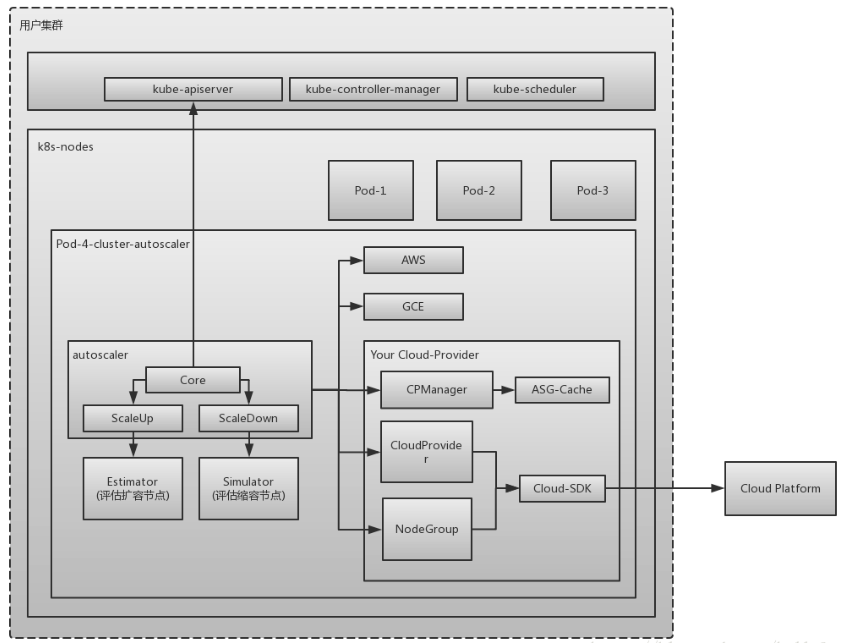
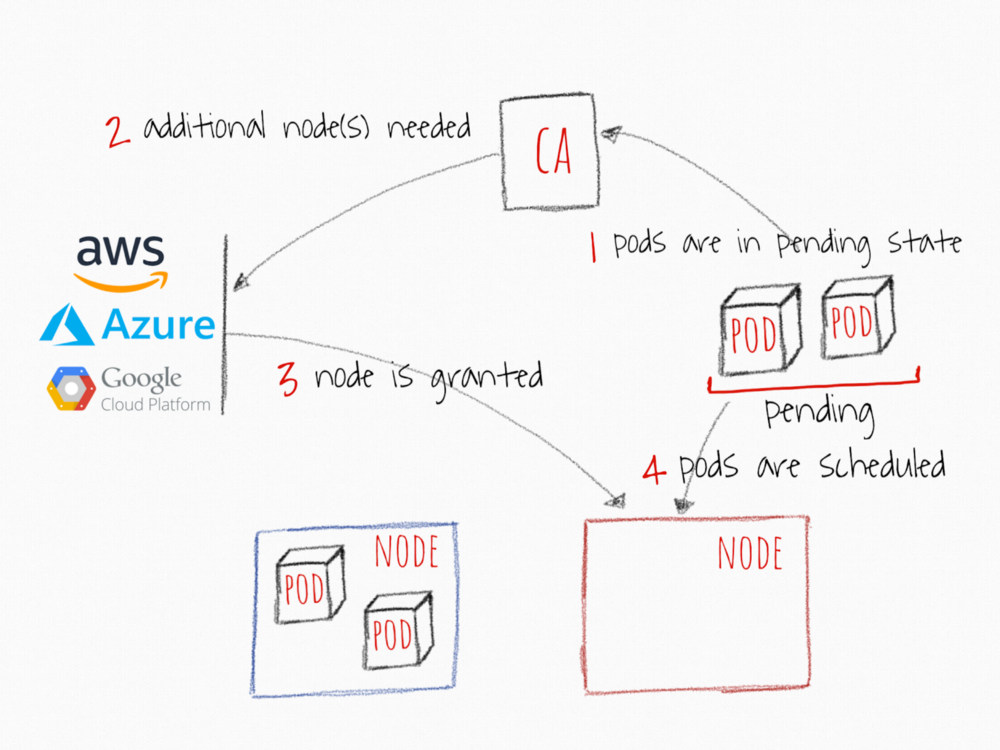
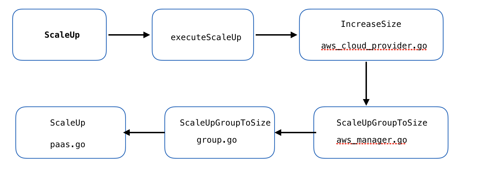

- [HPA](#hpa)
    - [概念及原理](#概念及原理)
    - [Install Metrics-Server](#install-metrics-server)
    - [usage](#usage)
    - [示例配置](#示例配置)
- [VPA](#vpa)
    - [概念及原理](#概念及原理)
    - [安装](#安装)
        - [关于向后兼容性的注意事项](#关于向后兼容性的注意事项)
        - [先决条件](#先决条件)
        - [安装](#安装)
        - [快速开始](#快速开始)
        - [测试您的安装](#测试您的安装)
        - [示例配置](#示例配置)
        - [故障排除](#故障排除)
        - [删除](#删除)
        - [alpha版本的已知限制](#alpha版本的已知限制)
- [CA](#ca)
    - [什么是cluster-autoscaler](#什么是cluster-autoscaler)
        - [什么时候扩？](#什么时候扩)
        - [什么时候缩？](#什么时候缩)
        - [什么样的节点不会被CA删除](#什么样的节点不会被ca删除)
        - [如何防止node被Cluster Autoscaler删除](#如何防止node被cluster-autoscaler删除)
        - [部署方式](#部署方式)
        - [What does CA do?](#what-does-ca-do)
        - [What CA doesn't do?](#what-ca-doesnt-do)
        - [Cluster Autoscaler架构](#cluster-autoscaler架构)
        - [扩容流程](#扩容流程)
        - [如何监控Cluster Autoscaler](#如何监控cluster-autoscaler)
        - [CA集群状态检查](#ca集群状态检查)
        - [部署使用CA](#部署使用ca)
    - [CA代码逻辑解析](#ca代码逻辑解析)
        - [CA 时序图](#ca-时序图)
        - [CA scaldown流程图](#ca-scaldown流程图)
        - [CA scalup流程图](#ca-scalup流程图)
        - [cloudprovider 简单版流程图](#cloudprovider-简单版流程图)
- [kubernetes cluster autoscaler调研与hpa/vpa联动](#kubernetes-cluster-autoscaler调研与hpa/vpa联动)
    - [横向扩容(HPA)](#横向扩容hpa)
    - [纵向扩容(VPA)](#纵向扩容vpa)
    - [集群扩容(Cluster Autoscaler)](#集群扩容cluster-autoscaler)
# HPA

## 概念及原理
利用Horizontal Pod Autoscaling（HPA），kubernetes能够根据监测到的CPU利用率自动的扩缩容 replication controller，deployment和replica set中pod的数量。<br></br>
HPA作为kubernetes API resource和controller 的实现。Resource确定controller的行为。Controller 会根据监测到用户指定的目标的 CPU 利用率周期性地调整 replication controller 或 deployment 的 replica 数量。


HPA由一个控制循环实现，循环周期由controller manager 中的 --horizontal-pod-autoscaler-sync-period标志指定。在每个周期内，controller manager会查询HPA中定义的metric的资源利用率。Controller manager 从 resource metric API（每个 pod 的 resource metric）或者自定义 metric API（所有的metric）中获取 metric。

## Install Metrics-Server

## usage
```
# kubectl autoscale sts apache2 --cpu-percent=50 --min=1 --max=3
```
```
# kubectl get hpa
NAME      REFERENCE             TARGETS   MINPODS   MAXPODS   REPLICAS   AGE
apache2   StatefulSet/apache2   5%/10%    1         2         2          33m
```
```
# kubectl describe hpa apache2

Name:                                                  apache2
Namespace:                                             default
Labels:                                                <none>
Annotations:                                           <none>
CreationTimestamp:                                     Wed, 11 Sep 2019 10:47:42 +0800
Reference:                                             StatefulSet/apache2
Metrics:                                               ( current / target )
  resource cpu on pods  (as a percentage of request):  5% (14m) / 10%
Min replicas:                                          1
Max replicas:                                          2
StatefulSet pods:                                      2 current / 2 desired
Conditions:
  Type            Status  Reason               Message
  ----            ------  ------               -------
  AbleToScale     True    ScaleDownStabilized  recent recommendations were higher than current one, applying the highest recent recommendation
  ScalingActive   True    ValidMetricFound     the HPA was able to successfully calculate a replica count from cpu resource utilization (percentage of request)
  ScalingLimited  False   DesiredWithinRange   the desired count is within the acceptable range
Events:
  Type    Reason             Age   From                       Message
  ----    ------             ----  ----                       -------
  Normal  SuccessfulRescale  89s   horizontal-pod-autoscaler  New size: 2; reason: cpu resource utilization (percentage of request) above target
```
- AbleToScale：表明HPA是否 可以获取和更新伸缩信息，以及是否存在阻止伸缩的各种回退条件
- ScalingActive：表明HPA是否被启用（即目标的副本数量不为零） 以及是否能够完成伸缩计算。当这一状态为False时，通常表明获取度量指标存在问题。
- ScalingLimitted：表明所需伸缩的值被HorizontalPodAutoscaler所定义的最大或者最小值所限制（即已经达到最大或者最小伸缩值）。这通常表明您可能需要调整HorizontalPodAutoscaler 所定义的最大或者最小副本数量的限制了。

## 示例配置
第一步：部署pod、service：
```
$ kubectl run php-apache --image=gcr.io/google_containers/hpa-example --requests=cpu=200m --expose --port=80
service "php-apache" created
deployment "php-apache" created
```
第二步：创建Horizontal Pod Autoscaler：
```
$ kubectl autoscale deployment php-apache --cpu-percent=50 --min=1 --max=10
deployment "php-apache" autoscaled
```
```
$ kubectl get hpa
NAME         REFERENCE                     TARGET    MINPODS   MAXPODS   REPLICAS   AGE
php-apache   Deployment/php-apache/scale   0% / 50%  1         10        1
```
第三步：增加负载：
```
$ kubectl run -i --tty load-generator --image=busybox /bin/sh

Hit enter for command prompt

$ while true; do wget -q -O- http://php-apache.default.svc.cluster.local; done
```
```
$ kubectl get hpa
NAME         REFERENCE                     TARGET      CURRENT   MINPODS   MAXPODS   REPLICAS   AGE
php-apache   Deployment/php-apache/scale   305% / 50%  305%      1         10        1          3m
```
```
$ kubectl get deployment php-apache
NAME         DESIRED   CURRENT   UP-TO-DATE   AVAILABLE   AGE
php-apache   7         7         7            7           19m
```
第四步：停止负载：
```
$ kubectl get hpa
NAME         REFERENCE                     TARGET       MINPODS   MAXPODS   REPLICAS   AGE
php-apache   Deployment/php-apache/scale   0% / 50%     1         10        1          11m

$ kubectl get deployment php-apache
NAME         DESIRED   CURRENT   UP-TO-DATE   AVAILABLE   AGE
php-apache   1         1         1            1           27m
```

# VPA
## 概念及原理
Vertical Pod Autoscaler（VPA）使用户无需为其pods中的容器设置最新的资源request。配置后，它将根据使用情况自动设置request，从而允许在节点上进行适当的调度，以便为每个pod提供适当的资源量。

使用名为VerticalPodAutoscaler的自定义资源定义对象配置自动缩放 。它允许指定垂直自动缩放的pod以及是否/如何应用资源建议。

要在群集上启用vpa，请按照下面介绍的安装步骤进行操作。


## 安装

### 关于向后兼容性的注意事项
在alpha期间，VPA CRD对象可能以不同版本之间的兼容方式发展。如果安装新版本的VPA，最安全的做法是删除现有的VPA CRD对象。请注意，如果您只是使用vpa-down.sh脚本拆除旧的VPA安装，则会自动执行此操作。

### 先决条件
* 强烈建议使用Kubernetes 1.9或更高版本。您的群集必须支持MutatingAdmissionWebhooks，默认情况下自1.9（#58255）启用。了解有关VPA Admission Webhook的更多信息。
* kubectl 应该连接到要安装VPA的群集。
* 必须在群集中部署Metrics Server。阅读有关Metrics Server的更多信息。
* 如果您使用的是GKE Kubernetes群集，则需要授予您当前的Google身份 cluster-admin角色。否则，您将无权授予VPA系统组件额外的权限。

```console
$ gcloud info | grep Account    # get current google identity
Account: [myname@example.org]

$ kubectl create clusterrolebinding myname-cluster-admin-binding --clusterrole=cluster-admin --user=myname@example.org
Clusterrolebinding "myname-cluster-admin-binding" created
```
 *  如果您的群集中已安装了另一版本的VPA，则必须首先删除现有安装：

```
./hack/vpa-down.sh
```

### 安装
要安装VPA，请下载VPA的源代码（例如使用 git clone https://github.com/kubernetes/autoscaler.git）并在vertical-pod-autoscaler目录中运行以下命令：

```
./hack/vpa-up.sh
```

注意：脚本当前读取环境变量：$REGISTRY和$TAG。除非您要使用非默认版本的VPA，否则请确保不设置它们。

该脚本kubectl向集群发出多个命令，这些命令插入配置并在kube-system命名空间中启动所有需要的pod（请参阅 体系结构）。它还会生成并上载VPA Admission Controller在与API服务器通信时使用的机密（CA证书）。

### 快速开始
安装完成后，系统就可以为您的pod建议和设置资源请求。为了使用它，您需要为具有相似资源要求的每个逻辑pod组插入Vertical Pod Autoscaler资源。我们建议为每个要自动控制的部署插入VPA，并使用与部署使用的相同的标签选择器。VPA有三种运作模式：

* "Auto"：VPA在创建pod时分配资源请求，并使用首选更新机制在现有pod上更新它们。目前这相当于"Recreate"（见下文）。一旦重启免费（“in-place”），pod请求的更新可用，"Auto"模式可以被用作优选的更新机制。
* "Recreate"：VPA在创建pod时分配资源请求，并在请求的资源与新建议明显不同时（如果已定义，则遵循Pod中断预算），通过逐出驱动来更新它们。只有在需要确保在资源请求发生更改时重新启动pod时，才应该很少使用此模式。否则更喜欢"Auto"可以利用免重启的更新模式。
* "Initial"：VPA仅在创建pod时分配资源请求，并且以后永远不会更改它们。
* "Off"：VPA不会自动更改pods的资源要求。计算建议并可在VPA对象中检查。


### 测试您的安装
检查Vertical Pod Autoscaler在集群中是否完全可操作的一种简单方法是创建示例部署和相应的VPA配置：

```
kubectl create -f examples/hamster.yaml
```

上面的命令创建了一个包含2个pod的deployment，每个pod运行一个请求100 millicores 的容器，并尝试使用略高于500millicores的容器。该命令还会创建一个VPA配置，其中包含与部署中的pod匹配的选择器。VPA将观察pod的行为，大约5分钟后，他们应该使用更高的CPU请求进行更新（请注意，VPA不会修改部署中的模板，但会更新pod的实际请求）。要查看VPA配置和当前建议的资源请求，请执行:

```
kubectl describe vpa
```

注意：如果您的群集的可用容量很小，则这些容器可能无法安排。您可能需要添加更多节点或调整examples / hamster.yaml以使用更少的CPU。


### 示例配置

```

apiVersion: poc.autoscaling.k8s.io/v1alpha1
kind: VerticalPodAutoscaler
metadata:
  name: my-app-vpa
spec:
  selector:
    matchLabels:
      app: my-app
  updatePolicy:
    updateMode: "Auto"

```

### 故障排除
要诊断VPA安装问题，请执行以下步骤：

检查所有系统组件是否正在运行：
```
kubectl --namespace=kube-system get pods|grep vpa
```

上面的命令应该列出状态为Running的3个pod（推荐者，更新者和准入控制器）。

检查系统组件是否记录任何错误。对于上一个命令返回的每个pod，执行以下操作：
```
kubectl --namespace=kube-system logs [pod name]| grep -e '^E[0-9]\{4\}'
 ```
检查是否已创建VPA自定义资源定义：
```
kubectl get customresourcedefinition|grep verticalpodautoscalers
```
VPA的组成部分
该项目包括3个组成部分：

* Recommender - 它监视当前和过去的资源消耗，并根据它提供推荐值容器的CPU和内存请求。

* Updater - 它检查哪些托管窗格具有正确的资源集，如果没有，则检查它们，以便控制器可以使用更新的请求重新创建它们。

* Admission Plugin - 它在新pod上设置正确的资源请求（由于Updater的活动而刚刚由其控制器创建或重新创建）。


### 删除
请注意，如果您停止在群集中运行VPA，则VPA已修改的pod的资源请求将不会更改，但任何新pod将获取控制器中定义的资源（即部署或复制），而不是根据先前的建议由VPA。

要停止在群集中使用Vertical Pod Autoscaling：

如果在GKE上运行，请清除在先决条件中创建的角色绑定：

```
kubectl delete clusterrolebinding myname-cluster-admin-binding
```
删除VPA组件：
```
./hack/vpa-down.sh
```

### alpha版本的已知限制
* 每当VPA更新pod资源时，都会重新创建pod，这会导致重新启动所有正在运行的容器。可以在不同节点上重新创建pod。
* vpa不应与CPU或内存上的Horizo​​ntal Pod Autoscaler(HPA)一起使用。但是，您可以在自定义和外部指标上使用VPA和HPA。
* Auto模式中的VPA 只能用于在控制器（例如部署）下运行的pod，后者负责重新启动已删除的pod。 在Auto模式下，没有在任何控制器下运行的pod的模式下使用VPA 将导致删除该pod并且不会重新创建该pod。
* VPA准入控制器是一个admission webhook。如果您向群集添加其他admission webhook，则必须分析它们之间的交互方式以及它们是否可能相互冲突。准入控制器的顺序由APIserver上的标志定义。
* VPA会对某些内存不足事件做出反应，但并非在所有情况下都会发生。
* VPA性能尚未在大型集群中进行测试。
* VPA建议可能会超出可用资源（例如节点大小，可用大小，可用配额）并导致pod进入待处理状态。这可以通过将VPA与Cluster Autoscaler一起使用来解决。
* 与同一个pod匹配的多个VPA资源具有未定义的行为。


相关链接

[FQA](https://github.com/kubernetes/autoscaler/blob/master/vertical-pod-autoscaler/FAQ.md)

[设计方案](https://github.com/kubernetes/community/blob/master/contributors/design-proposals/autoscaling/vertical-pod-autoscaler.md)

[API定义](https://github.com/kubernetes/autoscaler/blob/master/vertical-pod-autoscaler/pkg/apis/autoscaling.k8s.io/v1beta2/types.go)

[GitHub](https://github.com/kubernetes/autoscaler/blob/master/vertical-pod-autoscaler/README.md)

# CA

## 什么是cluster-autoscaler
CA[cluster-autoscaler](https://github.com/kubernetes/autoscaler/tree/master/cluster-autoscaler)是用来弹性伸缩kubernetes集群的。我们在使用kubernetes集群经常问到的一个问题是，我应该保持多大的节点规模来满足应用需求呢？ cluster-autoscaler的出现解决了这个问题，它可以自动的根据部署的应用所请求的资源量来动态的伸缩集群

### 什么时候扩？
由于资源不足，pod调度失败，导致pod处于pending状态时
### 什么时候缩？
node的资源利用率较低时，且此node上存在的pod都能被重新调度到其他节点

### 什么样的节点不会被CA删除
* 节点上有pod被PodDisruptionBudget控制器限制。
* 节点上有命名空间是kube-system的pods。
* 节点上的pod不是被控制器创建，例如不是被deployment, replica set, job, stateful set创建。
* 节点上有pod使用了本地存储
* 节点上pod驱逐后无处可去，即没有其他node能调度这个pod
* 节点有注解：”cluster-autoscaler.kubernetes.io/scale-down-disabled”: “true”

### 如何防止node被Cluster Autoscaler删除
kubectl annotate node  cluster-autoscaler.kubernetes.io/scale-down-disabled=true
### 部署方式
deployment
### What does CA do?

Monitor the state of the cluster
Look for pending pods
Simulate scheduler
Resize NodeGroups based on result of simulations

### What CA doesn't do?

Register nodes in kubernetes
Configure nodes in any way
Put any labels or taints on new nodes
Look at actual resource usage
Support custom scheduling
Predictive autoscaling

### Cluster Autoscaler架构


autoscaler：核心模块，负责整体扩缩容功能
Estimator：负责评估计算扩容
Simulator：负责模拟调度，计算缩容
Cloud Provider：抽象了CloudProvider及NodeGroup等相关接口，与云API交互

### 扩容流程


Cluster autoscaler每10s检查是否有pod处于pending状态
当发现有pod由于资源不足而处于pending状态，Cluster Autoscaler准备进行node的储备
由cloud provider创建node，node加入集群，进入ready状态

Scale-up启动一个API监听的服务，每10s(--scan-interval)检查因为无node可调度导致pending的pods，即unschedulable pods，PodCondition=false，reason=unschedulable。CA假设集群是基于node groups，同个node group里的机器具有相同的性能和同样的labesl集。基于这个袈裟，CA为每个node group创建一个template nodes。
Expander：用于根据策略决定scale up哪个node group。
新node拉取之后需要一些时间才能被注册到kubernetes，依赖于cloud provider和部署的时间。CA希望node在集群中的等待时间在15m之内（max-node-provision-time）。如果未如期注册，scale up会拉起新node并移除未注册的node

### 如何监控Cluster Autoscaler
CA metrics
/metrics
/health-check

### CA集群状态检查


/var/log/cluster-autoscaler.log

kubectl get configmap cluster-autoscaler-status -n kube-system -o yaml

Events

on pods (特别是unscheduled pods)
on nodes
on kube-system/cluster-autoscaler-status config map


kubectl get events -n kube-system | grep cluster-autoscaler-status


### 部署使用CA
直接在集群中部署即可，简化的yaml如下所示，启动参数按需添加，其中{{MIN}}是最小节点数，{{MAX}}是最大节点数
```
apiVersion: extensions/v1beta1
kind: Deployment
metadata:
  name: cluster-autoscaler
  labels:
    k8s-app: cluster-autoscaler
spec:
  replicas: 1
  selector:
    matchLabels:
      k8s-app: cluster-autoscaler
  template:
    metadata:
      labels:
        k8s-app: cluster-autoscaler
    spec:
      containers:
        - image: cluster-autoscaler:latest
          name: cluster-autoscaler
          command:
            - ./cluster-autoscaler
            - --nodes={{MIN}}:{{MAX}}:k8s-worker-asg-1
```


## CA代码逻辑解析
### CA 时序图


### CA scaldown流程图


### CA scalup流程图




### cloudprovider 简单版流程图


# kubernetes cluster autoscaler调研与hpa/vpa联动

Kubernetes作为容器编排工具，应用部署在集群中，应用的负载本身是会随着时间动态发生变化的，为了更好的平衡资源使用率以及性能，kubernetes引入了autoscaler。可以根据应用负载的情况动态的扩缩容资源
Kubernetes的autoscaler分成两个层次:

* pod级别的扩容，包含横向扩容(HPA)以及纵向扩容(VPA),扩容容器可用的资源使用量。
* 集群级别的扩容，通过CA(Cluster Autoscaler)来控制扩容或者缩小集群中Node的数量。集群级别的扩容，通过CA(Cluster Autoscaler)来控制扩容或者缩小集群中Node的数量。

## 横向扩容(HPA)

扩容pod的副本数，通过容器的CPU以及Ｍemory来触发扩容或者缩容操作，并且支持自定义指标、多个指标甚至是外部的指标来作为触发扩容或者缩容操作的条件。
HPA的工作流


* HPA每隔30sec来检查指标的值
* 如果SPECIFIFD 阈值满足条件将会增加pod副本的数量
* HPA主要更新deployment/replication controller控制器对象的副本数
* Deployment/replication controller将会创建出来额外需要的pods


当使用HPA的时候需要注意的地方

* HPA检查周期为30s可以通过设置controller manager的horizontal-pod-autoscaler-sync-period参数来改变
* 默认的HPA相对指标公差为10%
* HPA在最后一次扩容事件后等待3分钟，以使指标稳定下来。可通过 - horizontal-pod-autoscaler-upscale-delay参数来配置
* HPA从最后一次缩容事件开始等待5分钟，以避免自动调节器抖动。可通过 - horizontal-pod-autoscaler-downscale-delay参数来配置
* 相对于replication controller而言，ｈｐａ更加适合与deployment一起配置工作


## 纵向扩容(VPA)

Vertical Pods Autoscaler（VPA）为现有pod分配更多（或更少）的CPU或内存。它可以适用于有状态和无状态的pod，但它主要是为有状态服务而构建的。但是，如果您希望实现最初为pod分配的资源的自动更正，则可以将其用于无状态容器。VPA还可以对OOM（内存不足）事件做出反应。VPA当前要求重新启动pod以更改已分配的CPU和内存。当VPA重新启动pod时，它会考虑pods分发预算（PDB）以确保始终具有所需的最小pod数。您可以设置VPA可以分配给任何pod的资源的最小值和最大值。例如，您可以将最大内存限制限制为不超过8 GB。当您知道当前节点无法为每个容器分配超过8 GB时，这尤其有用。

VPA还有一个名为VPA Recommender的有趣功能。它监视所有pod的历史资源使用情况和OOM事件，以建议request资源的新值。推荐器使用一些智能算法来根据历史指标计算内存和CPU值。它还提供了一个API，通过它可以获取pod描述符并提供建议的request值。

值得一提的是，VPA推荐者不会设置资源的limit值。这可能导致pod垄断节点内的资源。建议你在namespac级别设置一个“限制”值，以避免疯狂消耗内存或CPU

VPA工作流


VPA每隔１０ｓ检查指标的值
* 当阈值达到的时候，VPA尝试修改分配的memory和CPU
* VPA主要是更新deployment或者replication controller specs中的resources定义
* 当Pod重启的时候，所有请求的资源得到调整
使用VPA的时候需要注意点

* 如果不重新启动pod，则无法进行资源更改。到目前为止主要理性，就是这种变化可能会造成很多不稳定。因此，想要重新启动pod并根据新分配的资源进行调度。
* VPA和HPA尚未相互兼容，无法在相同的pod上运行。如果您在同一群集中使用它们，请确保将它们的范围分开。
* VPA仅根据观察到的过去和当前资源使用情况调整容器的资源请求。它没有设置资源限制。对于行为不端的应用程序而言，这可能会出现问题，这些应用程序开始使用越来越多的资源导致pod被Kubernetes杀死。


## 集群扩容(Cluster Autoscaler)

Cluster Autoscaler（CA）根据pending状态的pod来扩展您的群集节点。它会定期检查是否有pending状态的pod，如果需要更多资源并且扩展后的群集仍在用户提供的约束范围内，则会增加群集的大小。CA与云提供商接口以请求更多节点或释放空闲节点。它适用于GCP，AWS和Azure。版本1.0（GA）与kubernetes 1.8一起发布。

CA工作流


* CA每隔10s检查以下pending状态的容器
* 如果存在因为资源不足导致pending状态的pod存在的时候，尝试创建一个或多个nodes
* 当node是被cloud provider所管理的，node将会被添加到集群中，成为ready的节点来创建pod
* Kubernetes调度器分配pending状态的pods到新的node节点上。如果一些pod仍然处于pending状态，这个过程将会继续，将会有更多的nodes添加到集群中

CA使用的时候注意事项

* Cluster Autoscaler确保群集中的所有pod都有一个可以运行的位置，无论是否有任何CPU负载。此外，它会尝试确保群集中没有不需要的节点。（资源）
* CA在大约30秒内实现了可扩展性需求。
* 在节点变为不需要之前，CA默认等待10分钟，然后再缩小节点。
* CA具有扩展器的概念。扩展器提供了不同的策略来选择要添加新节点的节点组。
* 负责任地使用"cluster-autoscaler.kubernetes.io/safe-to-evict"："true"。如果您设置了所有节点上的许多pod或足够的pod，则会失去很大的缩小灵活性。
* 使用PodDisruptionBudgets可以防止删除pod并使应用程序的一部分完全无法运行。

Kubernetes autoscalers交互一起怎么工作
如果您希望自动扩展您的Kubernetes集群，则需要在CA中使用pod层自动缩放器。他们彼此合作的方式相对简单，如下图所示。


* HPA或者VPA来更新已经存在的pod副本数或者使用的resources
* 如果没有足够的节点在可伸缩性事件后运行pod，则CA会发现部分或全部已缩放的pod处于挂起状态的事实。
* CA扩容新的node到集群中
* Pods将会被调度到被新管理的node上

常见的错误
我在不同的论坛上看过，比如Kubernetes　slack和StackOverflow问题，由于一些事实导致的常见问题，许多DevOps错过了自动缩放器。
HPA和VPA依赖于指标和一些历史数据。如果您没有分配足够的资源，您的pod将被OOM杀死，并且永远不会有机会生成指标。在这种情况下，pods上的扩展器可能永远不会发生。扩容是时间敏感的操作。在用户遇到应用程序中的任何中断或崩溃之前，您希望您的pod和群集能够相当快地扩展。您应该考虑容器和群集扩展的平均时间。

最佳案例场景－４分钟

* 30秒 - 目标指标值更新：30-60秒
* 30秒 - HPA检查指标值：30秒 - >30秒 - HPA检查指标值：30秒 - >
* <2秒 - Pods创建之后进入pending状态<2秒　－Pods创建之后进入pending状态
* <2秒 - CA看到pending状态的pods，之后调用来创建node 1秒<2秒　－CA看到pending状态的pods，之后调用来创建node 1秒
* 3分钟 - cloud provider创建node，之后加入k8s之后等待node变成ready,上线是10分钟
(合理)最糟糕的情况 - 12分钟

* 60 秒 —目标指标值更新
* 30 秒 — HPA检查指标值
* < 2 秒 — Pods创建之后进入pending状态
* < 2 秒 —CA看到pending状态的pods，之后调用来创建node 1秒
* 10 分钟 — cloud provider创建ｎｏｄｅ，之后加入ｋ8s之后等待node变成ready,上线是10分钟

 不要将云提供程序可伸缩性机制与CA混淆。CA在集群内部工作，而云提供商的可扩展性机制（例如AWS内部的ASG）基于节点分配工作。它不知道您的pod或应用程序正在发生什么。一起使用它们会使您的群集不稳定并且难以预测行为。


相关链接

[CA Events](https://github.com/kubernetes/autoscaler/blob/master/cluster-autoscaler/FAQ.md#what-events-are-emitted-by-ca)

[参数解析](https://github.com/kubernetes/autoscaler/blob/master/cluster-autoscaler/FAQ.md#what-are-the-parameters-to-ca)

[如何开发CA](https://github.com/kubernetes/autoscaler/blob/master/cluster-autoscaler/FAQ.md#what-events-are-emitted-by-ca)
