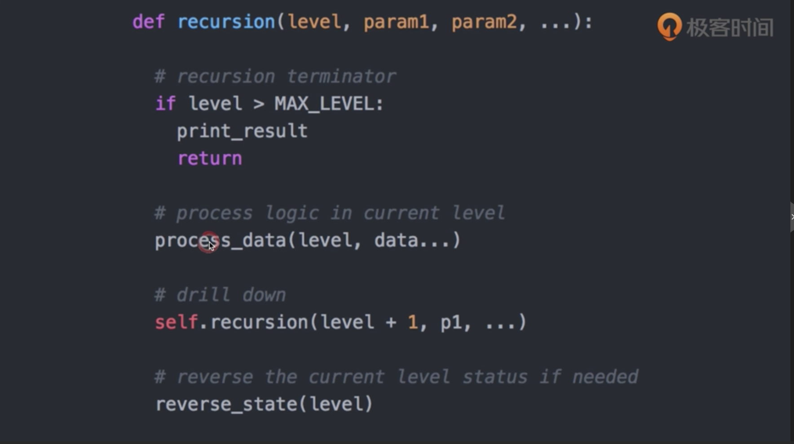
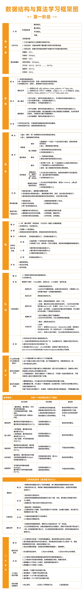

# algorithm

* [数据结构与算法](algorithm.md#数据结构与算法)
  * [BFS:](algorithm.md#bfs)
  * [DFS:](algorithm.md#dfs)
  * [recursion:](algorithm.md#recursion)
  * [binary search:](algorithm.md#binary-search)
  * [DP:](algorithm.md#dp)
  * [DP-summary:](algorithm.md#dp-summary)
  * [总结1:](algorithm.md#总结1)
  * [未完](algorithm.md#未完)

    **数据结构与算法**

这一部分就不做总结了， 因为实在太基础又重要，不是几万字能理清楚的。进阶我觉得可以从几方面入手吧， 多刷题， 多刷题解， 多刷初级和中级，具体咋玩可以自行选择吧

[http://leetcode.com/](http://leetcode.com/)

[https://leetcode-cn.com/](https://leetcode-cn.com/)

[fucking-algorithm](https://github.com/labuladong/fucking-algorithm)

[Algorithms Python](https://github.com/TheAlgorithms/Python)

这里就贴一下算法的技巧吧，

### BFS:

### DFS:

### recursion:

### binary search:

### DP:

### DP-summary:

### 总结1:

### 未完

