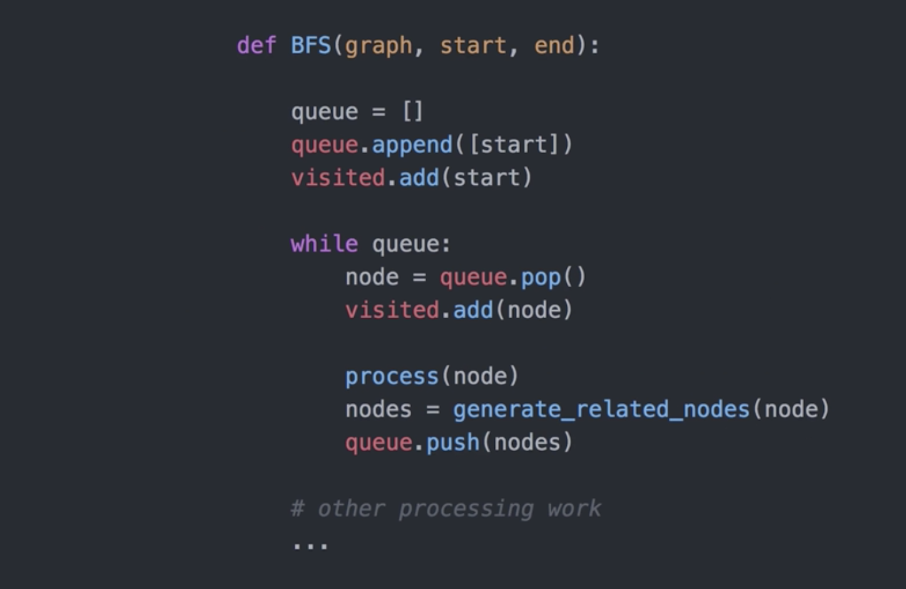
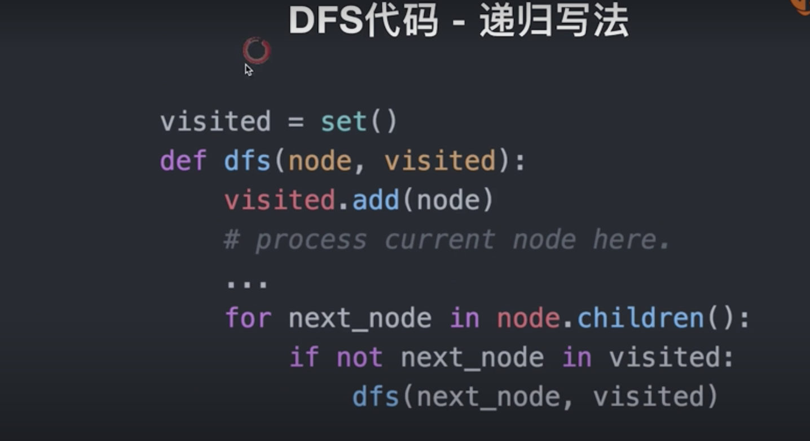
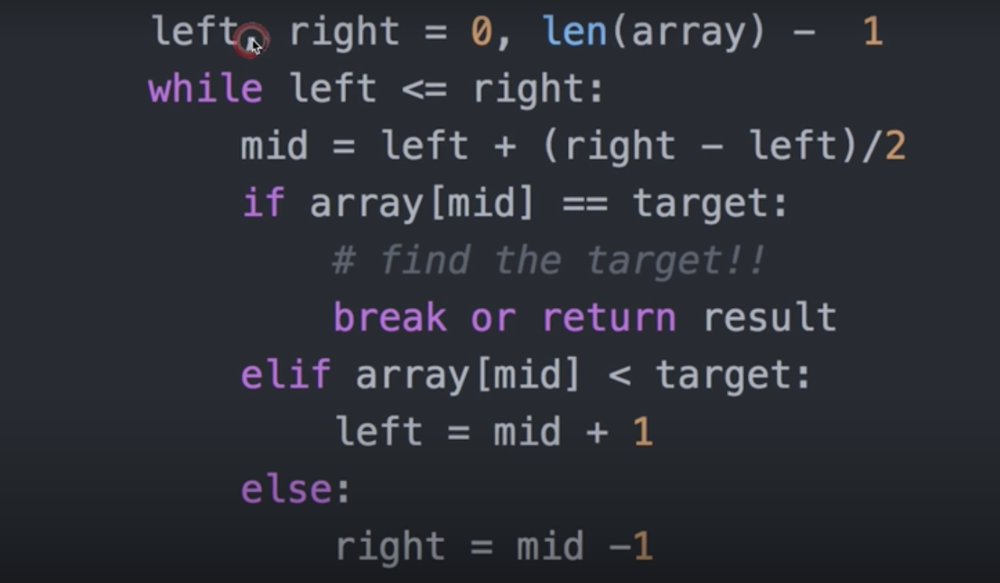
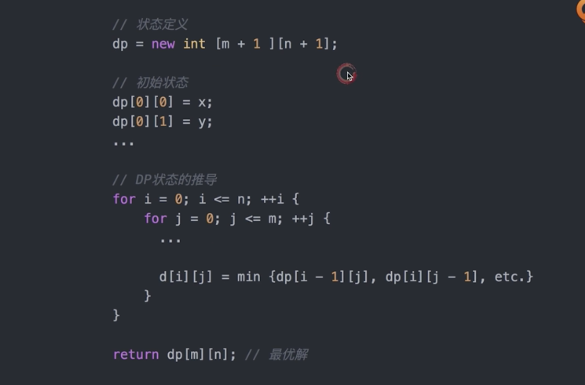

- [数据结构与算法](#数据结构与算法)
    - [BFS:](#bfs)
    - [DFS:](#dfs)
    - [recursion:](#recursion)
    - [binary search:](#binary-search)
    - [DP:](#dp)
    - [DP-summary:](#dp-summary)
    - [总结1:](#总结1)
    - [未完](#未完)
# 数据结构与算法

这一部分就不做总结了， 因为实在太基础又重要，不是几万字能理清楚的。进阶我觉得可以从几方面入手吧， 具体咋玩可以自行选择吧

http://leetcode.com/

https://leetcode-cn.com/

[fucking-algorithm](https://github.com/labuladong/fucking-algorithm)

[Algorithms Python](https://github.com/TheAlgorithms/Python)

这里就贴一下算法的技巧吧，

## BFS:

## DFS:

## recursion:

## binary search:

## DP:

## DP-summary:

## 总结1:

## 未完
