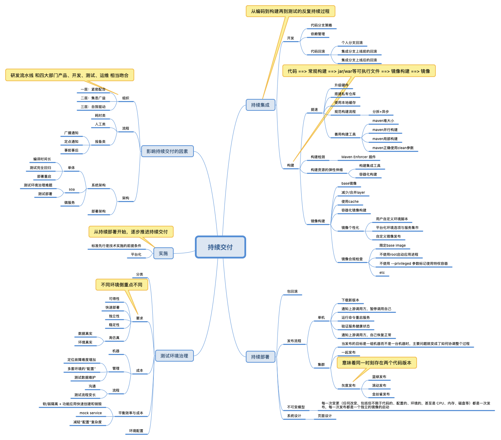
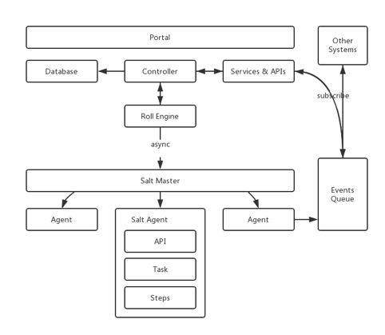
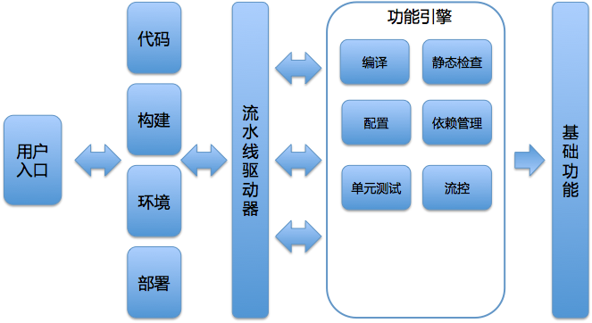
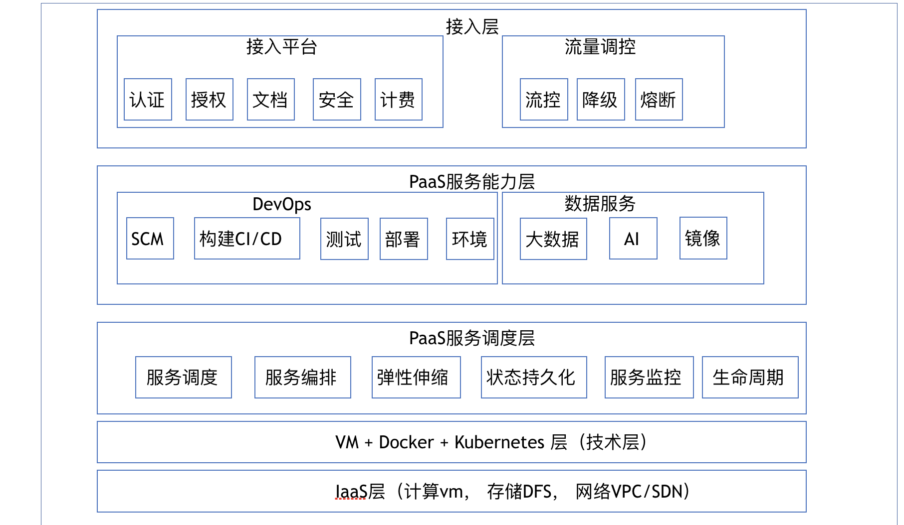

# cicd

* [持续交付](cicd.md#持续交付)
  * [扫盲概念篇](cicd.md#扫盲概念篇)
    * [持续集成、持续交付和持续部署的关系](cicd.md#持续集成持续交付和持续部署的关系)
    * [DevOps](cicd.md#devops)
  * [代码](cicd.md#代码)
    * [代码分支策略](cicd.md#代码分支策略)
      * [主干分支](cicd.md#主干分支)
      * [特性分支](cicd.md#特性分支)
    * [代码回滚](cicd.md#代码回滚)
  * [构建](cicd.md#构建)
    * [如何做到构建的提速](cicd.md#如何做到构建的提速)
      * [升级硬件资源](cicd.md#升级硬件资源)
      * [搭建私有仓库](cicd.md#搭建私有仓库)
      * [使用本地缓存](cicd.md#使用本地缓存)
      * [规范构建流程](cicd.md#规范构建流程)
    * [CI](cicd.md#ci)
      * [Travis CI](cicd.md#travis-ci)
      * [CircleCI](cicd.md#circleci)
      * [Jenkins CI](cicd.md#jenkins-ci)
  * [容器](cicd.md#容器)
    * [容器重新定义交付标准](cicd.md#容器重新定义交付标准)
    * [容器镜像的个性化及合规检查](cicd.md#容器镜像的个性化及合规检查)
      * [自定义环境脚本](cicd.md#自定义环境脚本)
      * [镜像安全合规检查](cicd.md#镜像安全合规检查)
  * [发布CD](cicd.md#发布cd)
    * [几种常见的灰度方式](cicd.md#几种常见的灰度方式)
    * [发布系统的核心架构和功能设计](cicd.md#发布系统的核心架构和功能设计)
    * [发布系统核心模型](cicd.md#发布系统核心模型)
    * [发布流程及状态流转](cicd.md#发布流程及状态流转)
      * [刹车机制](cicd.md#刹车机制)
      * [提升发布速度](cicd.md#提升发布速度)
      * [降级机制](cicd.md#降级机制)
  * [如何利用监控保障发布质量](cicd.md#如何利用监控保障发布质量)
  * [平台化](cicd.md#平台化)

    **持续交付**

### 扫盲概念篇

持续交付是，提升软件交付速率的一套工程方法和一系列最佳实践的集合。它的关注点可以概括为：持续集成构建、测试自动化和部署流水线。

#### 持续集成、持续交付和持续部署的关系

我们通把软件研发工作拆解，拆分成不同模块或不同团队后进行编码，编码完成后，进行集成构建和测试。这个从编码到构建再到测试的反复持续过程，就叫作“持续集成”。

“持续集成”一旦完成，则代表产品处在一个可交付状态，但并不代表这是最优状态，还需要根据外部使用者的反馈逐步优化。当然这里的使用者并不一定是真正的用户，还可能是测试人员、产品人员、用户体验工程师、安全工程师、企业领导等等。 这个在“持续集成”之后，获取外部对软件的反馈再通过“持续集成”进行优化的过程就叫作“持续交付”，它是“持续集成”的自然延续。

那“持续部署”又是什么呢？软件的发布和部署通常是最艰难的一个步骤。 而“持续部署”就是将可交付产品，快速且安全地交付用户使用的一套方法和系统，它是“持续交付”的最后“一公里”。

#### DevOps

* DevOps是一组技术，包括：自动化运维、持续交付、高频部署、Docker等内容。
* DevOps是一个职能，这也是我在各个场合最常听到的观点
* DevOps是一种文化，推倒Dev与Ops之间的阻碍墙
* DevOps是一种组织架构，将Dev和Ops置于一个团队内，一同工作，同化目标，以达到 DevOps文化地彻底贯彻

### 代码

#### 代码分支策略

**主干分支**

**特性分支**

* Github flow
* Git Flow
* GitLab Flow

#### 代码回滚

* 包回滚是指，线上运行的系统，从现在的版本回滚到以前稳定的老版本。
* 代码回滚是指，Git分支的指针（游标），从指向当前有问题的版本改为指向一个该分支历史树上没问题的版本，而这个版本可以是曾经的commit，也可以是新建的commit。

### 构建

#### 如何做到构建的提速

**升级硬件资源**

硬件资源包括 CPU、内存、磁盘、网络等等，具体升级哪一部分，需要具体情况具体分析

**搭建私有仓库**

* 使用 createrepo 搭建CentOS 的 yum 仓库；
* 使用 Nexus 搭建 Java 的 Maven 仓库；
* 使用cnpm搭建 NodeJS 的 npm 仓库；
* 使用 pypiserver 搭建 Python 的 pip 仓库；
* 使用 GitLab 搭建代码仓库；
* 使用 Harbor 搭建 Docker 镜像仓库

**使用本地缓存**

主要包括以下两个方面：

对于变化的内容，增量下载；

对于不变的内容，不重复下载。

目前，很多工具都已经支持这两点了。

对于第一点，项目的源码是经常变化的内容，下载源码时，如果你使用 Git 进行增量下载，那么就不需要在每次构建时都重复拉取所有的代码。Jenkins 的 Git 插件，也默认使用这种方式。

对于第二点，Maven 每次下载依赖后都会在本地磁盘创建一份依赖的拷贝，在构建下载之前会先检查本地是否已经有依赖的拷贝，从而达到复用效果。并且，这个依赖的拷贝是公共的，也就是说每个项目都可以使用这个缓存，极大地提升了构建效率。

如果你使用 Docker，那么你可以在宿主机上 mount 同一个依赖拷贝目录到多个 Slave 容器上，这样多个容器就可以共享同一个依赖拷贝目录。你可以最大程度地利用这一优势，但要注意不要让宿主机的磁盘 I/O 达到瓶颈。

**规范构建流程**

以Java 构建为例，Enforcer 检查、框架依赖检查、Sonar 检查、单元测试、集成测试这些步骤，并没有放在同一个构建过程中同步执行，而是通过异步的方式穿插在 CI/CD 当中，甚至可以在构建过程之外执行。

比如， Sonar 扫描在代码集成阶段执行，用户在 GitLab 上发起一个合并请求（Merge Request），这时只对变更的代码进行对比 Sonar 扫描，只要变更代码检查没有问题，那么就可以保证合并之后主干分支的代码也是没问题的。

#### CI

持续集成工具，最流行的应属 Travis CI、Circle CI、Jenkins CI这三种

**Travis CI**

Travis CI 是基于GitHub的CI托管解决方案之一，由于和GitHub的紧密集成，在开源项目中被广泛使用。

Travis CI 的构建，主要通过 .travis.yml 文件进行配置。这个 .travis.yml 文件描述了构建时所要执行的所有步骤。

另外，Travis CI 可以支持市面上绝大多数的编程语言。但是，因为Travis只支持GitHub，而不支持其他代码托管服务，所以官方建议在使用前需要先具备以下几个条件：

能登录到GitHub；

对托管在GitHub上的项目有管理员权限；

项目中有可运行的代码；

有可以工作的编译和测试脚本。

Travis CI的收费策略是，对公共仓库免费，对私有仓库收费。

**CircleCI**

CircleCI 是一款很有特色，也是比较流行的，云端持续集成管理工具。CircleCI 目前也仅支持 GitHub 和Bitbucket管理。

CircleCI 与其他持续集成工具的区别在于，它们提供服务的方式不同。CircleCI 需要付费的资源主要是它的容器。

**Jenkins CI**

Jenkins 是一款自包含、开源的用于自动化驱动编译、测试、交付或部署等一系列任务的自动化服务，它的核心是Jenkins Pipline 。Jenkins Pipline可以实现对持续交付插件的灵活组合，以流水线的方式接入到Jenkins服务。

Jenkins 还提供了一整套可扩展的工具集，程序员可以通过代码的方式，定义任何流水线的行为。另外，经过多年的发展，Jenkins已经包含了很多实用的第三方插件，覆盖了持续交付的整个生命周期。

目前，绝大多数组织都选择了 Jenkins 作为内部的持续集成工具，主要原因是：

代码开源， 插件完善，系统稳定； 社区活跃，成功实践与网上资源比较丰富； Jenkins Pipeline 非常灵活好用。 大致了解了集成工具之后，携程和绝大部分企业一样，选择了最开放、最易于扩展的Jenkins作为集成构建的引擎，而且分别从实现横向的Master高可用和纵向的Slave弹性伸缩两方面，使构建系统更为强大和高效。

### 容器

#### 容器重新定义交付标准

* 交付结果一致
* 交付自动化
* 交付个性化
* 交付版本控制

#### 容器镜像的个性化及合规检查

**自定义环境脚本**

我们允许用户在编译后的代码包内放入包含自定义环境脚本的 .paas 目录（这是一个自定义的隐藏目录），来满足用户对环境的个性化需求。

这个.paas目录中，可能会存在build-env.sh和image-env.sh两个文件，分别运行于构建代码和构建镜像的过程中。

其中，build-env.sh是在构建代码之前运行，image-env.sh是在构建镜像的时候插入到我们规范的 Dockerfile 中，从而被打到容器内部。

这样就不仅可以满足用户对发布的镜像的个性化需求，同时还能满足对构建代码镜像的个性化需求。

比如，某个Python应用依赖一些动态链接库，那么这个依赖在构建代码和构建镜像环节都是必须的。这时，用户就需要在 build-env.sh和 image-env.sh这两个文件中都写入安装依赖的步骤，构建系统会在不同阶段判断是否有这两个文件，如果有就运行。

通常情况下，自定义环境脚本的方式，可以满足大部分用户的普通需求。但是，这个方式有两个缺点：

构建镜像需要用完就删，因为我们无法感知用户在构建中修改了什么内容，是否会对下一次构建产生影响。这就要求每次构建都要生成新的容器，会在一定程度上降低构建性能。

如果多个项目有同样的需求，那么这些项目就都要引用这个脚本文件，不但啰嗦，而且后面也不好维护，如果脚本内容变化，还需要通知所有引用的项目都改一遍。

好的工具就是要解决用户的一切痛点，因此针对第二个问题，我们在系统上通过平台化环境选项和服务集市的方式做了统一处理。

* 平台化环境选项与服务集市；

  像JaCoCo这样的复杂功能，我们会抽象成服务，供用户使用。他们只要在构建镜像时选择对应的服务，和该服务起效的环境就可以了。

* 自定义镜像发布。

**镜像安全合规检查**

当构建系统 Push 一个新的镜像或者用户 Push 一个自定义镜像之后，Harbor 会自动触发 CoreOS Clair 进行镜像安全扫描。Clair 会对每个容器 Layer 进行扫描，并且对那些可能成为威胁的漏洞发出预警

Clair 是一种静态检查，但对于动态的情况就显得无能为力了。所以，对于镜像的安全规则我还总结了如下的一些基本建议：

基础镜像来自于 Docker 官方认证的，并做好签名检查；

不使用 root 启动应用进程；

不在镜像保存密码，Token 之类的敏感信息；

不使用 --privileged参数标记使用特权容器；

安全的 Linux 内核、内核补丁。如 SELinux，AppArmor，GRSEC等。

### 发布CD

#### 几种常见的灰度方式

灰度发布中最头疼的是如何保持服务的向后兼容性，发现苗头不对后如何快速切回老的服务。这在微服务场景中，大量服务相互依赖，A回滚需要B也回滚，或是A的新API测试需要B的新API时十分头疼。为了解决这些问题，业界基于不同的服务治理状况，提出了不同的灰度理念。

蓝绿发布，是先增加一套新的集群，发布新版本到这批新机器，并进行验证，新版本服务器并不接入外部流量。此时旧版本集群保持原有状态，发布和验证过程中老版本所在的服务器仍照常服务。验证通过后，流控处理把流量引入新服务器，待全部流量切换完成，等待一段时间没有异常的话，老版本服务器下线。

这种发布方法需要额外的服务器集群支持，对于负载高的核心应用机器需求可观，实现难度巨大且成本较高。 蓝绿发布的好处是所有服务都使用这种方式时，实际上创造了蓝绿两套环境，隔离性最好、最可控，回滚切换几乎没有成本。 滚动发布，是不添加新机器，从同样的集群服务器中挑选一批，停止上面的服务，并更新为新版本，进行验证，验证完毕后接入流量。重复此步骤，一批一批地更新集群内的所有机器，直到遍历完所有机器。 这种滚动更新的方法比蓝绿发布节省资源，但发布过程中同时会有两个版本对外提供服务，无论是对自身或是调用者都有较高的兼容性要求，需要团队间的合作妥协。但这类问题相对容易解决，实际中往往会通过功能开关等方式来解决。

金丝雀发布，从集群中挑选特定服务器或一小批符合要求的特征用户，对其进行版本更新及验证，随后逐步更新剩余服务器。这种方式，比较符合携程对灰度发布的预期，但可能需要精细的流控和数据的支持，同样有版本兼容的需求。

结合实际情况，携程最终选择的方式是：综合使用滚动发布和金丝雀发布。

#### 发布系统的核心架构和功能设计

Roll Engine，即发布引擎，主要负责创建发布批次，按批次粒度实施部署策略，通过异步方式调用Salt Master服务，再分发到各个Agent节点上执行部署任务。真正的单机部署脚本会根据不同的应用或机型进行分发和定制。而 Controller ，则作为接收外部指令和读写数据的控制器。当然，对于一些对外的通知事务，发布系统会采用消息机制向外广播。

发布系统需要将发布相关的元数据信息（主要包括App应用、Group集群、Server服务器等），从外部CMDB资产数据库落地到本地数据库，作为一层本地缓存。

数据更新的方式，主要有两种，一种是在每次发布前更新，另一种是通过消费通知消息进行更新，以保证发布元数据的准确性。

根据携程发布系统结构设计的经验，我总结了几个需要注意的点：

每台服务实例上的发布脚本一旦产生则不再修改，以达到不可变模型的要求；

发布引擎和Salt Master之间采用异步通信，但为增强系统健壮性，要有同步轮询的备案；

面对频繁的信息获取，要善用缓存，但同时也一定要慎用缓存，注意发布信息的新鲜度。

#### 发布系统核心模型

发布系统的核心模型主要包括Group、DeploymentConfig、Deployment、DeploymentBatch，和DeploymentTarget这5项。

Group，即集群，一组相同应用的实例集合，是发布的最小单元，其概念如图2所示。

同时，Group的属性非常重要，包括Site站点、Path虚拟路径、docBase物理路径、Port应用端口、HealthCheckUrl健康检测地址等，这些属性都与部署逻辑息息相关。携程之所以这样设计，是因为group这个对象直接表示一个应用的一组实例，这样既可以支持单机单应用的部署架构，也可以支持单机多应用的情况。

* DeploymentConfig，即发布配置，提供给用户的可修改配置项要通俗易懂，包括：单个批次可拉出上限比、批次间等待时间、应用启动超时时间、是否忽略点火。
* Deployment，即一个发布实体，主要包括Group集群、DeploymentConfig发布配置、Package发布包、发布时间、批次、状态等等信息。
* DeploymentBatch，即发布批次，通常发布系统选取一台服务器作为堡垒批次，集群里的其他服务器会按照用户设置的单个批次可拉出上限比划分成多个批次，必须先完成堡垒批次的发布和验证，才能继续其他批次的发布。
* DeploymentTarget，即发布目标服务器或实例，它与该应用的Server列表中的对象为一对一的关系，包括主机名、IP地址、发布状态信息。

这里一定要注意，发布系统的对象模型和你所采用的部署架构有很大关系。 比如，携程发布系统的设计中并没有pool这个对象，而很多其他企业却采用pool实现对实例的管理。又比如，在针对Kubernetes时，我们也需要根据它的特性，针对性地处理Set对象等等。

#### 发布流程及状态流转

发布系统的主流程大致是：

同一发布批次中，目标服务器并行发布；不同发布批次间则串行处理。每台目标服务器在发布流程中的五个阶段包括 Markdown、Download、Install、Verify、Markup。

如图3描绘了具体的发布流程。 

发布过程从技术实现上来说，就是通过状态机控制状态流转，而每个状态都对应一些具体的操作。

那么，我们就一起来看看整个状态流转如何通过状态机进行控制：

首先，借助于Celery分布式任务队列的Chain函数，发布系统将上述的Markdown、Download、Install、Verify、Markup五个阶段定义为一个完整的链式任务工作流，保证一个Chain函数里的子任务会依次执行。

其次，每个子任务执行成功或失败，都会将DeploymentTarget设置为对应的发布状态。 例如，堡垒批次中的DeploymentTarget执行到Verify点火这个任务时，如果点火验证成功，那么DeploymentTarget会被置为VERIFY\_SUCCESS（点火成功）的状态，否则置为VERIFY\_FAILURE（点火失败）的状态。

发布过程中，如果有任意一台DeploymentTarget发布失败，都会被认为是发布局部失败，允许用户重试发布。因此，重试发布只针对于有失败的服务器批次进行重试，对于该批次中已经发布成功的服务器，发布系统会对比当前运行版本与发布目标版本是否一致，如果一致且点火验证通过的话，则直接跳过。

这里需要注意的是， 堡垒批次不同于其他批次：堡垒批次中DeploymentTarget的Chain的最后一个子任务是Verify点火，而不是Markup。

再次，点火验证成功，DeploymentTarget的状态流转到VERIFY\_SUCCESS后，需要用户在发布系统页面上触发Baking操作，即堡垒批次中DeploymentTarget的Markup，此时执行的是一个独立的任务事务，会将堡垒批次中的服务器拉入集群，接入生产流量。也就是说，这部分是由用户触发而非自动拉入。BAKE\_SUCCESS堡垒拉入成功之后，就是其他批次的RollingOut事务了，这也是一个独立的任务，需要由用户触发其他批次开始发布的操作。

最后，设置发布批次。

除堡垒批次外，其他的机器会按照用户自主设置的最大拉出比来分批，每个批次间允许用户设置等待时间，或者由用户手动执行启动下个批次发布的操作。从第3个批次起，允许用户设置较短的或者不设置等待批次的间隔时间，以提高最后几个批次的速度，即尾单加速，这样可以提高整个发布过程的效率。

携程的发布系统，利用了一个分布式异步任务框架来处理整个发布过程的事务，然后通过状态机来控制这些任务的开始和停止。当然，由于我们使用Python语言，所以选择了Celery框架，其他语言也有很多成熟的类似框架，也建议你在实施过程中，充分利用这些框架的优势。

**刹车机制**

为了保证用户体验的顺畅和发布系统的高容错性，除堡垒批次外的每个发布批次均采用了Quick and Dirty的发布方式，即不管成功或失败，优先尝试把版本发布完，继续执行下个发布批次，后续再解决个别目标服务器发布失败的问题。

试想在这种发布方式下，我们应该如何避免大面积的发布失败影响业务呢？

于是，我们需要为发布系统提供刹车机制，即在每个批次开始发布任务前，系统会根据用户设置的单个批次可拉出上限比，进行失败率的计算与控制。发布时，一旦达到这个失败率，立即中断当前发布，从而保护Quick and Dirty发布方式。

一旦刹车后，发布系统允许用户先执行重试发布操作，如果因为重试批次中的服务器失联或者其他外因导致重试无果，则用户需要终止当前发布，重新设置单个批次可拉出上限比，或者临时将服务器从各个负载均衡设备或访问入口中拉出（与发布拉出为独立的标志位），由此发布系统的分组策略会剔除被拉出的服务器，不再做发布。与此同时，用户可以同步进行失败服务器的下线或者更换操作，而不会阻塞发布。

**提升发布速度**

从上面的发布过程中，你不难发现影响发布速度的步骤通常是下载和点火。

为了提高下载速度，携程在各个机房搭建了发布包专用的存储系统，实现了类似CDN的功能，编译和打包系统在任何一个写入点写入发布包，都会尽快同步到各个IDC及各个独立存储中，这样真正发布时，服务器只需从本IDC或本网段做下载。

对于点火，携程在框架层面统一提供了点火入口和常规的点火验证方法，收口了所有应用的点火验证规范和标准，容错性和速度都得到大幅提升。

而回滚方面，不再设置堡垒批次，发布系统默认提供了单个批次可拉出上限比为50%的配置，即分两个批次执行回滚发布。这样可以追求最快的回滚速度。当然在日常发布过程中，比如扩容发布，也可以不设置堡垒批次，但前提是待发布的版本已经被证明可以正确工作。

在单机部署逻辑上，发布系统在服务器本地保留了多个版本，在回滚发布时，可快速进行目录切换，进而直接省略了下载发布包的过程，最大限度地缩短应用的故障时间，提升回滚速度。

**降级机制**

对外部系统的服务依赖，例如LB负载均衡服务的拉出或拉入调用，发布系统需要具备降级机制，熔断外部系统依赖的能力，一旦发现外部服务不可用，可以及时处理，保证用户的紧急发布需求。

对外部系统的元数据依赖，例如从CMDB同步Group信息的场景下，发布系统可以使用Redis锁合并重复的请求，提高同步数据的吞吐能力，以解决重试并发的问题。另外，由于发布系统做了数据缓存，也就同时具备了一键降级CMDB等其他外部系统依赖的能力。

降级机制能够保证在突发异常情况下，发布系统可以解除所有外部依赖，独立完成任何发布应用的任务。也就是说，降级机制可以保证发布系统做到，只有部署包存在，就能恢复服务。

总结 我今天分享的主题就是，从后端系统设计的角度，来看看一套发布系统的核心架构和功能应该如何设计。我以携程目前使用的发布系统为例，从发布系统的架构、核心模型、发布流程及状态流转三个方面，展开了今天的分享。

首先，高效的发布系统架构应该是清晰的、健壮的、低耦合的，携程在经历各种迭代后，采用了以 Protal、Controller、Roll Engine、Salt Scripts 为核心的分层架构。

其次，在设计核心模型时，考虑到部署架构的个性化设计，即要兼容单机单应用，又要兼容单机多应用的问题，携程的发布系统采用了以 Group 和 Deployment 为核心的主要对象模型设计方案。这里你需要注意的是，发布系统的对象模型和你所采用的部署架构有很大关系，所以还是要量体裁衣。

再次，关于发布系统的发布流程，可以通过状态流转控制单机发布的5个步骤和发布批次。这部分你需要注意的是，堡垒批次不同于其他批次：堡垒批次中DeploymentTarget的Chain的最后一个子任务是Verify点火，而不是Markup。

最后，一款出色的发布系统，除了要考虑架构、核心模型，以及发布流程的问题外，还必须同时考虑一些附加问题，比如：

为了降低Quick and Dirty方式对业务功能的影响，你需要提供发布刹车机制； 利用分布式存储、尾单加速、symlink回滚等方式，可以提升发布速度； 必要的降级机制，可以保证发布系统的高可用。

### 如何利用监控保障发布质量

* 用户侧监控，可以通过打点收集，或者定期采集日志的方式进行数据收集；
* 网络监控，通过模拟手段或定期采样进行收集；
* 业务监控，需要定义正确的指标以及相匹配的采集技术，务必注意实时性；
* 应用监控，可以通过中间件打点采集，也可以通过日志联合分析进行数据采集；
* 系统监控，通常采用定期采样的方式收集数据。

### 平台化

互联网厂商平台化的玩法，往往是指自己搭台子，让其他人唱戏。也就是说，由互联网厂商自己提供一些基础保障能力，建立必要的标准，从而形成底层支撑平台；而由其他供应商或用户利用这个底层平台提供的服务，自己完成具体业务、功能流程设计，从而达到千人千面的个性化服务能力。

* 确定模块及其范围 
* 学会做减法，并不是只有完整的端到端自动化才叫“持续交付”，代码管理，集成编译，环境管理、发布部署这四大核心模块，其实就是一个交付的闭环。挑选最为重要或最为急迫的模块，优先加以实施。另外一种做减法的方式是减少纵向的深度，比如只支持容器部署服务化java应用，再逐步向scala等提供支持。
* 制定标准，对持续交付平台的设计来说，最重要的标准是定义各个模块交付产物的标准
* 选择合适的驱动器，小团队用jenkins，较大规模团队自研
* 抽象公共能力，账户与权限、用户行为日志、消息通知、安全与故障处理等
* 选择用户入口，统一站点、命令行格式、ide插件、jenkins界面，比较建议为持续交付独立形成一个 Portal，这样不会受到其他系统的限制，你可以根据自己的设计更好地完成用户引导和使用体验
* 聚力而成

  

我们平台的一个架构图 

最后推荐我领导的专栏 王潇俊的持续交付36讲， 你会受益颇丰

