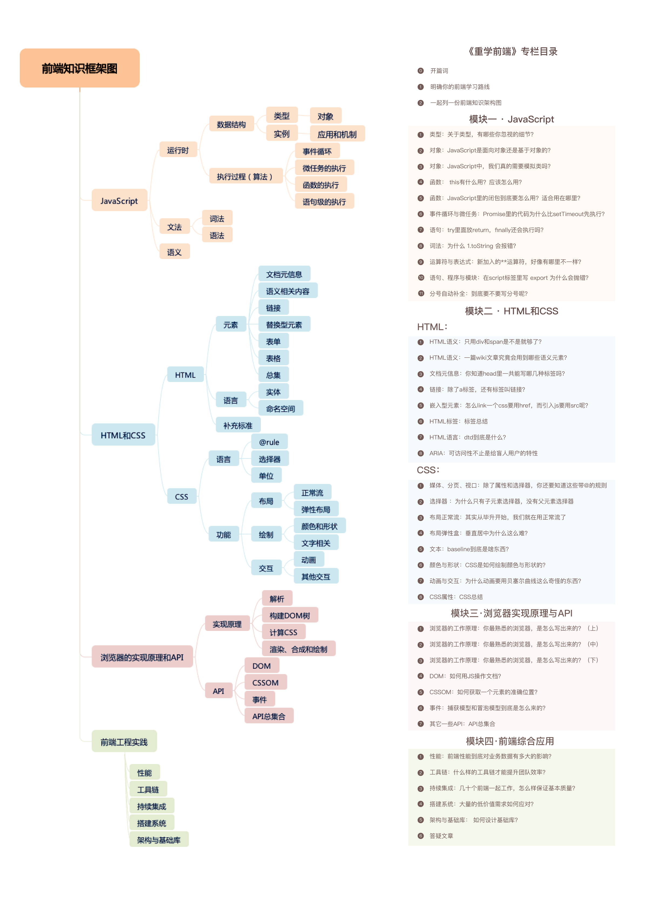
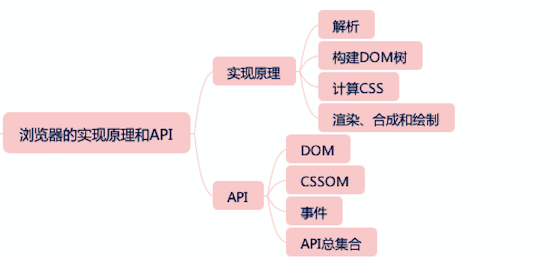
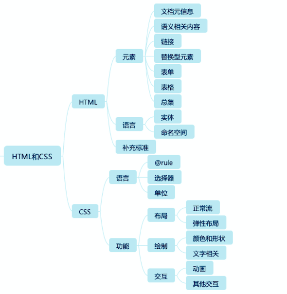
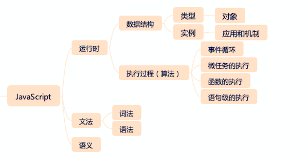

# Frontend

## Dom

## CSS
## HTML

## Javascript

## 浏览器和他们是如何工作的

* [How Browsers Work](https://www.html5rocks.com/en/tutorials/internals/howbrowserswork/)

* [图解浏览器的基本工作原理](https://zhuanlan.zhihu.com/p/47407398)

## 参考
[winter程邵非-重学前端]()
