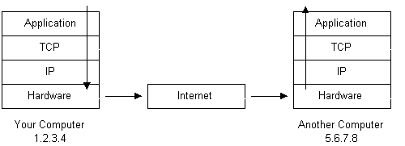
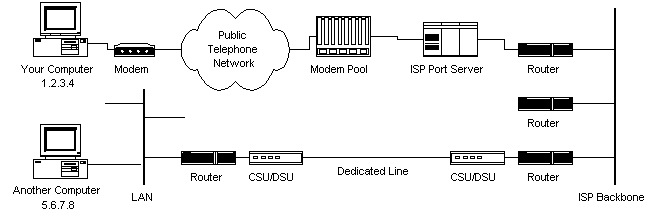
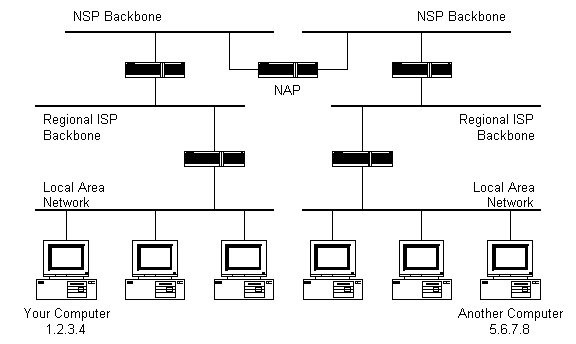

# How-Does-the-Internet-Work

* [How Does the Internet Work?](how-does-the-internet-work.md#how-does-the-internet-work)
  * [介绍](how-does-the-internet-work.md#介绍)
  * [从Internet地址开始](how-does-the-internet-work.md#从internet地址开始)
  * [协议栈和数据包](how-does-the-internet-work.md#协议栈和数据包)
  * [Internet基础设施](how-does-the-internet-work.md#internet基础设施)
  * [Internet路由结构](how-does-the-internet-work.md#internet路由结构)
  * [域名和地址解析](how-does-the-internet-work.md#域名和地址解析)
  * [Internet 协议再次回顾](how-does-the-internet-work.md#internet-协议再次回顾)
  * [应用协议：HTTP和World Wide Web www](how-does-the-internet-work.md#应用协议：http和world-wide-web-www)
  * [应用协议：SMTP和电子邮件](how-does-the-internet-work.md#应用协议：smtp和电子邮件)
  * [传输控制协议](how-does-the-internet-work.md#传输控制协议)
  * [Internet 协议 IP协议](how-does-the-internet-work.md#internet-协议-ip协议)
  * [结束语](how-does-the-internet-work.md#结束语)
  * [资源](how-does-the-internet-work.md#资源)
  * [参考文献](how-does-the-internet-work.md#参考文献)

    **How Does the Internet Work?**

Translated Base [How Does the Internet Work](https://web.stanford.edu/class/msande91si/www-spr04/readings/week1/InternetWhitepaper.htm)

### 介绍

互联网怎样工作？ 好问题！ 互联网爆炸式增长， 似乎经常出现在电视， 收音机，杂志里。 因为网络已经变成了我们生活如此重要的一部分， 只有很好的理解它才能更更高效的使用它

白皮书通过基础设施和技术解释了互联网怎样工作， 本文不会很深入， 但基本涵盖了每个涉及到的基本概念

### 从Internet地址开始

由于Internet是一个全球性的网络联合在一起的，所以必须有一个独一无二的地址。IP的形式是：nnn.nnn.nnn.nnn 而nnn范围是0-255。这个地址就是ip地址（ip代表互联网协议， 稍后详细介绍）

如下图片阐述了两台联网的电脑，随着本文的发展,图1的互联网部分将解释和多次重绘互联网接触的细节 

如果你通过ISP（Internet Service Provider 互联网服务提供商）来链接互联网，你可能会短暂的获得一个临时的IP地址在你拨号期间。如果你通过一个局域网LAN（local area network ）来链接网络，你可能会有一个固定的IP地址，或者你会有一个通过DHCP（Dynamic Host Configuration Protocol）服务器动态分派的IP。

```text
ping 命令是发送一个ICMP请求到指定的机器，被ping的机器会返回一个回复。这个程序会计算回应的时间。如果你输入了一个域名地址而不是一个IP地址如：www.ctrip.com ping将会解析域名名字并且展示计算机的IP地址。
```

### 协议栈和数据包

如果你的电脑联网了，并且有唯一ip地址， 那它怎么和其他电脑连接呢？ 例如你的Ip是 1.2.3.4 需要给你目标机器 5.6.7.8 来发送消息，这些消息需要从文字信息转换为电子信号然后在Internet上传输，最后再从电子信号转换为文字信息。这个过程是由协议栈来完成的。协议栈通常是内建在操作系统中的，经常在网络上用的协议栈被称为TCP/IP因为这两个协议常常被使用。

| Protocol Layer | Comments |
| :---: | :---: |
| 应用协议层 | 协议对特定应用比如：WWW，e-mail，FTP |
| 传输控制协议层 | TCP将数据包根据计算机上特定端口发送到特定的应用中 |
| 网络协议层 | IP通过ip地址传输数据包到计算机 |
| 硬件层 | 转换二进制数据包到网络信号并且传回 （以太网卡， 电话线路等） |

如果我们根据一条信息“你好 电脑 5.6.7.8！”从我们电脑传到另外一台电脑上，流向如下图： 

* 1.消息是从你的计算机最顶层协议栈开始的，然后向下。
* 2.如果这个消息是很长的，这个消息走过的栈层也许会将这条信息切片为更小的数据块。这是因为数据在互联网中发送是在可控的块的。这些数据块被称为包。— 切块
* 3.这个数据包会从应用层到TCP层。每一个数据包被标记一个端口号。端口会在后续解释。我们需要知道的事目标端的程序需要监听特定的端口来获得消息。— 标记目标端端口号
* 4.走过了TCP层后，这些包知道他们的目标IP地址 5.6.7.8 — 获得IP地址
* 5.现在你的数据包有端口号和IP地址，它们准备好通过Internet来发送了。硬件层将我们文字信息转化为电子信号通过电话线传输。
* 6.在你的网络提供商的另一端是直接和Internet相联的。ISPs的路由解释了每个包中的目标地址并且决定如何发送它。通常数据包的下一站是另外一个路由。
* 7.最终这些数据包到达了5.6.7.8.这些数据开始从计算机TCP/IP栈往上处理。
* 8.随着包一层层往上，所有的由发送计算机栈添加的路由信息被从数据包中剥离出来。
* 9.当数据到达协议栈顶部，这个包已经被重新组装为它原来的形式了“你好 电脑  5.6.7.8！”。

网络基础设施 以上我们已经清楚了数据包的传输， 那是什么组成了因特网了，让我们来看下图： 

现在我们可以看到图片一被重新添加了很多细节。通过手机网络连接到isp容易猜到， 除此之外， 还有更多解释

ISP为她们拨入的用户维护了一个调制解调器池。这个通过某种形式的计算机来管理，通常是控制数据流从调制解调器池到骨干或专用线路路由器。这一步也许被称为端口服务器，因为它服务链接到网络。帐单和使用信息通常收集在这里。

在你的数据包通过了电话网络和你的ISP本地装置后，她们被路由到ISP的主干或者ISP买带宽的主干上。通过这，数据包会经过一些路由器和ISP的主干，专用线路已经其他的网络直到她们到达目的地。

有一方法来查看我们的数据包在网络上经过了什么：

```text
Traceroute Program
Traceroute www.ctrip.com

➜  ~ Traceroute www.ctrip.com
Traceroute to www.ctrip.com (52.221.153.122), 64 hops max, 52 byte packets
 1  192.168.0.1 (192.168.0.1)  2.328 ms  2.231 ms  2.285 ms
 2  192.168.1.1 (192.168.1.1)  2.258 ms  2.260 ms  2.732 ms
 3  100.65.0.1 (100.65.0.1)  5.589 ms  6.668 ms  13.992 ms
 4   (117.135.42.17)  6.343 ms  5.029 ms  10.048 ms
^C
```

上图也只是一个简单的网络结构，网络更加复杂。

### Internet基础设施

Internet的主干是由很多大型网络互相连接而组成。这些大型网络被称为网络服务提供商（Network Service Providers or NSPs）。每个NSP需要连接三个网络接入点或称为NAPs（Network Access Points）。在NAPs中，数据包在一个NSP的主干传输到另外一个NSP的主干。NSPs同样通过城域交换（Metropolitan Area Exchanges or MAEs）。MAEs和NAPs由相同的目的但是是私有的。NAPs是最原始的交换点。MAES和NAPs都被称为互联网交换点或者IXs（Internet Exchange Points）。NSPs也会买带宽给小的网络比如ISPs和小的带宽提供商。


上图只是一个抽象的概念，没有实际的主干架构，我们可以自己去NSP的网站上找着她们的网络架构。

### Internet路由结构

所以数据包怎么知道通过网络传输？ 每台联网的电脑知道对方吗？ 数据包真的是简单通过广播传给联网的每台电脑吗？ 当然不是

没有电脑知道其他的计算机所在的地方，同时数据包也不会送给每一个电脑。数据包到达它们的目的地是通过每个路由器中所存储的路由表来获取的。

路由器是分组交换的。一个路由通常是在网络之间来路由数据包的。每一个路由器知道它们的自网络以及那些子网络所用的IP地址。这个路由器通常不知道它上面的IP地址。如下图，黑色的盒子连接主干网络的就是路由器。大型的NSP直接使用NSP来连接的。然后就是一层层来的。



当一个数据包到一个路由器上时，这个路由器检查它由IP层放上的IP地址。这个路由器检查他的路由表，如果包含这个IP地址的网络被找到，那么这个数据包就发送到这个网络上，如果没有找到，那么这个路由器发送数据包到默认的路由上，通常是这个主干层级下的下一个路由，希望它可以找到。如果没有找到，那么这个数据包继续被路由直到找到一个NSP主干上。和NSP相连的主干路由有最大的路由表，在这数据包将会被路由到正确的主干上，然后它将会开始一层层的向更小的网络传输。

### 域名和地址解析

但是如果你不知道你想要连接的计算机的IP地址了？ 你怎么通过www.ctrip.com 来访问到正确的计算机的？ 这些都是因为有域名解析器（DNS Domain Name Service） DNS 是一个分布式的数据库，保持记录计算机的名字和他对应的在互联网上的IP地址 很多计算机连接到DNS数据库的互联网主机部分同时这个软件运行其他人来访问它。这些计算机被认为是DNS服务器。没有DNS服务器有全部的数据库，他们只有其中的子集。如果一个DNS服务器没有包含被请求的域名，DNS将会将这个请求重定向到另外一台DNS服务器上。


域名服务的架构和IP路由层级有些相同。一些常见的，很久的域名靠近顶端。图片中没有展示的是众多的在世界上的DNS来组成其他的层级。 当一个网络连接建立的时候，一个主要的和多个次要的DNS服务器也会在安装的时候启动。这样任何一个需要域名解析服务的应用才能很好的工作。比如，在你输入一个网络地址在浏览器中时，这个浏览器会首先连接你的主要的DNS来获取IP地址，然后浏览器才会请求你想要的网络页面。

### Internet 协议再次回顾

就像前面暗示的关于协议栈的信息，有很多协议在路由器上使用。有很通讯的协议被因特网要求来完成功能。这些包括有TCP， IP，路由协议，媒体访问控制协议，应用级协议等。下面章节介绍一些广泛应用的很重要的协议。高层级的协议先被讨论，然后是低层级的协议。

### 应用协议：HTTP和World Wide Web www

一个最普遍用到的服务就是万维网WWW（World Wide Web）。是网页工作的协议是HTTP协议（Hypertext Transfer Protocol ）。HTML（Hypertext Markup Language）是超文本标记语言，和她没有什么关系，是用来写网页的。HTTP是网页浏览器和服务器用来沟通的协议。它是一个应用层的协议因为它是在TCP层之上，被一些特定的应用来和其他的机器通讯的。在这个例子中就是网页浏览器和网页服务器了。

HTTP是基于文本的协议连接。客户端发送请求到服务器请求一些网页元素，比如网页或者图片。在这个请求被服务器服务后，这个在客户端和服务器之间的连接就会断开。每次请求都要重新开始一次新的连接。很多协议都是面向连接的。这意味着两个计算机通讯时需要一直开着连接。HTTP并没有。一旦一个客户端开始HTTP请求，一个新的连接就要重新向服务器。

当你输入一个URL到一个web浏览器的时候，发生了下面这些事情：

* 1.如果URL包含域名，浏览器先连接一个域名服务器，然后获得网络服务的对应的IP地址
* 2.网页浏览器连接网页服务器然后发送一个HTTP请求（通过协议栈）来获取需要的网页。
* 3.网页服务器获得请求并且检查需要的页面，如果页面存在，服务器发送它，如果不能找到请求的页面，它会发送一个HTTP 404的错误信息。（404 代表页面不存在。）
* 4.网页浏览器受到页面并且连接中断。
* 5.浏览器然后解析页面并切查找其他它需要的页面元素来完整整个页面。这里包括图片，小应用程序等。
* 6.对每个需要元素，浏览器另外建立连接以及HTTP请求。
* 7.当浏览器完成了载入图片，小程序等，页面会完全的在浏览器中载入。

```text
使用Telnet客户端来获取一个页面通过HTTP
telnet www.ctrip.com 80
```

### 应用协议：SMTP和电子邮件

另外一个常用的网络服务是电子邮件服务。E-mail使用应用层的SMTP协议。SMTP同样也是基于文本的协议，但是不像HTTP，SMTP是面向连接的。SMTP也比HTTP更加复杂。SMTP有更多的命令和注意事项比起HTTP来。

当你打开你的邮箱客户端来读取你的邮件，下面是通常会发生的：

* 1.邮箱客户端打开一个连接到它默认的邮箱服务器，这个邮箱服务器的域名或者IP地址通常会在客户端安装的时候安装。
* 2.邮箱服务器常常传输第一条信息来认证它自己。
* 3.客户端会发送一个SMTP HELO的命令同时服务器会响应一个250 ok的信息。
* 4.取决于客户端是否是在检查邮箱，发送邮件等，对应的SMTP命令将会发送给服务器，并且会获得对应的回应。
* 5.这个请求/答复的事物将会一直继续知道客户端发送一个SMTP QUIT的命令。这个服务器然后会说再见并且这个连接将会关闭。

一个简单的SMTP客户端和服务器的对话如下：**R**表示服务器发送的信息 **S**表示客户端发送的信息。

```text
This SMTP example shows mail sent by Smith at host USC-ISIF, to
      Jones, Green, and Brown at host BBN-UNIX.  Here we assume that
      host USC-ISIF contacts host BBN-UNIX directly.  The mail is
      accepted for Jones and Brown.  Green does not have a mailbox at
      host BBN-UNIX.

      -------------------------------------------------------------

         R: 220 BBN-UNIX.ARPA Simple Mail Transfer Service Ready
         S: HELO USC-ISIF.ARPA
         R: 250 BBN-UNIX.ARPA

         S: MAIL FROM:<Smith@USC-ISIF.ARPA>
         R: 250 OK

         S: RCPT TO:<Jones@BBN-UNIX.ARPA>
         R: 250 OK

         S: RCPT TO:<Green@BBN-UNIX.ARPA>
         R: 550 No such user here

         S: RCPT TO:<Brown@BBN-UNIX.ARPA>
         R: 250 OK

         S: DATA
         R: 354 Start mail input; end with <CRLF>.<CRLF>
         S: Blah blah blah...
         S: ...etc. etc. etc.
         S: .
         R: 250 OK

         S: QUIT
         R: 221 BBN-UNIX.ARPA Service closing transmission channel
```

上面的事物是从RFC821获取的，定义SMTP的。

### 传输控制协议

在应用层下是TCP层。当一个应用和另外一个计算机开启一个连接时，它们发送的信息（使用的是特定的应用层协议）会传输到协议栈下一层TCP层。TCP是负责路由应用协议到目的计算机的正确的应用。为了达到这个目的，会使用到端口号。端口可以被考虑为一个独立的频道在每个计算机上。这是因为不同的应用会使用不同的端口号。当一个包到一个电脑的时候，同时通过协议栈，这个TCP层决定哪一个应用接受包通过端口号。

TCP像这样工作：

* 当TCP层从应用层接受到数据的时候，它分片这些数据，并且分解为可以控制的大小，并且添加特定的TCP信息给每块。TCP头包含的信息包括这些数据需要传送给到对应应用的端口号。
* 当TCP层收到一个从IP层传上来的数据包是，TCP剥掉TCP头，并且如果需要做一些数据的重构，然后发送数据到正确的应用使用TCP头中的端口号。

TCP不是文本协议。TCP是一个面向连接的，可靠的字节流服务。面向连接意味着两个使用TCP协议的应用必须先建立一个连接在交换数据之前。TCP是可靠的因为每一个数据包收到的时候，一个获得信息将会发送给发送方来确认这次发送。TCP也有一个CheckSum来检查传输的数据是否正确。TCP头数据结构如下：


注意到这里没有任何IP地址信息，因为TCP并不知道任何关于IP地址的信息。TCP是为了可靠的从应用层获取数据传到另外一个应用。

```text
Well Known Internet Port Numbers
        Listed below are the port numbers for some of the more commonly used Internet services.
        FTP    20/21
        Telnet    23
        SMTP    25
        HTTP    80
        Quake III Arena    27960
```

### Internet 协议 IP协议

不像TCP，IP是一个不可靠的，无连接的协议。IP不在乎一个数据包是否到达目的地。同样IP也不知道连接和端口号。IP的任务是发送和路由数据包到其他的计算机。IP数据包是独立的实体，并且也许会不按照顺序到达。这是TCP的工作来保证数据按照正确的顺序到达。它和TCP相同的地方是它也会增加一个IP头到报文中。


以上我们看到IP地址在IP头中。在之后就将数据传输到网络上了。下面图片展示了数据包在传输到应用层， TCP层， IP层的情况。应用层数据在传输到互联网时， 经过了tcp分段， 添加了tcp头， 然后传到ip层


### 结束语

现在你知道了互联网是怎么工作的。但是这种形式会保持多久了？目前IPV4只允许2的32次方个地址。目前已经有IPV6了，----话说从我知道有开始到现在感觉还没普及，谁知道会怎么发生。 \(此篇文章出自2002年，当前确实ip4已结耗尽， ip6开始使用\)

### 资源

[http://www.ietf.org/](http://www.ietf.org/) is the home page of the Internet Engineering Task Force. This body is greatly responsible for the development of Internet protocols and the like.

[http://www.internic.org/](http://www.internic.org/) is the organization responsible for administering domain names.

[http://www.nexor.com/public/rfc/index/rfc.html](http://www.nexor.com/public/rfc/index/rfc.html) is an excellent RFC search engine useful for finding any RFC.

[http://www.internetweather.com/](http://www.internetweather.com/) shows animated maps of Internet latency.

[http://routes.clubnet.net/iw/](http://routes.clubnet.net/iw/) is Internet Weather from ClubNET. This page shows packet loss for various carriers.

[http://navigators.com/isp.html](http://navigators.com/isp.html) is Russ Haynal's ISP Page. This is a great site with links to most NSPs and their backbone infrastructure maps.

### 参考文献

TCP和网络的相关书籍： TCP/IP Illustrated, Volume 1, The Protocols. W. Richard Stevens.  
 Addison-Wesley, Reading, Massachusetts. 1994.  
 Encyclopedia of Networking.  
 Tom Sheldon.  
 Osbourne McGraw-Hill, New York. 1998   


