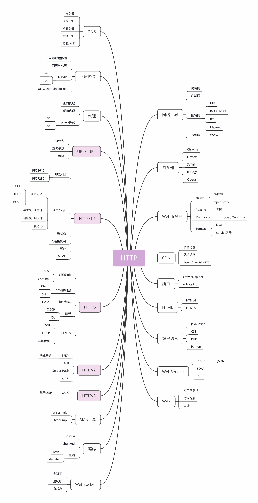
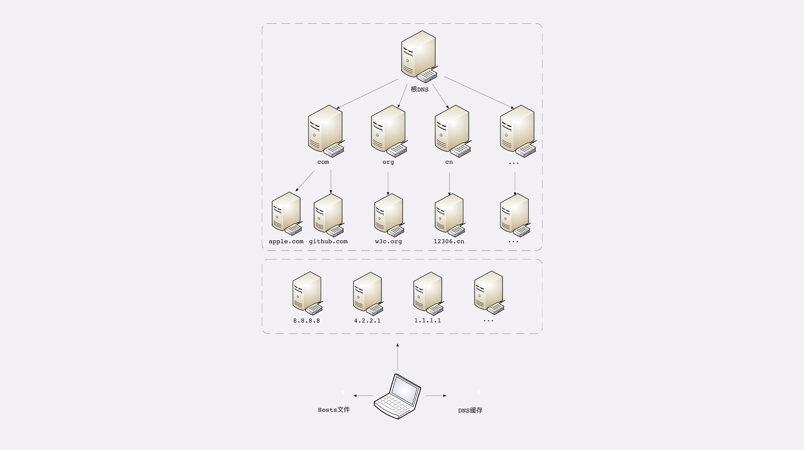
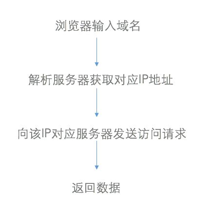
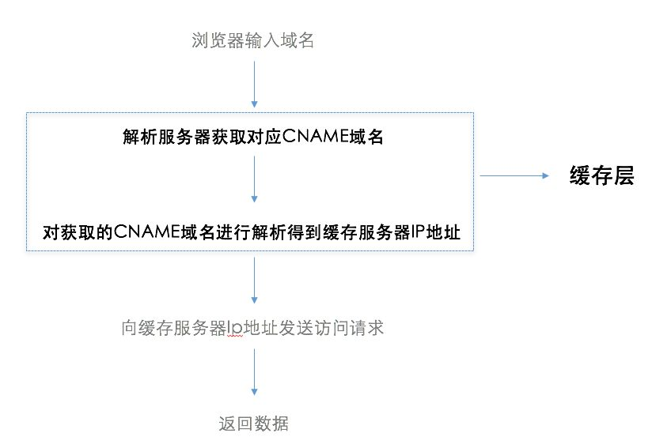

- [HTTP 基础](#http-基础)
- [HTTP 进阶](#http-进阶)
    - [概念](#概念)
    - [Domain](#domain)
    - [DNS](#dns)
    - [CDN](#cdn)
        - [基本原理](#基本原理)
        - [CDN与传统网站访问的区别](#cdn与传统网站访问的区别)
        - [关键技术](#关键技术)
        - [CDN 具体有什么作用呢](#cdn-具体有什么作用呢)
        - [关于CDN的一些常见名词](#关于cdn的一些常见名词)
    - [参考](#参考)
# HTTP 基础

* [HTTP基础-外链](https://github.com/CyC2018/CS-Notes/blob/master/notes/HTTP.md)

# HTTP 进阶

## 概念

HTTP协议始于三十年前蒂姆·伯纳斯-李的一篇论文；
* HTTP/0.9是个简单的文本协议，只能获取文本资源；
* HTTP/1.0确立了大部分现在使用的技术，但它不是正式标准；
* HTTP/1.1是目前互联网上使用最广泛的协议，功能也非常完善；
* HTTP/2基于Google的SPDY协议，注重性能改善，但还未普及；
* HTTP/3基于Google的QUIC协议，是将来的发展方向。

互联网上绝大部分资源都使用HTTP协议传输； 
浏览器是HTTP协议里的请求方，即User Agent； 
服务器是HTTP协议里的应答方，常用的有Apache和Nginx； 
CDN位于浏览器和服务器之间，主要起到缓存加速的作用； 
爬虫是另一类User Agent，是自动访问网络资源的程序。 
TCP/IP是网络世界最常用的协议，HTTP通常运行在TCP/IP提供的可靠传输基础上； 
DNS域名是IP地址的等价替代，需要用域名解析实现到IP地址的映射； 
URI是用来标记互联网上资源的一个名字，由“协议名+主机名+路径”构成，俗称URL； 
HTTPS相当于“HTTP+SSL/TLS+TCP/IP”，为HTTP套了一个安全的外壳； 
代理是HTTP传输过程中的“中转站”，可以实现缓存加速、负载均衡等功能。 

## Domain

域名是一个有层次的结构，是一串用“.”分隔的多个单词，最右边的被称为“顶级域名”，然后是“二级域名”，层级关系向左依次降低。

最左边的是主机名，通常用来表明主机的用途，比如“www”表示提供万维网服务、“mail”表示提供邮件服务，不过这也不是绝对的，名字的关键是要让我们容易记忆。

看一下极客时间的域名“time.geekbang.org”，这里的“org”就是顶级域名，“geekbang”是二级域名，“time”则是主机名。使用这个域名，DNS就会把它转换成相应的IP地址，你就可以访问极客时间的网站了。

域名不仅能够代替IP地址，还有许多其他的用途。

在Apache、Nginx这样的Web服务器里，域名可以用来标识虚拟主机，决定由哪个虚拟主机来对外提供服务，比如在Nginx里就会使用“server_name”指令：

server {
    listen 80;                       #监听80端口
    server_name  time.geekbang.org;  #主机名是time.geekbang.org
    ...
}
域名本质上还是个名字空间系统，使用多级域名就可以划分出不同的国家、地区、组织、公司、部门，每个域名都是独一无二的，可以作为一种身份的标识。

## DNS
DNS即Domain Name System，是域名解析服务

就像IP地址必须转换成MAC地址才能访问主机一样，域名也必须要转换成IP地址，这个过程就是“域名解析”。
目前全世界有几亿个站点，有几十亿网民，而每天网络上发生的HTTP流量更是天文数字。这些请求绝大多数都是基于域名来访问网站的，所以DNS就成了互联网的重要基础设施，必须要保证域名解析稳定可靠、快速高效。

**DNS的核心系统是一个三层的树状、分布式服务，基本对应域名的结构：**

根域名服务器（Root DNS Server）：管理顶级域名服务器，返回“com”“net”“cn”等顶级域名服务器的IP地址；
顶级域名服务器（Top-level DNS Server）：管理各自域名下的权威域名服务器，比如com顶级域名服务器可以返回apple.com域名服务器的IP地址；
权威域名服务器（Authoritative DNS Server）：管理自己域名下主机的IP地址，比如apple.com权威域名服务器可以返回www.apple.com的IP地址。

在这里根域名服务器是关键，它必须是众所周知的，否则下面的各级服务器就无从谈起了。目前全世界共有13组根域名服务器，又有数百台的镜像，保证一定能够被访问到。

有了这个系统以后，任何一个域名都可以在这个树形结构里从顶至下进行查询，就好像是把域名从右到左顺序走了一遍，最终就获得了域名对应的IP地址。

例如，你要访问“www.apple.com”，就要进行下面的三次查询：

访问根域名服务器，它会告诉你“com”顶级域名服务器的地址；

访问“com”顶级域名服务器，它再告诉你“apple.com”域名服务器的地址；

最后访问“apple.com”域名服务器，就得到了“www.apple.com”的地址。

虽然核心的DNS系统遍布全球，服务能力很强也很稳定，但如果全世界的网民都往这个系统里挤，即使不挤瘫痪了，访问速度也会很慢。

所以在核心DNS系统之外，还有两种手段用来减轻域名解析的压力，并且能够更快地获取结果，基本思路就是“缓存”。

首先，许多大公司、网络运行商都会建立自己的DNS服务器，作为用户DNS查询的代理，代替用户访问核心DNS系统。这些“野生”服务器被称为“非权威域名服务器”，可以缓存之前的查询结果，如果已经有了记录，就无需再向根服务器发起查询，直接返回对应的IP地址。

这些DNS服务器的数量要比核心系统的服务器多很多，而且大多部署在离用户很近的地方。比较知名的DNS有Google的“8.8.8.8”，Microsoft的“4.2.2.1”，还有CloudFlare的“1.1.1.1”等等。

其次，操作系统里也会对DNS解析结果做缓存，如果你之前访问过“www.apple.com”，那么下一次在浏览器里再输入这个网址的时候就不会再跑到DNS那里去问了，直接在操作系统里就可以拿到IP地址。

另外，操作系统里还有一个特殊的“主机映射”文件，通常是一个可编辑的文本，在Linux里是“/etc/hosts”，在Windows里是“C:\WINDOWS\system32\drivers\etc\hosts”，如果操作系统在缓存里找不到DNS记录，就会找这个文件。

有了上面的“野生”DNS服务器、操作系统缓存和hosts文件后，很多域名解析的工作就都不用“跋山涉水”了，直接在本地或本机就能解决，不仅方便了用户，也减轻了各级DNS服务器的压力，效率就大大提升了。

下面的这张图比较完整地表示了现在的DNS架构。

在Nginx里有这么一条配置指令“resolver”，它就是用来配置DNS服务器的，如果没有它，那么Nginx就无法查询域名对应的IP，也就无法反向代理到外部的网站。

resolver 8.8.8.8 valid=30s;  #指定Google的DNS，缓存30秒

**域名的“新玩法”**
有了域名，又有了可以稳定工作的解析系统，于是我们就可以实现比IP地址更多的“新玩法”了。

第一种，也是最简单的，“重定向”。因为域名代替了IP地址，所以可以让对外服务的域名不变，而主机的IP地址任意变动。当主机有情况需要下线、迁移时，可以更改DNS记录，让域名指向其他的机器。

比如，你有一台“buy.tv”的服务器要临时停机维护，那你就可以通知DNS服务器：“我这个buy.tv域名的地址变了啊，原先是1.2.3.4，现在是5.6.7.8，麻烦你改一下。”DNS于是就修改内部的IP地址映射关系，之后再有访问buy.tv的请求就不走1.2.3.4这台主机，改由5.6.7.8来处理，这样就可以保证业务服务不中断。

第二种，因为域名是一个名字空间，所以可以使用bind9等开源软件搭建一个在内部使用的DNS，作为名字服务器。这样我们开发的各种内部服务就都用域名来标记，比如数据库服务都用域名“mysql.inner.app”，商品服务都用“goods.inner.app”，发起网络通信时也就不必再使用写死的IP地址了，可以直接用域名，而且这种方式也兼具了第一种“玩法”的优势。

第三种“玩法”包含了前两种，也就是基于域名实现的负载均衡。

这种“玩法”也有两种方式，两种方式可以混用。

第一种方式，因为域名解析可以返回多个IP地址，所以一个域名可以对应多台主机，客户端收到多个IP地址后，就可以自己使用轮询算法依次向服务器发起请求，实现负载均衡。

第二种方式，域名解析可以配置内部的策略，返回离客户端最近的主机，或者返回当前服务质量最好的主机，这样在DNS端把请求分发到不同的服务器，实现负载均衡。

前面我们说的都是可信的DNS，如果有一些不怀好意的DNS，那么它也可以在域名这方面“做手脚”，弄一些比较“恶意”的“玩法”，举两个例子：

“域名屏蔽”，对域名直接不解析，返回错误，让你无法拿到IP地址，也就无法访问网站；
“域名劫持”，也叫“域名污染”，你要访问A网站，但DNS给了你B网站。
好在互联网上还是好人多，而且DNS又是互联网的基础设施，这些“恶意DNS”并不多见，你上网的时候不需要太过担心。

**总结**

域名使用字符串来代替IP地址，方便用户记忆，本质上一个名字空间系统；

DNS就像是我们现实世界里的电话本、查号台，统管着互联网世界里的所有网站，是一个“超级大管家”；

DNS是一个树状的分布式查询系统，但为了提高查询效率，外围有多级的缓存；

使用DNS可以实现基于域名的负载均衡，既可以在内网，也可以在外网。

一个域名解析流程可以归纳为：

浏览器缓存->操作系统dnscache ->hosts文件->非权威域名服务器->根域名服务器->顶级域名服务器->二级域名服务器->权威域名服务器。

## CDN

### 基本原理
CDN的全称是Content Delivery Network，即内容分发网络。CDN是构建在现有网络基础之上的智能虚拟网络，依靠部署在各地的边缘服务器，通过中心平台的负载均衡、内容分发、调度等功能模块，使用户就近获取所需内容，降低网络拥塞，提高用户访问响应速度和命中率。CDN的关键技术主要有内容存储和分发技术

最简单的CDN网络由一个DNS服务器和几台缓存服务器组成：

* 当用户点击网站页面上的内容URL，经过本地DNS系统解析，DNS系统会最终将域名的解析权交给CNAME指向的CDN专用DNS服务器。

* CDN的DNS服务器将CDN的全局负载均衡设备IP地址返回用户。
* 用户向CDN的全局负载均衡设备发起内容URL访问请求。
* CDN全局负载均衡设备根据用户IP地址，以及用户请求的内容URL，选择一台用户所属区域的区域负载均衡设备，告诉用户向这台设备发起请求。
* 区域负载均衡设备会为用户选择一台合适的缓存服务器提供服务，选择的依据包括：根据用户IP地址，判断哪一台服务器距用户最近；根据用户所请求的URL中携带的内容名称，判断哪一台服务器上有用户所需内容；查询各个服务器当前的负载情况，判断哪一台服务器尚有服务能力。基于以上这些条件的综合分析之后，区域负载均衡设备会向全局负载均衡设备返回一台缓存服务器的IP地址。
* 全局负载均衡设备把服务器的IP地址返回给用户。
* 用户向缓存服务器发起请求，缓存服务器响应用户请求，将用户所需内容传送到用户终端。如果这台缓存服务器上并没有用户想要的内容，而区域均衡设备依然将它分配给了用户，那么这台服务器就要向它的上一级缓存服务器请求内容，直至追溯到网站的源服务器将内容拉到本地。

### CDN与传统网站访问的区别

使用了CDN的网站访问：

与传统访问方式不同，CDN网络则是在用户和服务器之间增加缓存层，将用户的访问请求引导到最优的缓存节点而不是服务器源站点，从而加速访问速度。

完整的CDN工作流程：

### 关键技术
**内容发布**

它借助于建立索引、缓存、流分裂、组播（Multicast）等技术，将内容发布或投递到距离用户最近的远程服务点（POP）处。

内容分发包含从内容源到CDN边缘的Cache的过程。从实现上，有两种主流的内容分发技术：PUSH和PULL。

PUSH是一种主动分发的技术。通常，PUSH由内容管理系统发起，将内容从源或者中心媒体资源库分发到各边缘的 Cache节点。分发的协议可以采用 Http/ftp等。通过PUSH分发的内容一般是比较热点的内容，这些内容通过PUSH方式预分发（ Preload）到边缘Cache，可以实现有针对的内容提供。对于PUSH分发需要考虑的主要问题是分发策略，即在什么时候分发什么内容。一般来说，内容分发可以由CP（内容提供商）或者CDN内容管理员人工确定，也可以通过智能的方式决定，即所谓的智能分发，它根据用户访问的统计信息，以及预定义的内容分发的规则，确定内容分发的过程PULL是一种被动的分发技术，

PULL分发通常由用户请求驱动。当用户请求的内容在本地的边缘 Cache上不存在（未命中）时， Cache启动PUL方法从内容源或者其他CDN节点实时获取内容。在PULL方式下，内容的分发是按需的。

**内容路由**

它是整体性的网络负载均衡技术，通过内容路由器中的重定向（DNS）机制，在多个远程POP上均衡用户的请求，以使用户请求得到最近内容源的响应。

CDN负载均衡系统实现CDN的内容路由功能。它的作用是将用户的请求导向整个CDN网络中的最佳节点。最佳节点的选定可以根据多种策略，例如距离最近、节点负载最轻等。负载均衡系统是整个CDN的核心，负载均衡的准确性和效率直接决定了整个CDN的效率和性能。通常负载均衡可以分为两个层次:全局负载均衡（GSLB）和本地负载均衡（SLB）。全局负载均衡主要的目的是在整个网络范围内将用户的请求定向到最近的节点（或者区域）。因此，就近性判断是全局负载均衡的主要功能。本地负载均衡一般局限于一定的区域范围内，其目标是在特定的区域范围内寻找一台最适合的节点提供服务，因此，CDN节点的健康性、负载情况、支持的媒体格式等运行状态是本地负载均衡进行决策的主要依据。

**内容存储**

对于CDN系统而言，需要考虑两个方面的内容存储问题。一个是内容源的存储，一个是内容在 Cache节点中的存储。

对于内容源的存储，由于内容的规模比较大（通常可以达到几个甚至几十个TB），而且内容的吞吐量较大，因此，通常采用海量存储架构，如NAS和SON。对于在 Cache节点中的存储，是 Cache设计的一个关键问题。需要考虑的因素包括功能和性能两个方面:功能上包括对各种内容格式的支持，对部分缓存的支持;在性能上包括支持的容量、多文件吞吐率、可靠性、稳定性。

其中，多种内容格式的支持要求存储系统根据不同文件格式的读写特点进行优化，以提高文件内容读写的效率。特别是对针对流媒体文件的读写。部分缓存能力指流媒体内容可以以不完整的方式存储和读取。部分缓存的需求来自用户访问行为的随机性，因为许多用户并不会完整地收看整个流媒体节目。事实上，许多用户访问单个流媒体节目的时间不超过10分钟。因此，部分缓存能力能够大大提高存储空间的利用率，并有效提高用户请求的响应时间。但是部分缓存可能导致内容的碎片问题，需要进行良好的设计和控制。

Cache存储的另一个重要因素是存储的可靠性，目前，多数存储系统都采用了独立磁盘冗余阵列（RAID）技术进行可靠存储。但是不同设备使用的RAID方式各有不同。

**内容管理**

它通过内部和外部监控系统，获取网络部件的状况信息，测量内容发布的端到端性能（如包丢失、延时、平均带宽、启动时间、帧速率等），保证网络处于最佳的运行状态。

内容管理在广义上涵盖了从内容的发布、注入、分发、调整、传递等一系列过程。在这里，内容管理重点强调内容进人 Cache点后的内容管理，称其为本地内容管理。本地内容管理主要针对一个ODN节点（有多个 CDN Cache设备和一个SLB设备构成）进行。本地内容管理的主要目标是提高内容服务的效率，提高本地节点的存储利用率。通过本地内容管理，可以在CDN节点实现基于内容感知的调度，通过内容感知的调度，可以避免将用户重定向到没有该内容的 Cache设备上，从而提高负载均衡的效率。通过本地内容管理还可以有效实现在ODN节点内容的存储共享，提高存储空间的利用率。

### CDN 具体有什么作用呢

* 为了加速网站的访问
* 为了实现跨运营商、跨地域的全网覆盖
* 为了保障你的网站安全 CDN的负载均衡和分布式存储技术，可以加强网站的可靠性，相当无无形中给你的网站添加了一把保护伞，应对绝大部分的互联网攻击事件。防攻击系统也能避免网站遭到恶意攻击。
* 为了异地备援当某个服务器发生意外故障时，系统将会调用其他临近的健康服务器节点进行服务，进而提供接近100%的可靠性，这就让你的网站可以做到永不宕机。
* 为了节约成本投入使用CDN加速可以实现网站的全国铺设，你根据不用考虑购买服务器与后续的托管运维，服务器之间镜像同步，也不用为了管理维护技术人员而烦恼，节省了人力、精力和财力。
* 为了让你更专注业务本身CDN加速厂商一般都会提供一站式服务，业务不仅限于CDN，还有配套的云存储、大数据服务、视频云服务等，而且一般会提供7x24运维监控支持，保证网络随时畅通，你可以放心使用。并且将更多的精力投入到发展自身的核心业务之上。

### 关于CDN的一些常见名词
* 1、Origin Server源站做 CDN 之前的客户真正的服务器。
* 2、User访问者，也就是要访问网站的网民。
* 3、Last Mile最后一公里，也就是网民到他所访问到的 CDN 服务器之间的路径。
* 4、域名域名是Internet网络上的一个服务器或一个网络系统的名字，全世界，没有重复的域名。
* 5、CNAME记录它是一个别名记录( Canonical Name )；

    当 DNS 系统在查询 CNAME 左面的名称的时候，都会转向 CNAME 右面的名称再进行查询，一直追踪到最后的 PTR 或 A 名称，成功查询后才会做出回应，否则失败。

## 参考

[CDN是什么？使用CDN有什么优势](https://www.zhihu.com/question/36514327?rf=37353035)

[What is a CDN?](https://www.cloudflare.com/learning/cdn/what-is-a-cdn/)

[罗剑锋 透视http协议]()

[HTTP权威指南](https://github.com/woai30231/http)