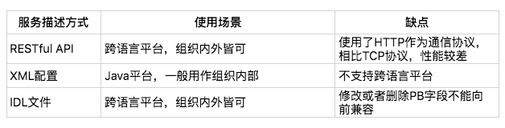
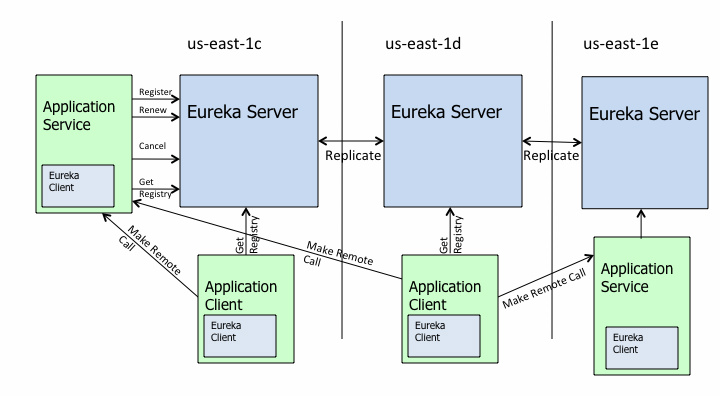
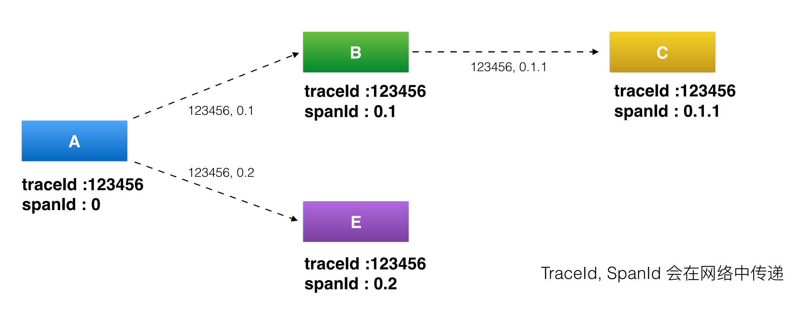
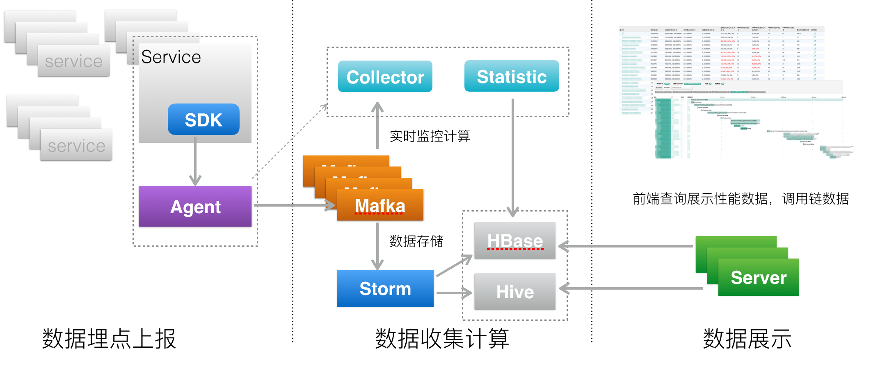
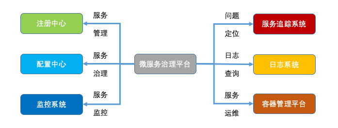

- [微服务](#微服务)
    - [什么是微服务](#什么是微服务)
    - [单体应用的拆分](#单体应用的拆分)
    - [微服务的挑战](#微服务的挑战)
    - [微服务架构](#微服务架构)
    - [服务描述](#服务描述)
    - [注册中心](#注册中心)
        - [注册中心原理](#注册中心原理)
        - [注册中心选型](#注册中心选型)
    - [服务框架](#服务框架)
    - [服务监控](#服务监控)
    - [服务追踪](#服务追踪)
        - [原理](#原理)
        - [架构](#架构)
    - [服务治理](#服务治理)
        - [节点管理](#节点管理)
        - [负载均衡](#负载均衡)
        - [服务路由](#服务路由)
        - [服务容错](#服务容错)
    - [平台化](#平台化)
- [如何落地](#如何落地)
    - [组建合适的技术团队](#组建合适的技术团队)
    - [从一个案例入手](#从一个案例入手)
    - [做好技术取舍](#做好技术取舍)
    - [采用DevOps](#采用devops)
    - [统一微服务治理平台](#统一微服务治理平台)
- [ServiceMesh](#servicemesh)
# 微服务

## 什么是微服务

微服务就是将庞杂臃肿的单体应用拆分成细粒度的服务，独立部署，并交给各个中小团队来负责开发、测试、上线和运维整个生命周期。

* 服务拆分粒度更细。微服务可以说是更细维度的服务化，小到一个子模块，只要该模块依赖的资源与其他模块都没有关系，那么就可以拆分为一个微服务。

* 服务独立部署。每个微服务都严格遵循独立打包部署的准则，互不影响。比如一台物理机上可以部署多个Docker实例，每个Docker实例可以部署一个微服务的代码。

* 服务独立维护。每个微服务都可以交由一个小团队甚至个人来开发、测试、发布和运维，并对整个生命周期负责。

* 服务治理能力要求高。因为拆分为微服务之后，服务的数量变多，因此需要有统一的服务治理平台，来对各个服务进行管理。

## 单体应用的拆分

将不同的功能模块服务化，独立部署和运维，这种拆分方式是纵向拆分，是从业务维度进行拆分。标准是按照业务的关联程度来决定，关联比较密切的业务适合拆分为一个微服务，而功能相对比较独立的业务适合单独拆分为一个微服务。

还有一种服务化拆分方式是横向拆分，是从公共且独立功能维度拆分。标准是按照是否有公共的被多个其他服务调用，且依赖的资源独立不与其他业务耦合。

## 微服务的挑战
一般情况下，业务系统引入新技术就必然会带来架构的复杂度提升，在具体决策前，你先要认识到新架构会带来哪些新的问题，这些问题你和你的团队是否能够解决？如何解决？是自己投入人力建设，还是采用业界开源方案？

下面几个问题，是从单体应用迁移到微服务架构时必将面临也必须解决的。

* 服务如何定义。对于单体应用来说，不同功能模块之前相互交互时，通常是以类库的方式来提供各个模块的功能。对于微服务来说，每个服务都运行在各自的进程之中，应该以何种形式向外界传达自己的信息呢？答案就是接口，无论采用哪种通讯协议，是HTTP还是RPC，服务之间的调用都通过接口描述来约定，约定内容包括接口名、接口参数以及接口返回值。

* 服务如何发布和订阅。单体应用由于部署在同一个WAR包里，接口之间的调用属于进程内的调用。而拆分为微服务独立部署后，服务提供者该如何对外暴露自己的地址，服务调用者该如何查询所需要调用的服务的地址呢？这个时候你就需要一个类似登记处的地方，能够记录每个服务提供者的地址以供服务调用者查询，在微服务架构里，这个地方就是注册中心。

* 服务如何监控。通常对于一个服务，我们最关心的是QPS（调用量）、AvgTime（平均耗时）以及P999（99.9%的请求性能在多少毫秒以内）这些指标。这时候你就需要一种通用的监控方案，能够覆盖业务埋点、数据收集、数据处理，最后到数据展示的全链路功能。

* 服务如何治理。可以想象，拆分为微服务架构后，服务的数量变多了，依赖关系也变复杂了。比如一个服务的性能有问题时，依赖的服务都势必会受到影响。可以设定一个调用性能阈值，如果一段时间内一直超过这个值，那么依赖服务的调用可以直接返回，这就是熔断，也是服务治理最常用的手段之一。

* 故障如何定位。在单体应用拆分为微服务之后，一次用户调用可能依赖多个服务，每个服务又部署在不同的节点上，如果用户调用出现问题，你需要有一种解决方案能够将一次用户请求进行标记，并在多个依赖的服务系统中继续传递，以便串联所有路径，从而进行故障定位。

## 微服务架构

首先服务提供者（就是提供服务的一方）按照一定格式的服务描述，向注册中心注册服务，声明自己能够提供哪些服务以及服务的地址是什么，完成服务发布。

接下来服务消费者（就是调用服务的一方）请求注册中心，查询所需要调用服务的地址，然后以约定的通信协议向服务提供者发起请求，得到请求结果后再按照约定的协议解析结果。

而且在服务的调用过程中，服务的请求耗时、调用量以及成功率等指标都会被记录下来用作监控，调用经过的链路信息会被记录下来，用于故障定位和问题追踪。在这期间，如果调用失败，可以通过重试等服务治理手段来保证成功率。

总结一下，微服务架构下，服务调用主要依赖下面几个基本组件：

* 服务描述

* 注册中心

* 服务框架

* 服务监控

* 服务追踪

* 服务治理

接下来，我来为你一一介绍这些组件。

## 服务描述
服务调用首先要解决的问题就是服务如何对外描述。比如，你对外提供了一个服务，那么这个服务的服务名叫什么？调用这个服务需要提供哪些信息？调用这个服务返回的结果是什么格式的？该如何解析？这些就是服务描述要解决的问题。

常用的服务描述方式包括RESTful API、XML配置以及IDL文件三种。

其中，RESTful API方式通常用于HTTP协议的服务描述，并且常用Wiki或者Swagger来进行管理。下面是一个RESTful API方式的服务描述的例子。

XML配置方式多用作RPC协议的服务描述，通过*.xml配置文件来定义接口名、参数以及返回值类型等。下面是一个XML配置方式的服务描述的例子。譬如dubbo

IDL文件方式通常用作Thrift和gRPC这类跨语言服务调用框架中，比如gRPC就是通过Protobuf文件来定义服务的接口名、参数以及返回值的数据结构

## 注册中心
有了服务的接口描述，下一步要解决的问题就是服务的发布和订阅，就是说你提供了一个服务，如何让外部想调用你的服务的人知道。这个时候就需要一个类似注册中心的角色，服务提供者将自己提供的服务以及地址登记到注册中心，服务消费者则从注册中心查询所需要调用的服务的地址，然后发起请求。

一般来讲，注册中心的工作流程是：

服务提供者在启动时，根据服务发布文件中配置的发布信息向注册中心注册自己的服务。

服务消费者在启动时，根据消费者配置文件中配置的服务信息向注册中心订阅自己所需要的服务。

注册中心返回服务提供者地址列表给服务消费者。

当服务提供者发生变化，比如有节点新增或者销毁，注册中心将变更通知给服务消费者。

### 注册中心原理

在微服务架构下，主要有三种角色：服务提供者（RPC Server）、服务消费者（RPC Client）和服务注册中心（Registry），三者的交互关系请看下面这张图，我来简单解释一下。

RPC Server提供服务，在启动时，根据服务发布文件server.xml中的配置的信息，向Registry注册自身服务，并向Registry定期发送心跳汇报存活状态。

RPC Client调用服务，在启动时，根据服务引用文件client.xml中配置的信息，向Registry订阅服务，把Registry返回的服务节点列表缓存在本地内存中，并与RPC Sever建立连接。

当RPC Server节点发生变更时，Registry会同步变更，RPC Client感知后会刷新本地内存中缓存的服务节点列表。

RPC Client从本地缓存的服务节点列表中，基于负载均衡算法选择一台RPC Sever发起调用。

注册中心实现方式
注册中心的实现主要涉及几个问题：注册中心需要提供哪些接口，该如何部署；如何存储服务信息；如何监控服务提供者节点的存活；如果服务提供者节点有变化如何通知服务消费者，以及如何控制注册中心的访问权限。下面我来一一给你讲解。

1. 注册中心API

根据注册中心原理的描述，注册中心必须提供以下最基本的API，例如：

* 服务注册接口：服务提供者通过调用服务注册接口来完成服务注册。

* 服务反注册接口：服务提供者通过调用服务反注册接口来完成服务注销。

* 心跳汇报接口：服务提供者通过调用心跳汇报接口完成节点存活状态上报。

* 服务订阅接口：服务消费者通过调用服务订阅接口完成服务订阅，获取可用的服务提供者节点列表。

* 服务变更查询接口：服务消费者通过调用服务变更查询接口，获取最新的可用服务节点列表。

除此之外，为了便于管理，注册中心还必须提供一些后台管理的API，例如：

* 服务查询接口：查询注册中心当前注册了哪些服务信息。

* 服务修改接口：修改注册中心中某一服务的信息。

2. 集群部署

注册中心作为服务提供者和服务消费者之间沟通的桥梁，它的重要性不言而喻。所以注册中心一般都是采用集群部署来保证高可用性，并通过分布式一致性协议来确保集群中不同节点之间的数据保持一致。

3. 目录存储

我看文档不是很理解这个目录存储的概念。。？？

4. 服务健康状态检测

注册中心除了要支持最基本的服务注册和服务订阅功能以外，还必须具备对服务提供者节点的健康状态检测功能，这样才能保证注册中心里保存的服务节点都是可用的。

5. 服务状态变更通知

一旦注册中心探测到有服务提供者节点新加入或者被剔除，就必须立刻通知所有订阅该服务的服务消费者，刷新本地缓存的服务节点信息，确保服务调用不会请求不可用的服务提供者节点。

6. 白名单机制

### 注册中心选型

* 应用内注册与发现：注册中心提供服务端和客户端的SDK，业务应用通过引入注册中心提供的SDK，通过SDK与注册中心交互，来实现服务的注册和发现。

* 应用外注册与发现：业务应用本身不需要通过SDK与注册中心打交道，而是通过其他方式与注册中心交互，间接完成服务注册与发现。

采用应用内注册与发现的方式，最典型的案例要属Netflix开源的Eureka，官方架构图如下。

对着这张图，我来介绍下Eureka的架构，它主要由三个重要的组件组成：

Eureka Server：注册中心的服务端，实现了服务信息注册、存储以及查询等功能。

服务端的Eureka Client：集成在服务端的注册中心SDK，服务提供者通过调用SDK，实现服务注册、反注册等功能。

客户端的Eureka Client：集成在客户端的注册中心SDK，服务消费者通过调用SDK，实现服务订阅、服务更新等功能。

采用应用外方式实现服务注册和发现，最典型的案例是开源注册中心Consul，它的架构图如下。

通过这张架构图，可以看出来使用Consul实现应用外服务注册和发现主要依靠三个重要的组件：

Consul：注册中心的服务端，实现服务注册信息的存储，并提供注册和发现服务。

Registrator：一个开源的第三方服务管理器项目，它通过监听服务部署的Docker实例是否存活，来负责服务提供者的注册和销毁。

Consul Template：定时从注册中心服务端获取最新的服务提供者节点列表并刷新LB配置（比如Nginx的upstream），这样服务消费者就通过访问Nginx就可以获取最新的服务提供者信息

总结:

* 如果你的业务体系都采用Java语言的话，Netflix开源的Eureka是一个不错的选择，并且它作为服务注册与发现解决方案，能够最大程度的保证可用性，即使出现了网络问题导致不同节点间数据不一致，你仍然能够访问Eureka获取数据。

* 如果你的业务体系语言比较复杂，Eureka也提供了Sidecar的解决方案；也可以考虑使用Consul，它支持了多种语言接入，包括Go、Python、PHP、Scala、Java，Erlang、Ruby、Node.js、.NET、Perl等。

* 如果你的业务已经是云原生的应用，可以考虑使用Consul，搭配Registrator和Consul Template来实现应用外的服务注册与发现。

## 服务框架
通过注册中心，服务消费者就可以获取到服务提供者的地址，有了地址后就可以发起调用。但在发起调用之前你还需要解决以下几个问题。

服务通信采用什么协议？就是说服务提供者和服务消费者之间以什么样的协议进行网络通信，是采用四层TCP、UDP协议，还是采用七层HTTP协议，还是采用其他协议？

数据传输采用什么方式？就是说服务提供者和服务消费者之间的数据传输采用哪种方式，是同步还是异步，是在单连接上传输，还是多路复用。

数据压缩采用什么格式？通常数据传输都会对数据进行压缩，来减少网络传输的数据量，从而减少带宽消耗和网络传输时间，比如常见的JSON序列化、Java对象序列化以及Protobuf序列化等。

## 服务监控
一旦服务消费者与服务提供者之间能够正常发起服务调用，你就需要对调用情况进行监控，以了解服务是否正常。通常来讲，服务监控主要包括三个流程。

指标收集。就是要把每一次服务调用的请求耗时以及成功与否收集起来，并上传到集中的数据处理中心。

数据处理。有了每次调用的请求耗时以及成功与否等信息，就可以计算每秒服务请求量、平均耗时以及成功率等指标。

数据展示。数据收集起来，经过处理之后，还需要以友好的方式对外展示，才能发挥价值。通常都是将数据展示在Dashboard面板上，并且每隔10s等间隔自动刷新，用作业务监控和报警等。

具体的看另一篇文章， 系统监控

## 服务追踪
除了需要对服务调用情况进行监控之外，你还需要记录服务调用经过的每一层链路，以便进行问题追踪和故障定位。

服务追踪的工作原理大致如下：

服务消费者发起调用前，会在本地按照一定的规则生成一个requestid，发起调用时，将requestid当作请求参数的一部分，传递给服务提供者。

服务提供者接收到请求后，记录下这次请求的requestid，然后处理请求。如果服务提供者继续请求其他服务，会在本地再生成一个自己的requestid，然后把这两个requestid都当作请求参数继续往下传递。

以此类推，通过这种层层往下传递的方式，一次请求，无论最后依赖多少次服务调用、经过多少服务节点，都可以通过最开始生成的requestid串联所有节点，从而达到服务追踪的目的。

### 原理
这就不得不提到服务追踪系统的鼻祖：Google发布的一篇的论文Dapper, a Large-Scale Distributed Systems Tracing Infrastructure，里面详细讲解了服务追踪系统的实现原理。它的核心理念就是调用链：通过一个全局唯一的ID将分布在各个服务节点上的同一次请求串联起来，从而还原原有的调用关系，可以追踪系统问题、分析调用数据并统计各种系统指标。

可以说后面的诞生各种服务追踪系统都是基于Dapper衍生出来的，比较有名的有Twitter的Zipkin、阿里的鹰眼、美团的MTrace等。

要理解服务追踪的原理，首先必须搞懂一些基本概念：traceId、spanId、annonation等。Dapper这篇论文讲得比较清楚，但对初学者来说理解起来可能有点困难，美团的MTrace的原理介绍理解起来相对容易一些，下面我就以MTrace为例，给你详细讲述服务追踪系统的实现原理。虽然原理有些晦涩，但却是你必须掌握的，只有理解了服务追踪的基本概念，才能更好地将其实现出来。

首先看下面这张图，我来给你讲解下服务追踪系统中几个最基本概念。

*  traceId，用于标识某一次具体的请求ID。当用户的请求进入系统后，会在RPC调用网络的第一层生成一个全局唯一的traceId，并且会随着每一层的RPC调用，不断往后传递，这样的话通过traceId就可以把一次用户请求在系统中调用的路径串联起来。

* spanId，用于标识一次RPC调用在分布式请求中的位置。当用户的请求进入系统后，处在RPC调用网络的第一层A时spanId初始值是0，进入下一层RPC调用B的时候spanId是0.1，继续进入下一层RPC调用C时spanId是0.1.1，而与B处在同一层的RPC调用E的spanId是0.2，这样的话通过spanId就可以定位某一次RPC请求在系统调用中所处的位置，以及它的上下游依赖分别是谁。

* annotation，用于业务自定义埋点数据，可以是业务感兴趣的想上传到后端的数据，比如一次请求的用户UID。

### 架构

* 数据采集层，负责数据埋点并上报。

* 数据处理层，负责数据的存储与计算。

* 数据展示层，负责数据的图形化展示。  业界比较流行Zipkin的调用链路图 ，Pinpoint的调用拓扑图

## 服务治理
服务监控能够发现问题，服务追踪能够定位问题所在，而解决问题就得靠服务治理了。服务治理就是通过一系列的手段来保证在各种意外情况下，服务调用仍然能够正常进行。

### 节点管理
根据我的经验，服务调用失败一般是由两类原因引起的，一类是服务提供者自身出现问题，如服务器宕机、进程意外退出等；一类是网络问题，如服务提供者、注册中心、服务消费者这三者任意两者之间的网络出现问题。

无论是服务提供者自身出现问题还是网络发生问题，都有两种节点管理手段。

1. 注册中心主动摘除机制

这种机制要求服务提供者定时的主动向注册中心汇报心跳，注册中心根据服务提供者节点最近一次汇报心跳的时间与上一次汇报心跳时间做比较，如果超出一定时间，就认为服务提供者出现问题，继而把节点从服务列表中摘除，并把最近的可用服务节点列表推送给服务消费者。

2. 服务消费者摘除机制

虽然注册中心主动摘除机制可以解决服务提供者节点异常的问题，但如果是因为注册中心与服务提供者之间的网络出现异常，最坏的情况是注册中心会把服务节点全部摘除，导致服务消费者没有可用的服务节点调用，但其实这时候服务提供者本身是正常的。所以，将存活探测机制用在服务消费者这一端更合理，如果服务消费者调用服务提供者节点失败，就将这个节点从内存中保存的可用服务提供者节点列表中移除。

### 负载均衡
一般情况下，服务提供者节点不是唯一的，多是以集群的方式存在，尤其是对于大规模的服务调用来说，服务提供者节点数目可能有上百上千个。由于机器采购批次的不同，不同服务节点本身的配置也可能存在很大差异，新采购的机器CPU和内存配置可能要高一些，同等请求量情况下，性能要好于旧的机器。对于服务消费者而言，在从服务列表中选取可用节点时，如果能让配置较高的新机器多承担一些流量的话，就能充分利用新机器的性能。这就需要对负载均衡算法做一些调整。

常用的负载均衡算法主要包括以下几种。

1. 随机算法

顾名思义就是从可用的服务节点中随机选取一个节点。一般情况下，随机算法是均匀的，也就是说后端服务节点无论配置好坏，最终得到的调用量都差不多。

2. 轮询算法

就是按照固定的权重，对可用服务节点进行轮询。如果所有服务节点的权重都是相同的，则每个节点的调用量也是差不多的。但可以给某些硬件配置较好的节点的权重调大些，这样的话就会得到更大的调用量，从而充分发挥其性能优势，提高整体调用的平均性能。

3. 最少活跃调用算法

这种算法是在服务消费者这一端的内存里动态维护着同每一个服务节点之间的连接数，当调用某个服务节点时，就给与这个服务节点之间的连接数加1，调用返回后，就给连接数减1。然后每次在选择服务节点时，根据内存里维护的连接数倒序排列，选择连接数最小的节点发起调用，也就是选择了调用量最小的服务节点，性能理论上也是最优的。

4. 一致性Hash算法

指相同参数的请求总是发到同一服务节点。当某一个服务节点出现故障时，原本发往该节点的请求，基于虚拟节点机制，平摊到其他节点上，不会引起剧烈变动。

这几种算法的实现难度也是逐步提升的，所以选择哪种节点选取的负载均衡算法要根据实际场景而定。如果后端服务节点的配置没有差异，同等调用量下性能也没有差异的话，选择随机或者轮询算法比较合适；如果后端服务节点存在比较明显的配置和性能差异，选择最少活跃调用算法比较合适。

### 服务路由
对于服务消费者而言，在内存中的可用服务节点列表中选择哪个节点不仅由负载均衡算法决定，还由路由规则确定。

所谓的路由规则，就是通过一定的规则如条件表达式或者正则表达式来限定服务节点的选择范围。

为什么要制定路由规则呢？主要有两个原因。

1. 业务存在灰度发布的需求

比如，服务提供者做了功能变更，但希望先只让部分人群使用，然后根据这部分人群的使用反馈，再来决定是否做全量发布。这个时候，就可以通过类似按尾号进行灰度的规则限定只有一定比例的人群才会访问新发布的服务节点。

2. 多机房就近访问的需求

据我所知，大部分业务规模中等及以上的互联网公司，为了业务的高可用性，都会将自己的业务部署在不止一个IDC中。这个时候就存在一个问题，不同IDC之间的访问由于要跨IDC，通过专线访问，尤其是IDC相距比较远时延迟就会比较大，比如北京和广州的专线延迟一般在30ms左右，这对于某些延时敏感性的业务是不可接受的，所以就要一次服务调用尽量选择同一个IDC内部的节点，从而减少网络耗时开销，提高性能。这时一般可以通过IP段规则来控制访问，在选择服务节点时，优先选择同一IP段的节点。

那么路由规则该如何配置呢？根据我的实际项目经验，一般有两种配置方式。

1. 静态配置

就是在服务消费者本地存放服务调用的路由规则，在服务调用期间，路由规则不会发生改变，要想改变就需要修改服务消费者本地配置，上线后才能生效。

2. 动态配置

这种方式下，路由规则是存在注册中心的，服务消费者定期去请求注册中心来保持同步，要想改变服务消费者的路由配置，可以通过修改注册中心的配置，服务消费者在下一个同步周期之后，就会请求注册中心来更新配置，从而实现动态更新。

### 服务容错
服务调用并不总是一定成功的，前面我讲过，可能因为服务提供者节点自身宕机、进程异常退出或者服务消费者与提供者之间的网络出现故障等原因。对于服务调用失败的情况，需要有手段自动恢复，来保证调用成功。

常用的手段主要有以下几种。

FailOver：失败自动切换。就是服务消费者发现调用失败或者超时后，自动从可用的服务节点列表总选择下一个节点重新发起调用，也可以设置重试的次数。这种策略要求服务调用的操作必须是幂等的，也就是说无论调用多少次，只要是同一个调用，返回的结果都是相同的，一般适合服务调用是读请求的场景。

FailBack：失败通知。就是服务消费者调用失败或者超时后，不再重试，而是根据失败的详细信息，来决定后续的执行策略。比如对于非幂等的调用场景，如果调用失败后，不能简单地重试，而是应该查询服务端的状态，看调用到底是否实际生效，如果已经生效了就不能再重试了；如果没有生效可以再发起一次调用。

FailCache：失败缓存。就是服务消费者调用失败或者超时后，不立即发起重试，而是隔一段时间后再次尝试发起调用。比如后端服务可能一段时间内都有问题，如果立即发起重试，可能会加剧问题，反而不利于后端服务的恢复。如果隔一段时间待后端节点恢复后，再次发起调用效果会更好。

FailFast：快速失败。就是服务消费者调用一次失败后，不再重试。实际在业务执行时，一般非核心业务的调用，会采用快速失败策略，调用失败后一般就记录下失败日志就返回了。

从我对服务容错不同策略的描述中，你可以看出它们的使用场景是不同的，一般情况下对于幂等的调用，可以选择FailOver或者FailCache，非幂等的调用可以选择FailBack或者FailFast。

## 平台化

1. 服务管理

通过微服务治理平台，可以调用注册中心提供的各种管理接口来实现服务的管理。根据我的经验，服务管理一般包括以下几种操作：

服务上下线。当上线一个新服务的时候，可以通过调用注册中心的服务添加接口，新添加一个服务，同样要下线一个已有服务的时候，也可以通过调用注册中心的服务注销接口，删除一个服务。

节点添加/删除。当需要给服务新添加节点时候，可以通过调用注册中心的节点注册接口，来给服务新增加一个节点。而当有故障节点出现或者想临时下线一些节点时，可以通过调用注册中心的节点反注册接口，来删除节点。

服务查询。这个操作会调用注册中心的服务查询接口，可以查询当前注册中心里共注册了多少个服务，每个服务的详细信息。

服务节点查询。这个操作会调用注册中心的节点查询接口，来查询某个服务下一共有多少个节点。

2. 服务治理

通过微服务治理平台，可以调用配置中心提供的接口，动态地修改各种配置来实现服务的治理。根据我的经验，常用的服务治理手段包括以下几种：

限流。一般是在系统出现故障的时候，比如像微博因为热点突发事件的发生，可能会在短时间内流量翻几倍，超出系统的最大容量。这个时候就需要调用配置中心的接口，去修改非核心服务的限流阈值，从而减少非核心服务的调用，给核心服务留出充足的冗余度。

降级。跟限流一样，降级也是系统出现故障时的应对方案。要么是因为突发流量的到来，导致系统的容量不足，这时可以通过降级一些非核心业务，来增加系统的冗余度；要么是因为某些依赖服务的问题，导致系统被拖慢，这时可以降级对依赖服务的调用，避免被拖死。

切流量。通常为了服务的异地容灾考虑，服务部署在不止一个IDC内。当某个IDC因为电缆被挖断、机房断电等不可抗力时，需要把故障IDC的流量切换到其他正常IDC，这时候可以调用配置中心的接口，向所有订阅了故障IDC服务的消费者下发指令，将流量统统切换到其他正常IDC，从而避免服务消费者受影响。

3. 服务监控

微服务治理平台一般包括两个层面的监控。一个是整体监控，比如服务依赖拓扑图，将整个系统内服务间的调用关系和依赖关系进行可视化的展示；一个是具体服务监控，比如服务的QPS、AvgTime、P999等监控指标。其中整体监控可以使用服务追踪系统提供的服务依赖拓扑图，而具体服务监控则可以通过Grafana等监控系统UI来展示。

4. 问题定位

微服务治理平台实现问题定位，可以从两个方面来进行。一个是宏观层面，即通过服务监控来发觉异常，比如某个服务的平均耗时异常导致调用失败；一个是微观层面，即通过服务追踪来具体定位一次用户请求失败具体是因为服务调用全链路的哪一层导致的。

5. 日志查询

微服务治理平台可以通过接入类似ELK的日志系统，能够实时地查询某个用户的请求的详细信息或者某一类用户请求的数据统计。

6. 服务运维

微服务治理平台可以调用容器管理平台，来实现常见的运维操作。根据我的经验，服务运维主要包括下面几种操作：

发布部署。当服务有功能变更，需要重新发布部署的时候，可以调用容器管理平台分批按比例进行重新部署，然后发布到线上。

扩缩容。在流量增加或者减少的时候，需要相应地增加或者缩减服务在线上部署的实例，这时候可以调用容器管理平台来扩容或者缩容。

# 如何落地

## 组建合适的技术团队
人才

## 从一个案例入手

从众多业务中找到一个小的业务进行试点

## 做好技术取舍
技术选型

## 采用DevOps
devops可以看另外一篇文章

## 统一微服务治理平台
前面讲了

# ServiceMesh
看下一篇文章  ServiceMesh
