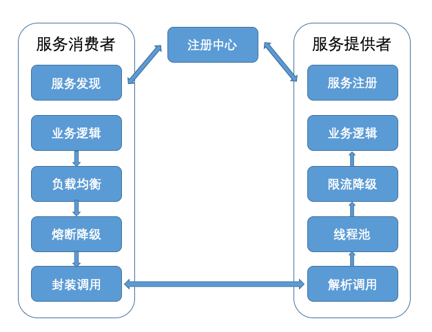
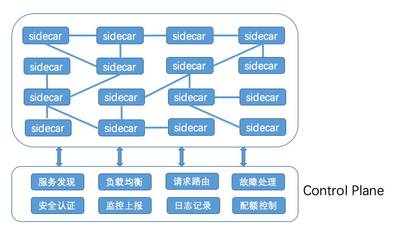

# servicemesh

* [Service Mesh](servicemesh.md#service-mesh)

  **Service Mesh**

  Service Mesh以轻量级的网络代理的方式与应用的代码部署在一起，用于保证服务与服务之间调用的可靠性，这与传统的微服务架构有着本质的区别

* 1.跨语言服务调用的需要。在大多数公司内通常都存在多个业务团队，每个团队业务所采用的开发语言一般都不相同,都需要在各个语言的SDK中实现一遍，开发成本很高。
* 2.云原生应用服务治理的需要。微服务越来越多开始容器化，并使用Kubernetes类似的容器平台对服务进行管理，逐步朝云原生应用的方向进化。而传统的服务治理要求在业务代码里集成服务框架的SDK，这显然与云原生应用的理念相悖，因此迫切需要一种对业务代码无侵入的适合云原生应用的服务治理方式。

Service Mesh实现的关键就在于两点：

* 一个是轻量级的网络代理也叫SideCar，它的作用就是转发服务之间的调用；
* 一个是基于SideCar的服务治理也被叫作Control Plane，它的作用是向SideCar发送各种指令，以完成各种服务治理功能。

下面我就来详细讲解这两点是如何实现的。

1.SideCar

我们首先来看一下，在传统的微服务架构下服务调用的原理。你可以看下面这张图，服务消费者这边除了自身的业务逻辑实现外，还需要集成部分服务框架的逻辑，比如服务发现、负载均衡、熔断降级、封装调用等，而服务提供者这边除了实现服务的业务逻辑外，也要集成部分服务框架的逻辑，比如线程池、限流降级、服务注册等。 

而在Service Mesh架构中，服务框架的功能都集中实现在SideCar里，并在每一个服务消费者和服务提供者的本地都部署一个SideCar，服务消费者和服务提供者只管自己的业务实现，服务消费者向本地的SideCar发起请求，本地的SideCar根据请求的路径向注册中心查询，得到服务提供者的可用节点列表后，再根据负载均衡策略选择一个服务提供者节点，并向这个节点上的SideCar转发请求，服务提供者节点上的SideCar完成流量统计、限流等功能后，再把请求转发给本地部署的服务提供者进程，从而完成一次服务请求。整个流程你可以参考下面这张图。 

我们可以把服务消费者节点上的SideCar叫作正向代理，服务提供者节点上的SideCar叫作反向代理，那么Service Mesh架构的关键点就在于服务消费者发出的请求如何通过正向代理转发以及服务提供者收到的请求如何通过反向代理转发。从我的经验来看，主要有两种实现方案。

* 基于iptables的网络拦截。这种方案请见下图，节点A上服务消费者发出的TCP请求都会被拦截，然后发送给正向代理监听的端口15001，正向代理处理完成后再把请求转发到节点B的端口9080。节点B端口9080上的所有请求都会被拦截发送给反向代理监听的端口15001，反向代理处理完后再转发给本机上服务提供者监听的端口9080。 
* 采用协议转换的方式。这种方案请见下图，节点A上的服务消费者请求直接发给正向代理监听的端口15001，正向代理处理完成后，再把请求转发到节点B上反向代理监听的端口15001，反向代理处理完成后再发送给本机上的服务提供者监听的端口9080。 

可见，这两种方案最大的不同之处在于，一个是通过iptables网络拦截实现代理转发的，一个是靠直接把请求发送给代理来转发的。基于iptables网络拦截的方式，理论上会有一定的性能损耗，但它的优点是从网络层实现调用拦截，能做到完全的业务无感知，所以适合云原生应用。而直接把请求发送给代理的方式，要求代理层加入业务逻辑，才能把请求转发给对应的服务提供者监听的端口。

2.Control Plane

既然SideCar能实现服务之间的调用拦截功能，那么服务之间的所有流量都可以通过SideCar来转发，这样的话所有的SideCar就组成了一个服务网格，再通过一个统一的地方与各个SideCar交互，就能控制网格中流量的运转了，这个统一的地方就在Sevice Mesh中就被称为Control Plane。如下图所示，Control Plane的主要作用包括以下几个方面：

* 服务发现。服务提供者会通过SideCar注册到Control Plane的注册中心，这样的话服务消费者把请求发送给SideCar后，SideCar就会查询Control Plane的注册中心来获取服务提供者节点列表。
* 负载均衡。SideCar从Control Plane获取到服务提供者节点列表信息后，就需要按照一定的负载均衡算法从可用的节点列表中选取一个节点发起调用，可以通过Control Plane动态修改SideCar中的负载均衡配置。
* 请求路由。SideCar从Control Plane获取的服务提供者节点列表，也可以通过Control Plane来动态改变，比如需要进行A/B测试、灰度发布或者流量切换时，就可以动态地改变请求路由。
* 故障处理。服务之间的调用如果出现故障，就需要加以控制，通常的手段有超时重试、熔断等，这些都可以在SideCar转发请求时，通过Control Plane动态配置。
* 安全认证。可以通过Control Plane控制一个服务可以被谁访问，以及访问哪些信息。
* 监控上报。所有SideCar转发的请求信息，都会发送到Control Plane，再由Control Plane发送给监控系统，比如Prometheus等。
* 日志记录。所有SideCar转发的日志信息，也会发送到Control Plane，再由Control Plane发送给日志系统，比如Stackdriver等。
* 配额控制。可以在Control Plane里给服务的每个调用方配置最大调用次数，在SideCar转发请求给某个服务时，会审计调用是否超出服务对应的次数限制。 

