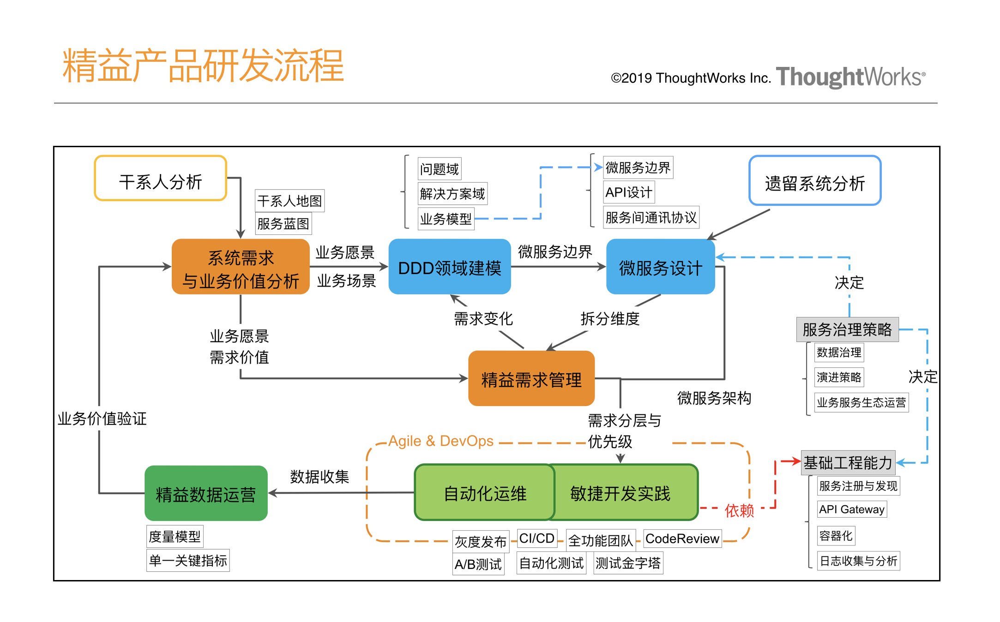

- [中台](#中台)
    - [分类](#分类)
    - [设计中台 D4模型](#设计中台-d4模型)
    - [Discovery企业战略分解及现状调研](#discovery企业战略分解及现状调研)
    - [Define企业数字化全景规划](#define企业数字化全景规划)
    - [Design中台的规划与设计](#design中台的规划与设计)
    - [Delivery中台的建设与接入](#delivery中台的建设与接入)
# 中台

摘自王健的说透中台， 因为我理解的中台很简单， 但一听王健讲的我感觉我理解的中台就是渣渣。。因为内容太多， 我摘录了部分核心

中台： 企业级能力复用平台

* “企业级”定义了中台的范围，区分开了单系统的服务化与微服务；
* “能力”定义了中台的主要承载对象，能力的抽象解释了各种各样中台的存在；
* “复用”定义了中台的核心价值，传统的平台化对于易复用性和前台的用户体验并没有给予足够的关注，中台的提出和兴起，让人们通过可复用性将目光更多的从平台内部设计转换到平台对于前台业务的支撑上；
* “平台”定义了中台的主要形式，区别于传统的应用系统拼凑的方式，通过对于更细粒度能力的识别与平台化沉淀，实现企业能力的柔性复用，更好地支撑前台业务。

## 分类
主流代表：业务数据双中台

业务中台就是在产生数据，数据中台是做数据的二次加工，并将结果再服务于业务，为业务进行数据和智能的赋能

非主流系列
在业务数据双中台之外，还出现过各式各样的中台，而这些中台的出现也让原本还比较清晰的中台概念变得有些模糊。那接下来我就快速为你介绍一些这几年我所接触过的中台，在我讲述的过程中，你也可以思考一下，这些中台中哪些是李逵，而哪些是李鬼，谁才真正配得上中台的称号，谁又是来蹭流量的。

技术中台

除了业务数据双中台，最常被提到，在我看来介于主流和非主流之间的就得属技术中台了。技术中台相比业务中台和数据中台，边界也会更加清晰，简单来讲就是在CloudNative下将使用云或其他基础设施的能力、各种技术中间件的能力进行整合和包装。过滤掉技术细节，提供简单一致、易于使用的应用技术基础设施的能力接口，助力前台和业务中台、数据中台的快速建设。不过业界也有说法，认为技术中台没有很强的业务属性，只是一些中间件的集合，顶多算是个中间件平台而已，称不上中台，你怎么看呢？

研发中台

软件开发是一项工程，涉及到管理、流程、测试、团队协作等等方面。如何将企业的开发流程、最佳实践沉淀成可重用的“能力”，从而助力创新性应用的快速开发迭代，也是我们看到的很多企业正在做的事情，我们可以管这种关注开发效能管理的平台叫作研发中台。

移动中台

在移动互联网时代，移动优先的原则已经成为不争的事实，将App开发过程中的通用技术组件进行封装沉淀到移动中台中，就可以在构建新的App时大量复用已有组件和能力，快速构建和响应。

管理中台

最近很多企业开始尝试把中台思维应用到企业内部，重新对“人”“事”“流程”“企业运营”进行平台化/中台化改造。试图通过中台化建设，加速企业管理标准化和提升运营能力。

组织中台

## 设计中台 D4模型

第一个阶段是Discovery 帮助我们在中台规划前先建立全局视野。在这个过程中我们以企业愿景和战略为输入，结合行业趋势、竞争对手分析、用户客群分析 、业务现状分析、IT资产盘点，全方位多角度地理解企业的战略市场环境以及业务及IT全貌，帮助我们做出最正确的判断。

第二个阶段是Define，帮助我们基于之前Discovery发散的各维度信息进行收敛与分析， 对于中台的架构进行定义。通过对跨业务线的业务梳理进行重合度分析，并结合领域分析对业务表象之后的企业核心问题域做进一步展开和重合度分析，一起来收敛推导基于中台的企业架构设计。并基于多维度的打分，形成具体的实施路径规划，说白了就是先做什么后做什么。这里需要注意一点，此时收敛的是仍是企业架构层面，像业务中台、数据中台这种级别的产品，可能只是实施路径中的一个项目，在这个阶段也可以回答那个我们关心的问题，我们到底需不需要中台，需要哪些中台？

第三个阶段是Design，帮助我们针对实施路径中的某一个产品，例如业务中台，做详细的设计，包括产品级的业务需求分析、功能及架构设计、实施计划等。例如对于业务中台产品，在Design阶段我们需要回答产品的愿景、边界、产品形态、技术架构、交付计划、成本预估等等，这个过程就是一个标准的产品设计过程，只不过在中台项目中大多是针对中台类的产品而已。

第四个阶段就是Delivery，这个时候我们就可以针对一个设计好的中台，开始具体的交付过程，我们采用的是敏捷结合精益软件开发的方式，用快速迭代和基于反馈的调整，最大程度地弥补由中台建设本身的复杂度带来的设计偏差和其他的交付问题，并且注重架构的治理与守护，减少实现与设计的偏离。

## Discovery企业战略分解及现状调研

## Define企业数字化全景规划

## Design中台的规划与设计

## Delivery中台的建设与接入

