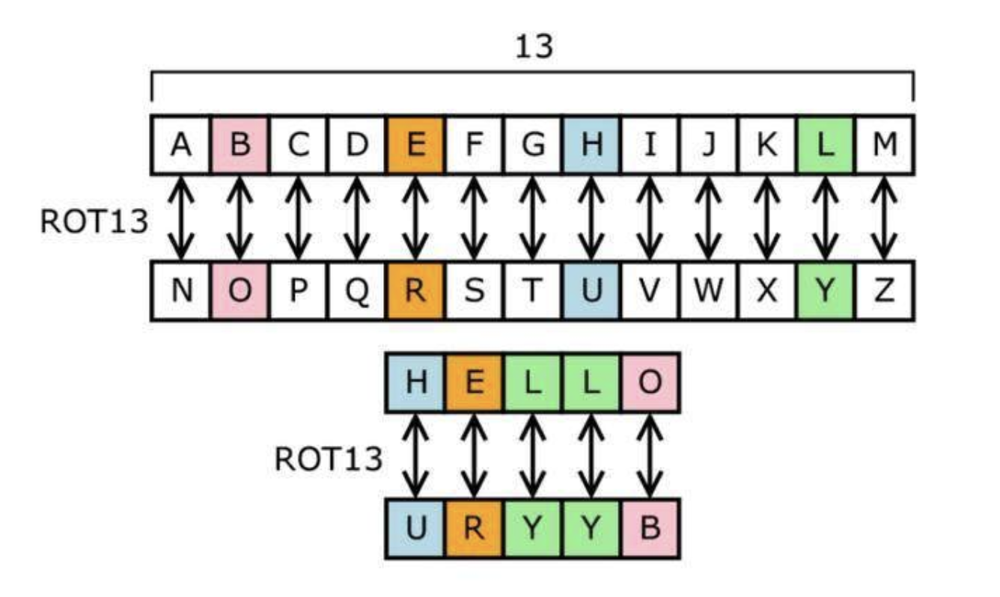

- [Python 那些趣事](#python-那些趣事)
    - [Zen of Python](#zen-of-python)
    - [BDFL](#bdfl)
    - [antigravity](#antigravity)
    - [braces](#braces)
    - [barry_as_FLUFL](#barry_as_flufl)
    - [EAFP or LBYL](#eafp-or-lbyl)
# Python 那些趣事

## Zen of Python

```
>>> import this
The Zen of Python, by Tim Peters

Beautiful is better than ugly.
Explicit is better than implicit.
Simple is better than complex.
Complex is better than complicated.
Flat is better than nested.
Sparse is better than dense.
Readability counts.
Special cases aren't special enough to break the rules.
Although practicality beats purity.
Errors should never pass silently.
Unless explicitly silenced.
In the face of ambiguity, refuse the temptation to guess.
There should be one-- and preferably only one --obvious way to do it.
Although that way may not be obvious at first unless you're Dutch.
Now is better than never.
Although never is often better than *right* now.
If the implementation is hard to explain, it's a bad idea.
If the implementation is easy to explain, it may be a good idea.
Namespaces are one honking great idea -- let's do more of those!

```

2001年秋，Foretec(一家会议组织公司)正在准备召开第十届International Python Conference(IPC 10，Pycon的前身)，Foretec打算征集一条印在会议T恤衫上的标语，最终他们从Python社区收到了500多条投稿。

Foretec邀请了Python的核心开发Guido, Fred, Jeremy，Tim Peter，Barry 等来担任评审。评审委员们从投稿中过滤出了130多条后就一直没有进展，直到会议快要召开时他们也没有确定最终标语。


会议就要开始的前几天，到了评审们不得不做出决定的时候了。于是由Tim Peter和Barry 两人轮流评审，每人每次淘汰一半留下一半，直到最后只剩一条。

最终，“import this”被选了出来，大家对"import this"非常满意。但是当选择了这条以后，他们意识到他们必须要实现它。经过简单的讨论后，“import this”的被定为输出Tim Peter写的《The Zen of Python》——Python编程和设计的指导原则。

Time Peter建议在代码中对输出的内容做一些简单的混淆，于是他们就用rot13对打印内容进行了一些处理。如果你打开lib下的[this.py](https://github.com/python/cpython/tree/master/Lib/this.py)你就会发现下面内容。

```
s = """Gur Mra bs Clguba, ol Gvz Crgref

Ornhgvshy vf orggre guna htyl.
Rkcyvpvg vf orggre guna vzcyvpvg.
Fvzcyr vf orggre guna pbzcyrk.
Pbzcyrk vf orggre guna pbzcyvpngrq.
Syng vf orggre guna arfgrq.
Fcnefr vf orggre guna qrafr.
Ernqnovyvgl pbhagf.
Fcrpvny pnfrf nera'g fcrpvny rabhtu gb oernx gur ehyrf.
Nygubhtu cenpgvpnyvgl orngf chevgl.
Reebef fubhyq arire cnff fvyragyl.
Hayrff rkcyvpvgyl fvyraprq.
Va gur snpr bs nzovthvgl, ershfr gur grzcgngvba gb thrff.
Gurer fubhyq or bar-- naq cersrenoyl bayl bar --boivbhf jnl gb qb vg.
Nygubhtu gung jnl znl abg or boivbhf ng svefg hayrff lbh'er Qhgpu.
Abj vf orggre guna arire.
Nygubhtu arire vf bsgra orggre guna *evtug* abj.
Vs gur vzcyrzragngvba vf uneq gb rkcynva, vg'f n onq vqrn.
Vs gur vzcyrzragngvba vf rnfl gb rkcynva, vg znl or n tbbq vqrn.
Anzrfcnprf ner bar ubaxvat terng vqrn -- yrg'f qb zber bs gubfr!"""

d = {}
for c in (65, 97):
    for i in range(26):
        d[chr(i+c)] = chr((i+13) % 26 + c)

print("".join([d.get(c, c) for c in s]))
```
其实，rot13就是凯撒密码的一种，每个字母变换为它后面的第13个字母。例如A变换为它后面的第13个字母N，所有字母变换关系如下图：


等到IPC 10结束后，作为庆祝这次会议圆满结束的活动之一就是他们悄悄的把代码提交到Python 2.2.1。过了一段时间，才逐渐有人发现“import this”这个彩蛋。

有趣的是, Python 之禅的实现代码违反了他自己

## BDFL
仁慈的独裁者

[Wikipedia](https://link.zhihu.com/?target=https%3A//en.wikipedia.org/wiki/Guido_van_Rossum) 有解释：Guido van Rossum (Dutch pronunciation: [ˈɣido vɑn ˈrɔsʏm, -səm], born 31 January 1956) is a Dutch programmer best known as the author of the Python programming language, for which he is the "Benevolent Dictator For Life" (BDFL), which means he continues to oversee Python development, making decisions when necessary.BDFL

直译为：仁慈的独裁者。维基说 he is the "BDFL"， 指 GVR 在 Python 开发上有监管的权利，在必要时有决定权。这句简单的介绍很中立，没有感情色彩。根据 Wikipedia 的引用，这个说法来自于 [Benevolent dictator for life](https://link.zhihu.com/?target=https%3A//web.archive.org/web/20061001143603/http%3A//www.linuxformat.co.uk/modules.php%3Fop%3Dmodload%26name%3DSections%26file%3Dindex%26req%3Dviewarticle%26artid%3D10) 这篇采访文章，文章里 GVR 提到，社区对 Python 的热情与自己对 Python 的控制相冲突，社区与自己存在着相互约束。并亲口说：只要社区承认我是Python 的 BDFL，我就对任何更改提案拥有有效的否决权。我猜应该是他自己放话之后，大家都这么叫他了。

Two Scoops 里提到他时：See what Guido Van Rossum, BDFL of Python says.... 连创建者的身份都没表述，只有BDFL，可见这个词是 Python 社区对他的一种讽刺吧


[PEP-401 BDFL Retirement](https://www.python.org/dev/peps/pep-0401/)

## antigravity

Okay Python, Can you make me fly?/Python, 可否带我飞? *

好, 去吧.
```
import antigravity
```
Output: 嘘.. 这是个超级秘密.

💡 说明:
antigravity 模块是 Python 开发人员发布的少数复活节彩蛋之一.
import antigravity 会打开一个 Python 的经典 [XKCD](http://xkcd.com/353/) 漫画页面.
不止如此. 这个复活节彩蛋里还有一个复活节彩蛋. 如果你看一下[代码](https://github.com/python/cpython/blob/master/Lib/antigravity.py#L7-L17), 就会发现还有一个函数实现了 [XKCD's geohashing](https://xkcd.com/426/) 算法.


## braces
> Brace yourself!/做好思想准备 *
如果你不喜欢在Python中使用空格来表示作用域, 你可以导入 C 风格的 {},
```
from __future__ import braces
```
Output:
```
  File "some_file.py", line 1
    from __future__ import braces
SyntaxError: not a chance
```
想用大括号? 没门! 觉得不爽, 请去用java.

💡 说明:
通常 __future__ 会提供 Python 未来版本的功能. 然而，这里的 “未来” 是一个讽刺.
这是一个表达社区对此类问题态度的复活节彩蛋.


## barry_as_FLUFL
> Let's meet Friendly Language Uncle For Life/让生活更友好 *
Output (Python 3.x)
```
>>> from __future__ import barry_as_FLUFL
>>> "Ruby" != "Python" ## 这里没什么疑问
  File "some_file.py", line 1
    "Ruby" != "Python"
              ^
SyntaxError: invalid syntax

>>> "Ruby" <> "Python"
True
```
这就对了.

💡 说明:
* 相关的 [PEP-401](https://www.python.org/dev/peps/pep-0401/) 发布于 2009年4月1日 (所以你现在知道这意味着什么了吧).
* 引用 PEP-401

    意识到 Python 3.0 里的 != 运算符是一个会引起手指疼痛的恐怖错误, FLUFL 将 <> 运算符恢复为唯一写法.

Uncle Barry 在 PEP 中还分享了其他东西; 你可以在[这里](https://www.python.org/dev/peps/pep-0401/)获得他们.


## EAFP or LBYL
EAFP
“求原谅比求许可更容易”的英文缩写。

    这种 Python 常用代码编写风格会假定所需的键或属性存在，并在假定错误时捕获异常。这种简洁快速风格的特点就是大量运用 try 和 except 语句。于其相对的则是所谓 LBYL 风格，常见于 C 等许多其他语言。

LBYL
先查看后跳跃”的英文缩写。

    这种代码编写风格会在进行调用或查找之前显式地检查前提条件。此风格与 EAFP 方式恰成对比，其特点是大量使用 if 语句。

    在多线程环境中，LBYL 方式会导致“查看”和“跳跃”之间发生条件竞争风险。例如，以下代码 if key in mapping: return mapping[key] 可能由于在检查操作之后其他线程从 mapping 中移除了 key 而出错。这种问题可通过加锁或使用 EAFP 方式来解决。
